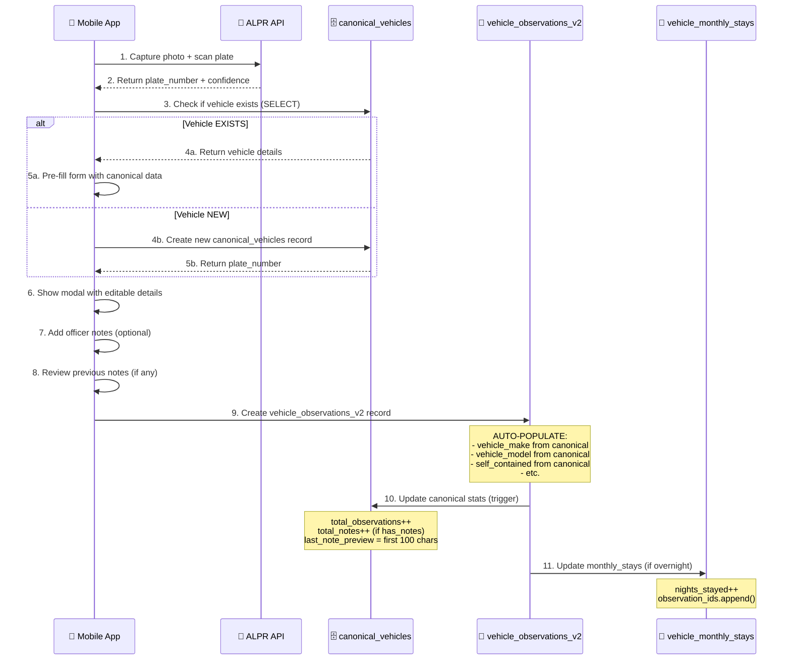

# 📱 Mobile App - New Data Flow (Vehicle Architecture V2)

## 🎯 Overview

The vehicle data architecture has been completely rebuilt with a **plate-number-centric design**. This guide shows how the mobile app should interact with the new schema.

---

## 📊 NEW DATABASE SCHEMA

### **1. `canonical_vehicles` - Master Vehicle Registry**
- **Primary Key**: `plate_number` (TEXT)
- **Purpose**: One record per vehicle (global source of truth)
- **Key Fields**:
  - `vehicle_make`, `vehicle_model`, `vehicle_year`, `vehicle_color`
  - `self_contained`, `self_contained_expiry`
  - `homeless_status` ('none' | 'claimed' | 'confirmed')
  - `is_flagged`, `flagged_priority`, `flagged_reason`
  - `profile_photo` (AI-selected best photo)
  - `total_notes` (count of all officer notes)
  - `last_note_preview` (first 100 chars of last note)
  - `total_observations`, `total_breaches`, `total_incidents`

### **2. `vehicle_observations_v2` - Independent Observation Records**
- **Primary Key**: `observation_id` (UUID)
- **Foreign Key**: `plate_number` → `canonical_vehicles(plate_number)`
- **Purpose**: Every sighting is a complete, independent record
- **Key Fields**:
  - `plate_number` (links to canonical)
  - `vehicle_make`, `vehicle_model`, `vehicle_year`, `vehicle_color` (snapshot from canonical)
  - `self_contained`, `self_contained_expiry` (snapshot from canonical)
  - `photo`, `photo_hash` (observation-specific photo)
  - `gps_latitude`, `gps_longitude`, `recorded_at`
  - `organization_id`, `zone_id`, `recorded_by`
  - **`officer_notes`** ✨ NEW - Officer comments
  - **`has_notes`** ✨ NEW - Boolean flag
  - **`notes_reference_previous`** ✨ NEW - Did officer review previous notes?
  - `breach_warning`, `is_breach`, `breach_type`, `breach_details`
  - `has_hs_incident`, `has_incident`, `has_homeless_claim`

### **3. `vehicle_monthly_stays` - Calendar Month Tracking**
- **Purpose**: Track nights stayed per zone per calendar month
- **Auto-resets**: Every 1st of the month at 08:00
- **Key Fields**:
  - `plate_number`, `organization_id`, `zone_id`, `calendar_month`
  - `nights_stayed`, `consecutive_nights`
  - `observation_ids` (array of UUIDs)
  - `reset_at`, `last_reset_at`

---

## 🔄 MOBILE APP DATA FLOW (Step-by-Step)

### **SCENARIO: Officer Scans a Vehicle Plate**



---

## 📱 MOBILE APP IMPLEMENTATION GUIDE

### **STEP 1: Scan Plate & Get/Create Canonical Vehicle**

```typescript
// After ALPR scan returns plate_number
async function handlePlateScan(plateNumber: string, photo: string) {
  // 1. Check if canonical vehicle exists
  const { data: canonical, error } = await supabase
    .from('canonical_vehicles')
    .select('*')
    .eq('plate_number', plateNumber)
    .single();

  let vehicleData;

  if (canonical) {
    // Vehicle exists - use canonical data to pre-fill form
    vehicleData = {
      plate_number: canonical.plate_number,
      vehicle_make: canonical.vehicle_make,
      vehicle_model: canonical.vehicle_model,
      vehicle_year: canonical.vehicle_year,
      vehicle_color: canonical.vehicle_color,
      self_contained: canonical.self_contained,
      self_contained_expiry: canonical.self_contained_expiry,
      is_flagged: canonical.is_flagged,
      flagged_reason: canonical.flagged_reason,
      homeless_status: canonical.homeless_status,
      total_notes: canonical.total_notes,
      last_note_preview: canonical.last_note_preview,
    };
  } else {
    // New vehicle - create canonical record
    const { data: newCanonical, error: createError } = await supabase
      .rpc('upsert_canonical_vehicle', {
        p_plate_number: plateNumber,
      });

    if (createError) throw createError;

    // Initialize empty vehicle data
    vehicleData = {
      plate_number: plateNumber,
      vehicle_make: null,
      vehicle_model: null,
      vehicle_year: null,
      vehicle_color: null,
      self_contained: false,
      self_contained_expiry: null,
      is_flagged: false,
      homeless_status: 'none',
      total_notes: 0,
    };
  }

  // 2. Show modal with pre-filled data
  showVehicleDetailsModal(vehicleData, photo);
}
```

---

### **STEP 2: Show Notes History (Minimize AI Credits)**

```typescript
// When officer taps "View Previous Notes" button
async function loadPreviousNotes(plateNumber: string) {
  const { data: notesHistory, error } = await supabase
    .rpc('get_vehicle_notes_history', {
      p_plate_number: plateNumber,
      p_limit: 10, // Last 10 notes
    });

  if (error) throw error;

  // Display notes in a scrollable list
  return notesHistory.map(note => ({
    observation_id: note.observation_id,
    notes: note.officer_notes,
    date: note.recorded_at,
    officer: note.recorded_by_name,
    zone: note.zone_name,
  }));
}
```

**UI Example:**
```jsx
<Card>
  <CardHeader>
    <CardTitle>
      Previous Notes ({canonical.total_notes})
    </CardTitle>
    {canonical.last_note_preview && (
      <p className="text-sm text-muted-foreground">
        Last: "{canonical.last_note_preview}..."
      </p>
    )}
  </CardHeader>
  <CardContent>
    <Button onClick={() => loadPreviousNotes(plateNumber)}>
      View Full History
    </Button>
  </CardContent>
</Card>
```

---

### **STEP 3: Create Observation with Notes**

```typescript
async function submitObservation(data: {
  plate_number: string;
  photo: string;
  gps_latitude: number;
  gps_longitude: number;
  zone_id: string;
  organization_id: string;
  officer_notes?: string; // NEW
  reviewed_previous_notes: boolean; // NEW
}) {
  // 1. Upload photo to Supabase Storage
  const photoHash = await calculateSHA256(data.photo);
  const photoUrl = await uploadPhoto(data.photo);

  // 2. Create observation record
  const { data: observation, error } = await supabase
    .from('vehicle_observations_v2')
    .insert({
      plate_number: data.plate_number,
      // Vehicle details will AUTO-POPULATE from canonical via trigger
      photo: photoUrl,
      photo_hash: photoHash,
      gps_latitude: data.gps_latitude,
      gps_longitude: data.gps_longitude,
      recorded_at: new Date().toISOString(),
      organization_id: data.organization_id,
      zone_id: data.zone_id,
      recorded_by: user.id,
      // Notes (NEW)
      officer_notes: data.officer_notes || null,
      has_notes: !!data.officer_notes,
      notes_reference_previous: data.reviewed_previous_notes,
    })
    .select()
    .single();

  if (error) throw error;

  // 3. Canonical vehicle stats are auto-updated via trigger
  // 4. Monthly stays are updated via trigger (if overnight)

  return observation;
}
```

---

### **STEP 4: Update Canonical Vehicle Details**

```typescript
// When officer edits vehicle details in the modal
async function updateCanonicalVehicle(plateNumber: string, updates: {
  vehicle_make?: string;
  vehicle_model?: string;
  vehicle_year?: number;
  vehicle_color?: string;
  self_contained?: boolean;
  self_contained_expiry?: string;
}) {
  const { error } = await supabase
    .rpc('upsert_canonical_vehicle', {
      p_plate_number: plateNumber,
      p_vehicle_make: updates.vehicle_make,
      p_vehicle_model: updates.vehicle_model,
      p_vehicle_year: updates.vehicle_year,
      p_vehicle_color: updates.vehicle_color,
      p_self_contained: updates.self_contained,
      p_self_contained_expiry: updates.self_contained_expiry,
    });

  if (error) throw error;

  // Canonical vehicle is updated
  // Next observation will auto-populate with these new details
}
```

---

## 🎯 KEY BENEFITS FOR MOBILE APP

### **1. Faster Data Entry** ✨
- Officer scans plate → Details auto-populate from canonical
- No need to re-enter make/model/color every time
- Self-contained status pre-filled

### **2. Notes History** ✨
- View previous officer notes before adding new ones
- Avoid duplicate AI analysis (saves credits)
- Context-aware decision making

### **3. Single Source of Truth** ✨
- Update canonical vehicle once → All future observations use it
- Consistent data across all observations
- Reduced data entry errors

### **4. Complete Audit Trail** ✨
- Every observation is independent and immutable
- Breach status is "sticky" (never deleted)
- Court-ready evidence with photo hashing

---

## 📋 MOBILE APP CHECKLIST

### **Required Changes:**

- [ ] Update observation submission to use `vehicle_observations_v2` table
- [ ] Add "View Previous Notes" button in vehicle details modal
- [ ] Implement `get_vehicle_notes_history()` RPC call
- [ ] Show `total_notes` count in vehicle details
- [ ] Add checkbox: "I reviewed previous notes" (sets `notes_reference_previous`)
- [ ] Pre-fill vehicle details from `canonical_vehicles` when plate exists
- [ ] Call `upsert_canonical_vehicle()` for new vehicles
- [ ] Add notes text area in observation form
- [ ] Display `last_note_preview` in vehicle summary cards

### **Optional Enhancements:**

- [ ] Show "Previous notes available" badge when `total_notes > 0`
- [ ] Highlight flagged vehicles with visual alert
- [ ] Show homeless status badge (claimed/confirmed)
- [ ] Display self-contained expiry countdown
- [ ] Add quick-action buttons for common notes ("Aggressive", "Cooperative", etc.)

---

## 🚀 MIGRATION TIMELINE

1. **Phase 1** (Now): SQL migration applied, new tables created
2. **Phase 2** (Next): Update mobile app to use new schema
3. **Phase 3** (After mobile update): Migrate old observations to `vehicle_observations_v2`
4. **Phase 4** (Final): Deprecate old `vehicle_observations` table

---

## ❓ FAQ

**Q: What happens to existing observations?**
A: They remain in the old `vehicle_observations` table. A migration script will copy them to `vehicle_observations_v2` after the mobile app is updated.

**Q: Do I need to update Edge Functions?**
A: Yes, Edge Functions like `process-field-scan` should be updated to insert into `vehicle_observations_v2` instead of `vehicle_observations`.

**Q: How do I test the new schema?**
A: Create a test observation using the mobile app. Verify that:
1. Canonical vehicle is created/updated
2. Observation auto-populates vehicle details
3. Notes count increments in canonical
4. Previous notes are displayed correctly

**Q: Can officers edit observations after submission?**
A: No, observations are immutable. However, admins can edit them via the admin portal if needed.

---

## 📞 Support

If you encounter issues with the new schema:
1. Check browser console for errors
2. Verify RLS policies allow your user to access data
3. Confirm Edge Functions are updated to use new tables
4. Review migration logs in Supabase Dashboard → SQL Editor

**Ready to rebuild? Let's do this! 🚀**
