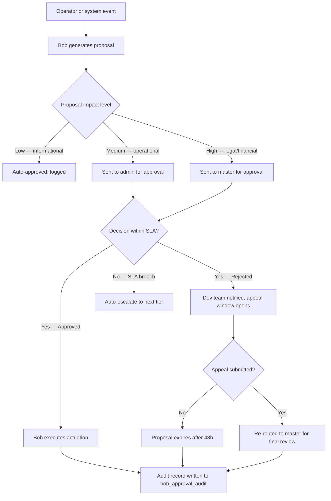

# Bob Approval Paths — Phase B

**Date**: 2026-05-12  
**Status**: Phase A — Documented (Phase B execution begins June 10)  
**Owner**: Bob/AI Lead  
**Related Sections**: BUILD_REALIGNMENT_PLAN sections 6.2, 6.4  

---

## Overview

Bob's approval paths define the minimum executable workflow for AI-assisted decisions in Phase B modules. Every approval flow must:

1. Be traceable via `bob_approval_audit` records.
2. Respect org isolation — proposals and decisions are scoped to the owning org.
3. Meet SLA targets for response time.
4. Support appeal when a proposal is rejected.
5. Never allow Bob to unilaterally execute an action with material operational or legal impact (admin/master confirmation always required for trespass orders, contract changes, and user role changes).

---

## Approval Workflow — Standard



---

## Impact Level Definitions

| Level | Examples | Approver Required | SLA |
|---|---|---|---|
| **Low** | Patrol summary generation, shift briefing, noise report draft | None (auto-approve) | Immediate |
| **Medium** | Dispatch priority suggestion, welfare check trigger, breach report draft | `admin` or `admin_officer` | 2 hours |
| **High** | Trespass order recommendation, contract amendment, user role change, org creation | `master` | 1 hour |
| **Emergency Override** | Armed danger detected — blocks ALL admin-level Bob actuations | System auto-block | Immediate |

---

## Audit Fields

Every decision written to `bob_approval_audit`:

```sql
id           UUID PRIMARY KEY
proposal_id  UUID NOT NULL           -- links to the Bob-generated proposal
approver_id  UUID                    -- null if auto-approved or expired
decision     TEXT                    -- 'approve' | 'reject' | 'auto_approve' | 'expired'
reasoning    TEXT                    -- Bob's reasoning OR approver override note
timestamp    TIMESTAMPTZ NOT NULL DEFAULT now()
status       TEXT NOT NULL           -- 'pending' | 'approved' | 'rejected' | 'appealed' | 'expired'
org_id       UUID NOT NULL           -- RLS: must match approver's org
appeal_of    UUID                    -- if this is an appeal, links to original audit record
```

---

## Escalation Rules

1. **No response within SLA**: Auto-escalate to the next tier (admin → master).
2. **Master no response after 2× SLA**: Proposal is flagged `status='escalation_breach'` and a push notification is sent to all master-role users in the org.
3. **Appeal path**: A rejected proposal can be appealed once. The appeal is sent directly to the master tier, bypassing admin. Appeals expire after 48 hours.
4. **Emergency override**: If `bob_voice_state` includes signal `armed_danger`, all pending medium/high proposals for the affected org are auto-suspended until the emergency is cleared.

---

## Phase B Module Approval Requirements

| Module | Proposal Type | Level | Approver |
|---|---|---|---|
| Patrol Dispatch | Route suggestion | Low | Auto |
| Dispatch Console | Priority escalation | Medium | admin |
| Enforcement Timeline | Trespass order recommendation | High | master |
| Site Guard | Tailgate alert | Medium | admin |
| ALPR Scanner | Plate alert suggestion | Low | Auto |
| Welfare Check | Missed check escalation | Medium | admin |
| Training Assignment | Auto-assignment suggestion | Low | Auto |

---

## Implementation Path (Phase B)

1. `bob_approval_audit` table is live (migration `20260504000004_bob_audit.sql`).
2. `src/lib/bob-brain.ts` `executeBobActuation()` checks impact level before writing proposal.
3. `BobAssistantStudio.tsx` renders pending approval queue for admin/master users.
4. Edge Function `bob-proposal-approver` (Phase B) handles approval/rejection webhooks and writes to audit.
5. Push notifications sent via `push_subscriptions` table when SLA is approaching.

---

## Governance Contract

See `scripts/dr-bob-review.mjs` for automated adversarial review of Bob proposals before production deployment.

Bob approval paths must pass `dr-bob-review` with no BLOCKER-level findings before Phase B go-live (June 10).
