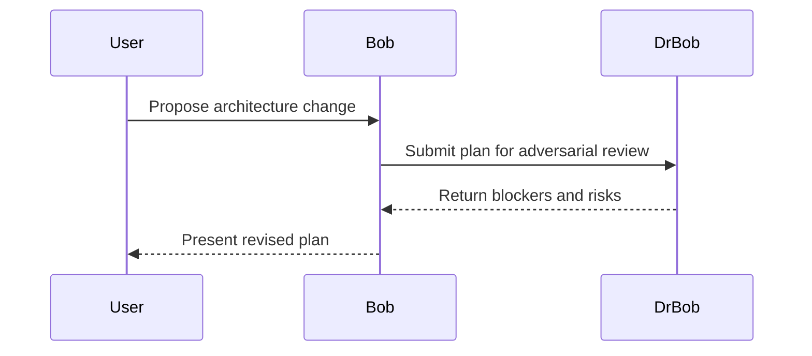
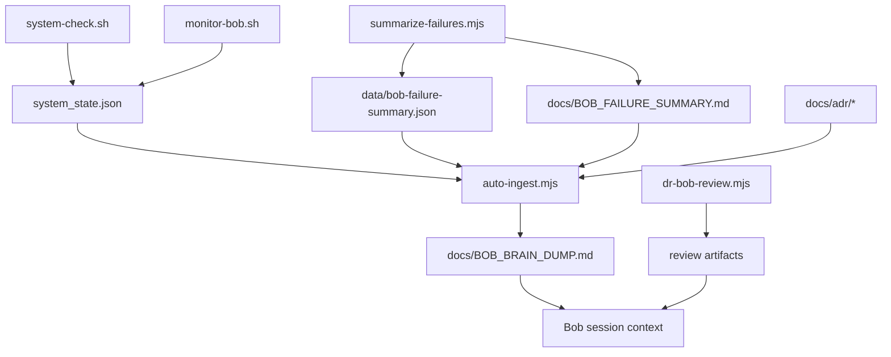
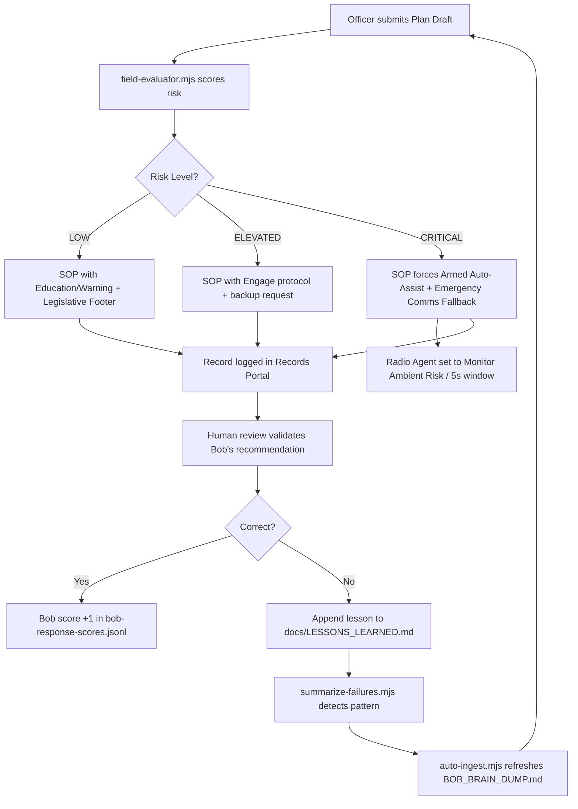

# PROJECT TRUTH SOURCE

Generated at: 2026-04-23T22:57:14.461Z
Workspace root: /home/runner/work/FreedomCamp-Manager/FreedomCamp-Manager

This file is generated by scripts/auto-ingest.mjs and is intended to be the living architecture context Bob reads first.

## FILE: docs/architecture/README.md

```
# Architecture Documentation

Details about the system architecture.
```

## FILE: docs/DECISIONS.md

```
# Decisions

This file is the historical memory for Bob and Dr Bob.

When a pattern, platform, or architectural decision changes, append a dated note here before asking Bob to extend that area.

## Decision Entry Template

- Date: YYYY-MM-DD
- Decision: one sentence
- Scope: files, services, or modules affected
- Reason: why the decision was made
- Consequences: follow-on constraints Bob must respect

## Current Standing Decisions

- Date: 2026-04-23
- Decision: Bob must read `system_state.json` before making redesign or new-module claims.
- Scope: architecture advice, `/chat`, `/code/task`, Dr Bob review, truth broadcaster.
- Reason: prevent hallucinated modules, package-manager drift, and ungrounded implementation plans.
- Consequences: any invented module path or ungrounded feature reference is a blocker and scores `0/10` in response logs.

- Date: 2026-04-23
- Decision: Major redesigns follow `spec.md` then self-critique then `plan.md` before implementation.
- Scope: Bob planning, Dr Bob review, architecture prompts, future CI review gates.
- Reason: force grounded design before code generation.
- Consequences: `scripts/review-architecture-artifacts.mjs` should run before implementation claims on major work.
```

## FILE: docs/LESSONS_LEARNED.md

```
# Lessons Learned

Use this file to record concrete mistakes Bob and Dr Bob found during adversarial review or failed executions.

## Entry Template

- Date: YYYY-MM-DD
- Trigger: command, review, or failure source
- Mistake: what Bob got wrong
- Risk: why it mattered
- Fix: what changed
- Prevention Rule: what Bob must do next time

## Current Lessons

- Date: 2026-04-23
- Trigger: `node scripts/dr-bob-review.mjs --file docs/BOB_TRAINING_ADVANCED_ARCHITECT_2026.md --type plan`
- Mistake: architecture guidance referenced ungrounded module placeholders without matching `system_state.json` evidence.
- Risk: Bob can invent module structure and mislead implementation planning.
- Fix: added blocker review flow, truth protocol checks, and failure summarization.
- Prevention Rule: any module path not grounded in repo files or `system_state.json` must be treated as unverified and blocked.
```

## FILE: docs/adr/000-template.md

```
# ADR 000: Template

## Status

Proposed

## Context

Describe the problem, constraints, tenant boundaries, and runtime conditions.

## Decision

State the chosen approach and why it was selected.

## Consequences

- Positive effect
- Tradeoff
- Follow-on constraint Bob must remember

## Verification

- Tests or checks required
- Dr Bob review artifact path

## Mermaid


```

## FILE: docs/adr/001-autonomous-learning-loop.md

```
# ADR 001: Bob Autonomous Learning Loop

## Status

Accepted

## Context

Bob now operates across Codespaces, VPS automation, and RunPod-backed review flows. Without durable memory and health signals, Bob can drift between sessions, miss runtime degradation, or repeat ungrounded architecture advice.

## Decision

We standardize Bob's autonomous learning loop around four generated artifacts and one review gate:

- `system_state.json` is the runtime truth source.
- `data/bob-failure-summary.json` and `docs/BOB_FAILURE_SUMMARY.md` summarize recent failure patterns.
- `docs/BOB_BRAIN_DUMP.md` is the generated architecture context snapshot.
- `scripts/dr-bob-review.mjs` remains the adversarial gate for major plans.
- `.github/workflows/ops-bob-autonomous-learning.yml` and the VPS timer run the same shared cycle command.

## Consequences

- Bob must prefer grounded runtime state over stale memory.
- Health degradation is escalated through `system_state.json` and can now fail the GitHub automation run.
- ADRs become the permanent memory layer for finalized design choices.
- Complex UX and multi-org flows should be visualized before implementation.

## Verification

- Run `bash scripts/run-autonomous-learning-cycle.sh` successfully.
- Confirm `system_state.json`, `data/bob-failure-summary.json`, `docs/BOB_FAILURE_SUMMARY.md`, and `docs/BOB_BRAIN_DUMP.md` refresh.
- Run `node scripts/dr-bob-review.mjs --file <artifact>` for major architecture artifacts.
- Confirm `.github/workflows/ops-bob-autonomous-learning.yml` opens or updates an issue and fails when `system_state.json` contains `critical_warning`.

## Mermaid


```

## FILE: docs/adr/README.md

```
# Architectural Decision Records

Use this folder to store Bob and Dr Bob's long-term architectural memory.

When a module design, UI architecture, or infrastructure decision is finalized, create a new ADR file here using the next numeric prefix:

- `001-<decision-name>.md`
- `002-<decision-name>.md`
- `003-<decision-name>.md`

Reference patterns:

- Keep a Changelog: <https://keepachangelog.com/en/1.1.0/>
- ADR GitHub Organization: <https://adr.github.io/>

Minimum ADR sections:

1. Title
2. Status
3. Context
4. Decision
5. Consequences
6. Verification

For complex UX or multi-org interaction changes, include a Mermaid diagram before implementation so the flow can be reviewed visually.
```

## FILE: docs/BOB_FAILURE_SUMMARY.md

```
# Bob Failure Summary

Generated: 2026-04-23T22:57:14.400Z
Window: last 24 hours
Entries analyzed: 9
Low-score entries: 1

## Top Failure Reasons

- Bob chat network failure (1)

## Top Hallucination Patterns

- none

## Repeated Hallucinations (>=3)

- none

## Most-Flagged Artifacts

- /workspaces/FreedomCamp-Manager/docs/BOB_AUTONOMOUS_LEARNING.md (3), /workspaces/FreedomCamp-Manager/docs/BOB_TRAINING_ADVANCED_ARCHITECT_2026.md (3)

## Recommendations

- Prefer the proven RunPod delivery path when Bob local /chat is unavailable.
```

## FILE: docs/BOB_AUTONOMOUS_LEARNING.md

```
# Bob Autonomous Learning

Purpose: define how Bob stays grounded, self-correcting, and context-aware in Codespaces and VPS environments.

## Final Ecosystem Checklist

| Phase | Action | Tool/Script |
| --- | --- | --- |
| Identity | Set the Truth Protocol | `.github/copilot-instructions.md` |
| Logic | Enable Multi-Org context | `useOrganization()` hook template in `docs/BOB_USER_MANAGEMENT_GOLD_STANDARD.md` |
| Memory | Automate ingestion | `scripts/auto-ingest.mjs` |
| Safety | Adversarial Review | `scripts/dr-bob-review.mjs` |
| Growth | Score the responses | `data/bob-response-scores.jsonl` |

## External Reference Set

Use these concepts as training references when refining Bob's autonomous behavior:

- Model Context Protocol (MCP): <https://modelcontextprotocol.io/>
- RAG guidance: <https://www.promptingguide.ai/research/rag>
- Greptile: <https://www.greptile.com/>
- LangSmith evaluation concepts: <https://www.langchain.com/langsmith>
- Mermaid.js Live Editor: <https://mermaid.live/>
- Keep a Changelog: <https://keepachangelog.com/en/1.1.0/>
- ADR GitHub Organization: <https://adr.github.io/>
- Sentry Guide to Error Monitoring: <https://sentry.io/for/error-monitoring/>
- UX Collective: <https://uxdesign.cc/>
- The Twelve-Factor App: <https://12factor.net/>
- AWS SaaS Factory Insights: <https://aws.amazon.com/partners/programs/saas-factory/>

These references are guidance only. Do not claim any external platform is configured in this repo unless the repo or runtime explicitly proves it.

## Automated Workflow

### Step A: Daily System Discovery

- Run `bash scripts/system-check.sh` or `node scripts/broadcast-truth-protocol.mjs` at the start of a session.
- Goal: ground Bob in the actual runtime state, lockfiles, active modules, and reachable delivery paths.

### Step B: Fail-Fast Feedback Loop

- Run `node scripts/summarize-failures.mjs` once per session.
- Review `data/bob-failure-summary.json` and `docs/BOB_FAILURE_SUMMARY.md`.
- If a hallucination pattern repeats 3 or more times, treat it as Never Use Until Verified for the rest of the session.

### Step B1: Automation Paths

- GitHub Actions automation: `.github/workflows/ops-bob-autonomous-learning.yml`
- VPS scheduler automation: `ops/bob-autonomous-learning.service`, `ops/bob-autonomous-learning.timer`, or `ops/bob-autonomous-learning.cron`
- Shared command: `bash scripts/run-autonomous-learning-cycle.sh`

### Step B2: Self-Healing Health Check

- Run `bash scripts/monitor-bob.sh` on the VPS or inside the autonomous cycle.
- It scans PM2, `journalctl`, and `/var/log/syslog` for server-side 500 errors.
- If errors spike above threshold, it appends a `critical_warning` into `system_state.json` so Bob sees degraded runtime health before answering.

### Step C: Adversarial Self-Review

- Run `node scripts/dr-bob-review.mjs --file <artifact>` or `node scripts/review-architecture-artifacts.mjs` before presenting major plans.
- If Dr Bob finds a real blocker or security flaw, add the resolved lesson to `docs/LESSONS_LEARNED.md`.

### Step D: Architectural Decision Records

- Every finalized module or architecture decision should create a new ADR in `docs/adr/00X-name.md`.
- Use `docs/adr/000-template.md` as the starting point.
- ADRs are Bob's long-term design memory and should be ingested by `scripts/auto-ingest.mjs`.

### Step E: Visual Reasoning

- For every complex UX or multi-org flow, generate a Mermaid diagram before implementation.
- Use the diagram to verify organization scoping, route guards, and service boundaries before code changes.

## Autonomous Learning Prompt

Use this grounded session prompt when enabling autonomous learning mode:

Bob, you are now in Autonomous Learning Mode. Follow these steps to stay updated without my intervention: Context Sync: every 10 messages, verify the current repo shape with a grounded file-tree check such as `find src -maxdepth 2 -type f`. Review the Scorecard: once per session, run `node scripts/summarize-failures.mjs`, identify your top 3 hallucination patterns, and state how you will avoid them. Update the Brain: if we solve a complex bug together, append a summary to `docs/DECISIONS.md`. Adversarial Check: do not submit major code or architecture work without first passing it through `scripts/dr-bob-review.mjs`.

## Workspace Tool Loop

| Tool | File Path | Training Function |
| --- | --- | --- |
| Response Logger | `scripts/bob-response-log.mjs` | Records Bob's successes and hallucinations. |
| Adversarial Review | `scripts/dr-bob-review.mjs` | Uses Dr. Bob to find "Blockers" in plans. |
| Truth Broadcaster | `scripts/broadcast-truth-protocol.mjs` | Syncs current VPS state to Bob's brain. |
| Instruction Manifest | `.github/copilot-instructions.md` | Bob's permanent memory for rules. |
```

## FILE: docs/BOB_FIELD_INTELLIGENCE.md

```
# Bob Field Intelligence Training Pack

> **Scope:** Aligns Bob from a General Coding assistant to a **Field Intelligence Layer** for high-stakes FieldOps environments — freedom camping enforcement, biosecurity inspection, crowd risk assessment, and officer welfare.

---

## Bob's Field Identity

| App Section | Bob's Role | Primary Standard |
|:---|:---|:---|
| **Radio Agent** | Crisis Monitor / Acoustic Filter | WebRTC Audio Analysis · NIST Audio Recognition |
| **Operations Planning Workspace** | Risk Architect / SOP Generator | ISO 31000 · WorkSafe NZ HSWA Good Practice |
| **Doctor Control Room** | System Medic | SRE Principles (Google SRE Book) |
| **FieldOps Manager / Intake Queue** | Compliance Officer | Freedom Camping Act 2011 · Local Government Bylaws |
| **Drawing Board** | Patrol Coverage Analyst | Geofencing + Coverage Gap Detection |

---

## 1. Radio Agent — Acoustic Context Training

### Purpose
Bob monitors ambient audio for danger phrases via the Radio Agent. The primary failure mode is **false positive escalation** — triggering Armed Danger Auto-Assist on benign speech.

### Acoustic False-Positive Library
Bob must filter these patterns **before** escalating:

| Phrase Pattern | Classification | Action |
|:---|:---|:---|
| "no danger here" | Explicit negation | Suppress alert |
| "it's not an emergency" | Explicit negation | Suppress alert |
| "just joking" / "kidding" | Comedic dismissal | Suppress alert |
| "training exercise" / "drill" | Drill context | Suppress alert |
| "false alarm" | Self-correction | Suppress alert |
| "all clear" | Resolved status | Suppress alert |

### Dual-Signal Confirmation Rule
Bob may only flag a genuine danger event when **both** conditions are met:
1. A danger phrase is detected within the signal window
2. No false-positive pattern is co-detected within the same 5-second window

### Radio Agent Mode Thresholds (from `scripts/field-evaluator.mjs`)
| Risk Level | Mode | Signal Window | Armed Auto-Assist |
|:---|:---|:---|:---|
| CRITICAL | Monitor Ambient Risk | 5 seconds | ✅ Enabled |
| ELEVATED | Active Listen | 10 seconds | ❌ Disabled |
| LOW | Passive | 30 seconds | ❌ Disabled |

### Reference Standards
- [NIST Audio Recognition / Emergency Detection](https://www.nist.gov/itl/iad/mig/audio-projects)
- [WebRTC Audio Analysis Patterns](https://webrtc.org/)

---

## 2. Operations Planning Workspace — SOP Generation

### Purpose
Bob drafts Standard Operating Procedures (SOPs) and H&S plans. Every SOP Bob generates must be **legally defensible** under NZ/AU law.

### Mandatory Legislative Footer
Every Bob-generated SOP **must** include a footer citing the applicable Acts. Example:

```
---
Legislative Basis (Bob-generated SOP)
- Freedom Camping Act 2011 – differentiate Prohibited vs Restricted zones.
- Health & Safety at Work Act 2015 – staff ratios must match crowd density.
- ISO 31000 – Likelihood × Consequence matrix applied.

_This SOP was generated by Bob Field Evaluator. All enforcement actions must be
reviewed by a qualified officer before execution._
```

### Key Regulatory References
| Domain | Legislation | Key Rule for Bob |
|:---|:---|:---|
| Freedom Camping | Freedom Camping Act 2011 | Differentiate Prohibited (s16) vs Restricted (s15) zones; verify Self-Contained status |
| Noise Control | RMA 1991 s326-328 | Direction valid 72h; threshold "unreasonably interferes with peace, comfort, convenience"; $500 infringement on non-compliance |
| Bio-Security | Biosecurity Act 1993 | Follow Check-Clean-Dry; halt entry on breach; notify Regional Council within 24h |
| Field H&S | HSWA 2015 | Identify/assess/minimise risks; 1:150 max staff-to-public ratio for high-density sites |
| Risk Framework | ISO 31000 | Apply Likelihood × Consequence weighting to zone classification |

### WorkSafe NZ Reference
Bob must apply [WorkSafe NZ Good Practice Guides](https://www.worksafe.govt.nz/managing-health-and-safety/getting-started/introduction-to-hswa/) for:
- Biological hazard controls
- Evacuation route design
- Personal Protective Equipment (PPE) requirements

---

## 3. Enforcement — Notice of Violation (Intake Queue)

### Burden-of-Proof Model
Bob must identify **three points of evidence** before processing any enforcement record:

1. **Identity** — Who/what (person name, vehicle registration, description)
2. **Location** — GPS coordinates or named zone
3. **Violation** — Specific bylaw or Act section reference

If any one of these is missing, Bob flags the record as **"Insufficient Evidence"** and does not process the infringement.

### Educate → Engage → Enforce Model
Bob follows the three-stage approach used by NZ local councils:

| Stage | Bob's Action | Trigger |
|:---|:---|:---|
| **Educate** | Verify if the subject knows the bylaw. Provide information. | First contact |
| **Engage** | Request voluntary compliance: "Please move to the permitted zone within 30 minutes." | Non-immediate danger |
| **Enforce** | Draft formal Infringement Notice using GPS + Photo evidence from the app. | Continued non-compliance after engagement window |

### Continuous Learning — Bylaw Sync
- Auto-sync Bob to [NZ Quality Planning](https://www.qualityplanning.org.nz/) portal for latest RMA policy updates
- Every Notice of Violation Bob drafts is logged in the Records portal for human review, creating the **Self-Correction audit loop**

---

## 4. Drawing Board — Patrol Coverage Analysis

When an officer draws a site perimeter on the Drawing Board, Bob must:

1. **Calculate Patrol Coverage Area** — derive total area from the sketched boundary and the site address
2. **Identify Blind Spots** — flag zones where the patrol path leaves coverage gaps > 50m
3. **Cross-reference Bio-Security** — overlay any biosecurity hazard markers on the sketch and suggest wash-down station placements at entry/exit intersections

> This connects the visual sketch to the risk score in `scripts/field-evaluator.mjs` — if the Drawing Board reveals coverage gaps in a CRITICAL-rated site, Bob must automatically upgrade the deployment recommendation.

---

## 5. Field Evaluator Script

**File:** `scripts/field-evaluator.mjs`

### Input Schema
```json
{
  "weather": "heavy rain, high winds",
  "bioHazards": ["kauri dieback risk"],
  "peopleCount": 600,
  "staffCount": 3,
  "history": ["previous trespass conflicts"],
  "noiseLevel": 90,
  "smokeVisual": "heavy",
  "inspectionsFailed": 1,
  "selfContained": false,
  "zoneType": "restricted",
  "audioFlags": ["armed man spotted"],
  "identity": "Vehicle ABC123",
  "gps": "-36.8485,174.7633",
  "bylawReference": "Freedom Camping Act 2011 s15"
}
```

### Output Schema
```json
{
  "riskScore": 155,
  "riskLevel": "CRITICAL",
  "legalAction": "Infringement/Enforcement",
  "legislativeRefs": ["Freedom Camping Act 2011 ...", "HSWA 2015 ...", "..."],
  "prescribedSOP": ["RESTRICTED ZONE – Non-Self-Contained vehicle: ...", "..."],
  "radioAgentMode": { "mode": "Monitor Ambient Risk", "signalWindow": 5, "armedAutoAssist": true },
  "evidenceCheck": { "identity": true, "location": true, "violation": true },
  "legislativeFooter": "---\n**Legislative Basis** ..."
}
```

### Running the Evaluator
```bash
# Smoke-test with built-in example:
node scripts/field-evaluator.mjs

# Pass a real plan as JSON:
node scripts/field-evaluator.mjs '{"weather":"clear","bioHazards":[],"peopleCount":50,"staffCount":2,"history":[]}'
```

### Bob Activation Prompt (paste into Planning Workspace)
```
Bob, I have added scripts/field-evaluator.mjs to your toolkit.
From now on, whenever I submit a draft in the Planning Workspace, you must:

1. Run the Evaluation: check inputs against the risk matrix.
2. Assign a Grade: label the plan as [LOW], [ELEVATED], or [CRITICAL].
3. Force Controls: if the score is CRITICAL, automatically insert
   "Armed Danger Auto-Assist" and "Emergency Comms Fallback" into the
   Comms Plan section of the draft.
4. Append the Legislative Footer to every SOP you generate.
```

---

## 6. External Reference Standards

| Standard | URL | Applied To |
|:---|:---|:---|
| ISO 31000 Risk Management | https://www.iso.org/iso-31000-risk-management.html | Risk scoring weights |
| NZ Legislation | https://www.legislation.govt.nz/ | Freedom Camping Act, RMA, HSWA, Biosecurity Act |
| WorkSafe NZ HSWA | https://www.worksafe.govt.nz/ | H&S plan generation |
| NIST Audio Recognition | https://www.nist.gov/itl/iad/mig/audio-projects | Radio Agent false-positive thresholds |
| WebRTC Audio Analysis | https://webrtc.org/ | Radio Agent signal processing |
| NZ Quality Planning (RMA) | https://www.qualityplanning.org.nz/ | Bylaw continuous sync |
| Google SRE Book | https://sre.google/sre-book/introduction/ | Doctor Control Room monitoring |
| NZ Police Crowd Management | https://www.police.govt.nz/ | Staff-to-public ratio standards |

---

## 7. Self-Correction Loop


```

## FILE: docs/BOB_TRAINING_TRUTH_PROTOCOL.md

```
# Bob/Dr Bob Training Pack: Truth Protocol

Purpose: prevent architecture drift and module hallucinations by grounding outputs in live repository state.

## Required Pre-Flight

Before any major redesign/new-module architecture response:

1. Run one script:
   - `bash scripts/system-check.sh`
   - `node scripts/system-check.mjs`
2. Read `system_state.json`.
3. Treat `system_state.json` as authoritative for existing modules and lockfiles.

## Stop-Hallucinating Rule

If a module is not listed in `system_state.json.modules`, do not claim it already exists.

If package manager choice is requested, resolve from `system_state.json.lockfiles`:

- `bun.lock` present => use Bun
- `package-lock.json` present => use npm

Never guess unknown runtime facts.

## Blocker Contract

If required state is missing or ambiguous, return:

- blocker_reason
- missing_inputs
- safest_fallback

## Grounding References

- Microsoft grounding overview:
  - https://learn.microsoft.com/en-us/training/modules/responsible-generative-ai/3-grounding
- Prompting Guide factuality techniques:
  - https://www.promptingguide.ai/techniques/factuality
- IBM AI hallucinations overview:
  - https://www.ibm.com/topics/ai-hallucinations

## Acceptance Gate

No final architecture response without verifying `system_state.json` or explicitly declaring blocker.
```

## FILE: docs/rules/auckland-council.md

```
# Auckland Council — Enforcement Rules

> **Jurisdiction:** Auckland Council (amalgamated supercity, 2010–present)
> **LINZ boundary:** Territorial Authority ID 2 — Auckland
> **Updated:** 2026

---

## Enforcement Parameters

| Parameter | Value | Authority |
|:---|:---|:---|
| Noise limit | 75 dB | Auckland Council Noise Control Bylaw / RMA s327 |
| Staff-to-public ratio | 1:150 | HSWA 2015 |
| Seizure rule | **2-hour removal notice required** before seizure | Auckland Council Freedom Camping Bylaw 2015 |
| Infringement fee (noise) | $500 | RMA 1991 s328 |
| Infringement fee (camping) | $200 (non-self-contained) | Freedom Camping Act 2011 Schedule 1 |

## Key Bylaws

| Bylaw | Scope |
|:---|:---|
| Auckland Council Freedom Camping Bylaw 2015 | Designates Prohibited, Restricted (self-contained only), and Permitted zones across all legacy council areas |
| Auckland Council Public Places Bylaw 2015 | Controls behaviour in public spaces including parks, reserves, and road reserves |
| Auckland Council Noise Control Bylaw | Sets 75 dB daytime / lower night thresholds; aligns with RMA s327 |

## Zone Types

- **Prohibited:** No freedom camping. Issue infringement immediately on confirmed violation (Freedom Camping Act 2011 s16).
- **Restricted — Self-Contained Only:** Verify NZMCA self-containment certificate. If non-compliant, educate first, then 30-min compliance window before issuing notice (s15).
- **Permitted:** Monitoring only. Record occupancy counts.

## Seizure Protocol

1. Issue verbal 2-hour removal notice. Record officer name, time, GPS, and subject description.
2. After 2 hours: if subject has not complied, complete written notice under Freedom Camping Act 2011 s16.
3. Seizure of equipment only if written notice is ignored AND a Duty Officer authorises.

## Bob Radio Response (if officer asks "Can I seize this tent?")

> "Under Auckland Council Bylaw 2015, you must first issue a 2-hour removal notice. Seizure is only permitted after that window has elapsed and a Duty Officer has authorised the action."

## Legislative References

- Auckland Council Freedom Camping Bylaw 2015 — https://www.aucklandcouncil.govt.nz/plans-projects-policies-reports-bylaws/bylaws/Pages/freedom-camping-bylaw.aspx
- Freedom Camping Act 2011 — https://www.legislation.govt.nz/act/public/2011/0061/latest/DLM3718900.html
- RMA 1991 s326-328 — https://www.legislation.govt.nz/act/public/1991/0069/latest/DLM237755.html
- HSWA 2015 — https://www.legislation.govt.nz/act/public/2015/0070/latest/DLM5976660.html
```

## FILE: docs/rules/generic.md

```
# Generic / National Baseline Rules

> **Applied when:** GPS coordinates do not match any registered territorial authority polygon.
> **Source of truth:** Freedom Camping Act 2011, RMA 1991, HSWA 2015 (national legislation).

---

## Enforcement Defaults

| Parameter | Value | Authority |
|:---|:---|:---|
| Noise limit | 80 dB | RMA 1991 s327 |
| Staff-to-public ratio | 1:150 | HSWA 2015 / ISO 31000 |
| Seizure rule | 2-hour notice | Freedom Camping Act 2011 s16 |
| Freedom camping zones | Must verify with local council | Freedom Camping Act 2011 |

## Standard Officer Protocol

1. **Identify** the nearest territorial authority using LINZ boundary data before issuing any infringement
2. **Educate** — confirm the subject is aware of the national Freedom Camping Act baseline rules
3. **Engage** — 30-minute voluntary compliance window for zone violations
4. **Enforce** — issue infringement under Freedom Camping Act 2011 once evidence is confirmed (Identity + GPS + Bylaw ref)

## Legislative References

- Freedom Camping Act 2011 — https://www.legislation.govt.nz/act/public/2011/0061/latest/DLM3718900.html
- RMA 1991 s326-328 — Excessive Noise Authority
- HSWA 2015 — https://www.legislation.govt.nz/act/public/2015/0070/latest/DLM5976660.html
- Local Government Act 2002 — https://www.legislation.govt.nz/act/public/2002/0084/latest/DLM170873.html

## LINZ Boundary Data

When operating in unknown territory, download the current Territorial Authority boundaries from:
- https://data.linz.govt.nz/ (authoritative)
- https://koordinates.com/layer/1110-nz-territorial-authorities/ (GeoJSON export)
```

## FILE: docs/rules/tasman-dc.md

```
# Tasman District Council — Enforcement Rules

> **Jurisdiction:** Tasman District Council (top of South Island, includes Golden Bay, Motueka, Richmond, Murchison)
> **LINZ boundary:** Territorial Authority ID 17 — Tasman District
> **Updated:** 2026

---

## Enforcement Parameters

| Parameter | Value | Authority |
|:---|:---|:---|
| Noise limit | 80 dB | RMA 1991 s327 / Tasman DC Noise Policy |
| Staff-to-public ratio | 1:200 | HSWA 2015 (lower-density rural context) |
| Seizure rule | **Immediate seizure permitted** at Prohibited sites | Tasman DC Freedom Camping Bylaw 2015 |
| Infringement fee (noise) | $500 | RMA 1991 s328 |
| Infringement fee (camping) | $200 (non-self-contained in restricted zone) | Freedom Camping Act 2011 Schedule 1 |

## Key Bylaws

| Bylaw | Scope |
|:---|:---|
| Tasman DC Freedom Camping Bylaw 2015 | Defines prohibited and restricted zones across Golden Bay, Waimea, Murchison, Motueka sub-regions |
| Tasman DC Public Places Bylaw | Controls parks, reserves, river corridors |
| Tasman DC Noise Excessive Directions | Aligns with RMA s327; rural context has higher baseline threshold (80 dB) |

## Key Difference from Auckland / Wellington

> **Immediate seizure is permitted at Prohibited sites.** Officers do not need to issue a 2-hour notice first.
> This applies to gear, vehicles, and structures. Document all seizures with GPS photo evidence and Duty Officer sign-off.

## Biosecurity — Kauri Dieback / Didymo

Tasman DC falls within the Kauri Dieback Movement Control Area and borders high-risk Didymo catchments (Buller River system).

- Mandatory Check-Clean-Dry inspection at all water access points and trail heads
- Refuse entry to vehicles/equipment that fail wash-down inspection
- Document under Biosecurity Act 1993 and notify Biosecurity NZ within 24 hours of any confirmed breach

## Bob Radio Response (if officer asks "Can I seize this tent?")

> "Under Tasman District Council Bylaw 2015, if this is a Prohibited site, you can seize immediately. Ensure you photograph the scene, note GPS coordinates, and obtain Duty Officer authorisation before removing the property."

## Legislative References

- Tasman DC Freedom Camping Bylaw 2015 — https://www.tasman.govt.nz/my-council/bylaws/
- Freedom Camping Act 2011 — https://www.legislation.govt.nz/act/public/2011/0061/latest/DLM3718900.html
- Biosecurity Act 1993 — https://www.legislation.govt.nz/act/public/1993/0095/latest/DLM314623.html
- RMA 1991 s326-328 — https://www.legislation.govt.nz/act/public/1991/0069/latest/DLM237755.html
- Biosecurity NZ Check-Clean-Dry — https://www.mpi.govt.nz/biosecurity/how-to-find-and-report-pests-and-diseases/check-clean-dry/
```

## FILE: docs/templates/clients/avis-car-rental/intake.example.json

```
{
  "clientId": "avis-richmond-depot",
  "clientName": "Avis Car Rental",
  "siteName": "Avis Car Rental Depot - Richmond",
  "siteType": "depot",
  "primaryContact": {
    "name": "Depot Duty Manager",
    "phone": "+64-3-555-0101",
    "email": "duty.manager@avis-example.co.nz"
  },
  "geofence": {
    "polygon": [
      [-41.3295, 173.1750],
      [-41.3295, 173.1835],
      [-41.3350, 173.1835],
      [-41.3350, 173.1750]
    ],
    "bufferMeters": 20
  },
  "jobModes": ["Client Site Security", "Asset Protection", "After-hours Patrol"],
  "compliance": {
    "jurisdictionId": "tasman-dc",
    "noiseThresholdDb": 80,
    "seizurePolicy": "immediate",
    "councilBylawRefs": [
      "Tasman District Council Excessive Noise Directions / RMA s327",
      "Tasman District Council Freedom Camping Bylaw 2015"
    ]
  },
  "sop": {
    "terminology": ["asset-protection", "depot-perimeter", "handover-lane"],
    "accessControlProcedure": "Check ID against shift roster. Verify vehicle booking tag before allowing movement through gate.",
    "incidentEscalationProcedure": "Escalate theft attempt or violence immediately to Duty Officer and NZ Police.",
    "radioCallSign": "AVIS-GATE-1"
  },
  "dataGovernance": {
    "retentionDays": 365,
    "containsPII": true,
    "approvedBy": "Ops Compliance Lead"
  }
}
```

## FILE: docs/templates/clients/avis-car-rental/sop.md

```
# Avis Car Rental Depot - Richmond SOP

## Operational Mode

Client Site Security / Asset Protection

## Access Control

- Validate staff or contractor ID against active shift roster.
- Verify booking or fleet movement ticket before gate release.
- Log all out-of-hours vehicle exits with plate + timestamp.

## Patrol Objectives

- Maintain full depot-perimeter patrol every 30 minutes.
- Prioritize handover-lane, key cabinet area, and fueling zone.
- Escalate tampering, theft attempt, or violent behavior immediately.

## Radio Language

- Preferred terms: asset-protection, depot-perimeter, handover-lane.
- Call sign: AVIS-GATE-1.

## Escalation

- Immediate escalation: armed threat, assault, attempted vehicle theft.
- Notify Duty Officer and NZ Police when criminal threshold is met.
- If overlapping public bylaw event occurs (e.g. noise), apply Tasman DC RMA direction in parallel.
```

## FILE: docs/templates/clients/client-intake-form.json

```
{
  "$schema": "https://json-schema.org/draft/2020-12/schema",
  "title": "Bob Client Intake Form",
  "description": "Schema for onboarding private enterprise geofence + SOP context into Bob Spatial Intelligence Engine.",
  "type": "object",
  "required": [
    "clientId",
    "clientName",
    "siteName",
    "siteType",
    "primaryContact",
    "geofence",
    "jobModes",
    "compliance"
  ],
  "properties": {
    "clientId": { "type": "string", "pattern": "^[a-z0-9-]+$" },
    "clientName": { "type": "string", "minLength": 2 },
    "siteName": { "type": "string", "minLength": 2 },
    "siteType": {
      "type": "string",
      "enum": ["depot", "campground", "retail", "transport-hub", "industrial", "other"]
    },
    "primaryContact": {
      "type": "object",
      "required": ["name", "phone", "email"],
      "properties": {
        "name": { "type": "string" },
        "phone": { "type": "string" },
        "email": { "type": "string", "format": "email" }
      }
    },
    "geofence": {
      "type": "object",
      "required": ["polygon"],
      "properties": {
        "polygon": {
          "type": "array",
          "minItems": 3,
          "items": {
            "type": "array",
            "prefixItems": [{ "type": "number" }, { "type": "number" }],
            "items": false
          }
        },
        "bufferMeters": { "type": "number", "minimum": 0 }
      }
    },
    "jobModes": {
      "type": "array",
      "items": {
        "type": "string",
        "enum": [
          "Client Site Security",
          "Asset Protection",
          "Visitor Screening",
          "After-hours Patrol",
          "Biosecurity Gate"
        ]
      }
    },
    "compliance": {
      "type": "object",
      "required": ["jurisdictionId", "noiseThresholdDb", "seizurePolicy"],
      "properties": {
        "jurisdictionId": { "type": "string" },
        "noiseThresholdDb": { "type": "number", "minimum": 40, "maximum": 140 },
        "seizurePolicy": { "type": "string", "enum": ["immediate", "2h-notice", "24h-notice"] },
        "councilBylawRefs": {
          "type": "array",
          "items": { "type": "string" }
        }
      }
    },
    "sop": {
      "type": "object",
      "properties": {
        "terminology": { "type": "array", "items": { "type": "string" } },
        "accessControlProcedure": { "type": "string" },
        "incidentEscalationProcedure": { "type": "string" },
        "radioCallSign": { "type": "string" }
      }
    },
    "dataGovernance": {
      "type": "object",
      "properties": {
        "retentionDays": { "type": "number", "minimum": 1 },
        "containsPII": { "type": "boolean" },
        "approvedBy": { "type": "string" }
      }
    }
  },
  "additionalProperties": false
}
```

## FILE: docs/BOB_TRAINING_ADVANCED_ARCHITECT_2026.md

```
# Bob/Dr Bob Training Pack: Advanced Architect Workflow 2026

Purpose: continuously improve Bob and Dr Bob from capable assistants into disciplined, senior-level architecture agents.

## 1. Spec-Driven Development (Spec-First)

Before implementation, enforce a four-step flow:

1. Spec: produce spec.md with requirements, data models, constraints, and edge cases.
2. Critique: perform self-review and list at least 3 flaws/risks in the spec.
3. Plan: produce plan.md with small, testable tickets.
4. Code: implement one ticket at a time with validation after each ticket.

Reference:
- https://addyosmani.com/blog/ai-coding-workflow/

## 2. Agentic Quality Control (Bob <-> Dr Bob)

Use Dr Bob as a reviewer adversary for each major change:

1. Bob proposes architecture + implementation plan.
2. Dr Bob attempts to break assumptions and generate regression checks.
3. Bob cannot declare completion until required tests pass.

Required behavior:
- Run project tests after changes (`bun run build` and relevant tests).
- If tests fail, continue iteration until fixed or explicit blocker is declared.

Agentic testing reference:
- https://www.virtuosoqa.com/post/test-case-generation

## 3. Grounding and Factuality Learning

Use these references to strengthen truthfulness and reduce hallucination:

- Microsoft grounding:
  - https://learn.microsoft.com/en-us/training/modules/responsible-generative-ai/3-grounding
- Prompting Guide factuality:
  - https://www.promptingguide.ai/techniques/factuality
- Anthropic coding trends report:
  - https://resources.anthropic.com/hubfs/2026%20Agentic%20Coding%20Trends%20Report.pdf

## 4. Human-in-the-Loop RLHF Scoring

Apply explicit feedback scoring after architecture responses:

- 10/10 examples: reward truthful, tenant-safe, grounded recommendations.
- 0/10 examples: penalize invented modules or ungrounded claims.

Scoring should mention why the score was given so the next response is shaped correctly.

Reference:
- https://www.ovhcloud.com/en/learn/what-is-rlhf/

## Summary Checklist

- Spec-First: plan before code.
- Self-Test: require tests for each feature increment.
- State Check: run system-check and read system_state.json for redesigns.
- Feedback Loop: score outputs for truthfulness and architectural quality.
```

## FILE: data/client-geofence-registry.json

```
{
  "generatedAt": "2026-04-23T06:48:14.775Z",
  "total": 1,
  "records": [
    {
      "id": "avis-richmond-depot",
      "name": "Avis Car Rental Depot - Richmond",
      "clientName": "Avis Car Rental",
      "clientType": "private-enterprise",
      "polygon": [
        [
          -41.3295,
          173.175
        ],
        [
          -41.3295,
          173.1835
        ],
        [
          -41.335,
          173.1835
        ],
        [
          -41.335,
          173.175
        ]
      ],
      "sopPath": "docs/templates/clients/avis-car-rental/sop.md",
      "accessCodeRef": "Check ID against shift roster. Verify vehicle booking tag before allowing movement through gate.",
      "terminology": [
        "asset-protection",
        "depot-perimeter",
        "handover-lane"
      ],
      "jobModes": [
        "Client Site Security",
        "Asset Protection",
        "After-hours Patrol"
      ],
      "compliance": {
        "jurisdictionId": "tasman-dc",
        "noiseLimit": 80,
        "seizureRule": "immediate",
        "councilBylawRefs": [
          "Tasman District Council Excessive Noise Directions / RMA s327",
          "Tasman District Council Freedom Camping Bylaw 2015"
        ]
      },
      "source": "docs/templates/clients/avis-car-rental/intake.example.json"
    }
  ],
  "errors": []
}
```

## FILE: data/roster-active-shifts.json

```
{
  "generatedAt": "2026-04-23T00:00:00.000Z",
  "shifts": [
    {
      "officerId": "officer-001",
      "assignment": "Site Security - Avis",
      "clientId": "avis-richmond-depot",
      "patrolZoneId": "beat-4-richmond-central",
      "specialistZoneId": "fc-restricted-richmond-foreshore",
      "startAt": "2026-04-23T06:00:00.000Z",
      "endAt": "2026-04-23T18:00:00.000Z"
    },
    {
      "officerId": "officer-002",
      "assignment": "Freedom Camping Patrol - Richmond",
      "clientId": null,
      "patrolZoneId": "beat-4-richmond-central",
      "specialistZoneId": "fc-restricted-richmond-foreshore",
      "startAt": "2026-04-23T06:00:00.000Z",
      "endAt": "2026-04-23T18:00:00.000Z"
    }
  ]
}
```

## FILE: scripts/spatial-intelligence-engine.mjs

```
/**
 * Bob Spatial Intelligence Engine
 *
 * Multi-layer geofence resolution with overlap handling and job-context tie-breakers.
 * Layer priority (highest to lowest):
 *   4) Client Site
 *   3) Specialist Zone
 *   2) Patrol Zone
 *   1) Jurisdiction
 *
 * Core rule set:
 *   - Job First: private client assignment can lock context to client SOPs.
 *   - Most Specific Wins: specialist zone overrides patrol/jurisdiction.
 *   - Conflict Alert: private site + public bylaw trigger -> notify officer.
 */

import fs from 'node:fs';
import path from 'node:path';
import { fileURLToPath } from 'node:url';

const __filename = fileURLToPath(import.meta.url);
const __dirname = path.dirname(__filename);
const workspaceRoot = path.resolve(__dirname, '..');

const isPointInPolygon = ([lat, lng], polygon) => {
  let inside = false;
  const n = polygon.length;
  for (let i = 0, j = n - 1; i < n; j = i++) {
    const [yi, xi] = polygon[i];
    const [yj, xj] = polygon[j];
    const intersects =
      yi > lat !== yj > lat &&
      lng < ((xj - xi) * (lat - yi)) / (yj - yi) + xi;
    if (intersects) inside = !inside;
  }
  return inside;
};

const polygonArea = (polygon) => {
  let area = 0;
  for (let i = 0, j = polygon.length - 1; i < polygon.length; j = i++) {
    const [yi, xi] = polygon[i];
    const [yj, xj] = polygon[j];
    area += (xj + xi) * (yj - yi);
  }
  return Math.abs(area / 2);
};

const pickMostSpecific = (matches) => {
  if (matches.length <= 1) return matches[0] ?? null;
  return [...matches].sort((a, b) => polygonArea(a.polygon) - polygonArea(b.polygon))[0];
};

// Layer 1: Jurisdiction
const JURISDICTIONS = [
  {
    layer: 1,
    type: 'jurisdiction',
    name: 'Tasman District Council',
    id: 'tasman-dc',
    polygon: [
      [-40.5000, 172.1000],
      [-40.5000, 173.5000],
      [-41.7500, 173.5000],
      [-41.7500, 172.1000],
    ],
    noiseLimit: 80,
    staffRatio: 200,
    seizureRule: 'immediate',
    rulesPath: 'docs/rules/tasman-dc.md',
    bylawRefs: {
      noise: 'Tasman District Council Excessive Noise Directions / RMA s327',
      freedomCamping: 'Tasman District Council Freedom Camping Bylaw 2015',
    },
  },
  {
    layer: 1,
    type: 'jurisdiction',
    name: 'Auckland Council',
    id: 'auckland-council',
    polygon: [
      [-36.2000, 174.1000],
      [-36.2000, 175.2000],
      [-37.2000, 175.2000],
      [-37.2000, 174.1000],
    ],
    noiseLimit: 75,
    staffRatio: 150,
    seizureRule: '2h-notice',
    rulesPath: 'docs/rules/auckland-council.md',
    bylawRefs: {
      noise: 'Auckland Council Noise Control Bylaw / RMA s327',
      freedomCamping: 'Auckland Council Freedom Camping Bylaw 2015',
    },
  },
];

const GENERIC_JURISDICTION = {
  layer: 1,
  type: 'jurisdiction',
  name: 'Generic / No Jurisdiction Detected',
  id: 'generic',
  noiseLimit: 80,
  staffRatio: 150,
  seizureRule: '2h-notice',
  rulesPath: 'docs/rules/generic.md',
  bylawRefs: {
    noise: 'RMA 1991 s327 (national baseline)',
    freedomCamping: 'Freedom Camping Act 2011 (national baseline)',
  },
};

// Layer 2: Patrol zones
const PATROL_ZONES = [
  {
    layer: 2,
    type: 'patrol-zone',
    name: 'Beat 4 - Richmond Central',
    id: 'beat-4-richmond-central',
    polygon: [
      [-41.3200, 173.1450],
      [-41.3200, 173.2200],
      [-41.3900, 173.2200],
      [-41.3900, 173.1450],
    ],
    templatePath: 'docs/templates/tasman-dc/patrol-beat-4.md',
    checkpoints: 'Randomized checkpoints every 20-40 minutes.',
  },
];

// Layer 3: Specialist zones
const SPECIALIST_ZONES = [
  {
    layer: 3,
    type: 'specialist-zone',
    name: 'Freedom Camping Restricted Zone - Richmond Foreshore',
    id: 'fc-restricted-richmond-foreshore',
    polygon: [
      [-41.3260, 173.1720],
      [-41.3260, 173.1910],
      [-41.3430, 173.1910],
      [-41.3430, 173.1720],
    ],
    mode: 'ENFORCEMENT_MODE',
    templatePath: 'docs/templates/tasman-dc/freedom-camping-restricted.md',
    infringementTemplate: 'Freedom camping restricted zone infringement template (self-contained check mandatory).',
  },
];

// Layer 4: Client sites (static fallback)
const STATIC_CLIENT_SITES = [
  {
    layer: 4,
    type: 'client-site',
    name: 'Avis Car Rental Depot - Richmond',
    id: 'avis-richmond-depot',
    clientType: 'private-enterprise',
    polygon: [
      [-41.3270, 173.1750],
      [-41.3270, 173.1840],
      [-41.3365, 173.1840],
      [-41.3365, 173.1750],
    ],
    sopPath: 'docs/templates/clients/avis-car-rental/sop.md',
    accessCodeRef: 'Use client access code from secure vault: AVIS_RICHMOND_GATE_CODE',
    terminology: ['asset-protection', 'depot-perimeter', 'handover-lane'],
  },
];

const loadImportedClientSites = () => {
  const registryPath = path.join(workspaceRoot, 'data', 'client-geofence-registry.json');
  if (!fs.existsSync(registryPath)) return [];

  try {
    const raw = fs.readFileSync(registryPath, 'utf8');
    const parsed = JSON.parse(raw);
    const records = Array.isArray(parsed.records) ? parsed.records : [];

    return records
      .filter((r) => Array.isArray(r.polygon) && r.polygon.length >= 3)
      .map((r) => ({
        layer: 4,
        type: 'client-site',
        name: r.name,
        id: r.id,
        clientType: r.clientType || 'private-enterprise',
        polygon: r.polygon,
        sopPath: r.sopPath || null,
        accessCodeRef: r.accessCodeRef || 'Client access control procedure required.',
        terminology: Array.isArray(r.terminology) ? r.terminology : [],
        jobModes: Array.isArray(r.jobModes) ? r.jobModes : [],
        compliance: r.compliance || null,
      }));
  } catch {
    return [];
  }
};

const CLIENT_SITES = (() => {
  const imported = loadImportedClientSites();
  const merged = [...STATIC_CLIENT_SITES, ...imported];
  const deduped = [];
  const seen = new Set();

  for (const site of merged) {
    if (!site?.id || seen.has(site.id)) continue;
    seen.add(site.id);
    deduped.push(site);
  }

  return deduped;
})();

const isPrivateClientJob = (jobContext, client) => {
  if (!jobContext || !client) return false;
  const type = (jobContext.type || '').toLowerCase();
  const assignment = (jobContext.assignment || '').toLowerCase();
  const clientId = (jobContext.clientId || '').toLowerCase();

  return (
    type.includes('private-client') ||
    assignment.includes('site security') ||
    assignment.includes('client site') ||
    clientId === client.id
  );
};

/**
 * Resolve all active geofence layers for a coordinate and optional job context.
 *
 * @param {object} input
 * @param {number} input.lat
 * @param {number} input.lng
 * @param {object} [input.jobContext]
 * @param {object} [input.signals] - operational signals (noiseLevel, etc)
 */
export const resolveSpatialContext = ({ lat, lng, jobContext = null, signals = {} }) => {
  const jurisdictionMatches = JURISDICTIONS.filter((z) => isPointInPolygon([lat, lng], z.polygon));
  const patrolMatches = PATROL_ZONES.filter((z) => isPointInPolygon([lat, lng], z.polygon));
  const specialistMatches = SPECIALIST_ZONES.filter((z) => isPointInPolygon([lat, lng], z.polygon));
  const clientMatches = CLIENT_SITES.filter((z) => isPointInPolygon([lat, lng], z.polygon));

  const layer1Jurisdiction = pickMostSpecific(jurisdictionMatches) ?? GENERIC_JURISDICTION;
  const layer2Patrol = pickMostSpecific(patrolMatches);
  const layer3Specialist = pickMostSpecific(specialistMatches);
  const layer4Client = pickMostSpecific(clientMatches);

  const stack = [
    layer1Jurisdiction,
    layer2Patrol,
    layer3Specialist,
    layer4Client,
  ].filter(Boolean);

  const conflictAlerts = [];

  const clientJobLock = isPrivateClientJob(jobContext, layer4Client);
  if (layer4Client && signals.noiseLevel != null && signals.noiseLevel > layer1Jurisdiction.noiseLimit) {
    conflictAlerts.push(
      `Note: You are on private property, but the Noise Nuisance Bylaw (${layer1Jurisdiction.name}) still applies to this radius.`
    );
  }

  let activeMode = 'JURISDICTION_BASELINE';
  let activeProfile = layer1Jurisdiction;
  let tieBreakerReason = 'Layer 1 baseline only.';

  if (clientJobLock && layer4Client) {
    activeMode = 'CLIENT_SITE_SECURITY';
    activeProfile = layer4Client;
    tieBreakerReason = 'Job First: private client assignment locked to client SOPs.';
  } else if (layer3Specialist) {
    activeMode = layer3Specialist.mode || 'SPECIALIST_ENFORCEMENT';
    activeProfile = layer3Specialist;
    tieBreakerReason = 'Most Specific Wins: specialist zone overrides patrol/jurisdiction.';
  } else if (layer2Patrol) {
    activeMode = 'PATROL_MODE';
    activeProfile = layer2Patrol;
    tieBreakerReason = 'Patrol zone active; jurisdiction still applies as legal baseline.';
  }

  const effectiveRules = {
    jurisdictionRulesPath: layer1Jurisdiction.rulesPath,
    patrolTemplatePath: layer2Patrol?.templatePath ?? null,
    specialistTemplatePath: layer3Specialist?.templatePath ?? null,
    clientSopPath: layer4Client?.sopPath ?? null,
  };

  const radioAnnouncement =
    `Jurisdiction Update: Now operating under ${layer1Jurisdiction.name} bylaws.` +
    (layer4Client && clientJobLock
      ? ` Active job context locked to ${layer4Client.name} private client SOPs.`
      : ' All infringement templates have been updated.');

  return {
    coordinate: { lat, lng },
    stack,
    activeMode,
    activeProfile,
    tieBreakerReason,
    effectiveRules,
    conflictAlerts,
    jobContext: jobContext ?? null,
    layers: {
      layer1Jurisdiction,
      layer2Patrol,
      layer3Specialist,
      layer4Client,
    },
    thresholds: {
      noiseLimit: layer1Jurisdiction.noiseLimit,
      staffRatio: layer1Jurisdiction.staffRatio,
      seizureRule: layer1Jurisdiction.seizureRule,
    },
    radioAnnouncement,
    references: {
      linz: 'https://data.linz.govt.nz/',
      awsGeofences: 'https://docs.aws.amazon.com/location/latest/developerguide/geofences.html',
      localGovernmentAct2002: 'https://www.legislation.govt.nz/act/public/2002/0084/latest/DLM170873.html',
    },
  };
};

export const detectSpatialHandover = (prevContext, nextContext) => {
  const events = [];
  if (!prevContext) {
    events.push({ type: 'ENTER', mode: nextContext.activeMode, details: 'Initial context acquired.' });
    return events;
  }

  if (prevContext.layers.layer1Jurisdiction.id !== nextContext.layers.layer1Jurisdiction.id) {
    events.push({
      type: 'JURISDICTION_CHANGE',
      from: prevContext.layers.layer1Jurisdiction.name,
      to: nextContext.layers.layer1Jurisdiction.name,
    });
  }

  if ((prevContext.layers.layer4Client?.id || null) !== (nextContext.layers.layer4Client?.id || null)) {
    events.push({
      type: 'CLIENT_SITE_CHANGE',
      from: prevContext.layers.layer4Client?.name || 'none',
      to: nextContext.layers.layer4Client?.name || 'none',
    });
  }

  if (prevContext.activeMode !== nextContext.activeMode) {
    events.push({
      type: 'MODE_SWITCH',
      from: prevContext.activeMode,
      to: nextContext.activeMode,
      reason: nextContext.tieBreakerReason,
    });
  }

  return events;
};

const args = process.argv.slice(2);
if (args.length >= 2) {
  const lat = Number(args[0]);
  const lng = Number(args[1]);
  const assignment = args[2] || 'Site Security - Avis';
  const context = resolveSpatialContext({
    lat,
    lng,
    jobContext: {
      type: 'private-client',
      assignment,
      clientId: 'avis-richmond-depot',
    },
    signals: { noiseLevel: 84 },
  });
  console.log(JSON.stringify(context, null, 2));
}
```

## FILE: scripts/import-client-geofences.mjs

```
#!/usr/bin/env node

import fs from 'node:fs/promises';
import path from 'node:path';
import process from 'node:process';
import { fileURLToPath } from 'node:url';

const __filename = fileURLToPath(import.meta.url);
const __dirname = path.dirname(__filename);
const workspaceRoot = path.resolve(__dirname, '..');
const clientsRoot = path.join(workspaceRoot, 'docs', 'templates', 'clients');
const outputPath = path.join(workspaceRoot, 'data', 'client-geofence-registry.json');

const REQUIRED_KEYS = [
  'clientId',
  'clientName',
  'siteName',
  'siteType',
  'primaryContact',
  'geofence',
  'jobModes',
  'compliance',
];

function isCoordinatePair(pair) {
  return Array.isArray(pair) && pair.length === 2 && pair.every((n) => Number.isFinite(n));
}

function validateIntake(data, sourcePath) {
  const issues = [];
  for (const key of REQUIRED_KEYS) {
    if (!(key in data)) issues.push(`Missing required key: ${key}`);
  }

  if (!data.geofence || !Array.isArray(data.geofence.polygon) || data.geofence.polygon.length < 3) {
    issues.push('geofence.polygon must contain at least 3 coordinate pairs');
  } else {
    for (const pair of data.geofence.polygon) {
      if (!isCoordinatePair(pair)) {
        issues.push('geofence.polygon contains invalid coordinate pair');
        break;
      }
    }
  }

  if (!data.compliance || !Number.isFinite(data.compliance.noiseThresholdDb)) {
    issues.push('compliance.noiseThresholdDb must be a number');
  }

  if (!data.compliance || typeof data.compliance.seizurePolicy !== 'string') {
    issues.push('compliance.seizurePolicy must be a string');
  }

  return {
    valid: issues.length === 0,
    issues,
    sourcePath,
  };
}

async function walk(dir) {
  const entries = await fs.readdir(dir, { withFileTypes: true });
  const files = [];
  for (const entry of entries) {
    const full = path.join(dir, entry.name);
    if (entry.isDirectory()) {
      files.push(...(await walk(full)));
    } else if (
      entry.isFile() &&
      entry.name.endsWith('.json') &&
      entry.name.startsWith('intake')
    ) {
      files.push(full);
    }
  }
  return files;
}

function toRegistryRecord(intake) {
  return {
    id: intake.clientId,
    name: intake.siteName,
    clientName: intake.clientName,
    clientType: 'private-enterprise',
    polygon: intake.geofence.polygon,
    sopPath: `docs/templates/clients/${intake.clientName.toLowerCase().replace(/[^a-z0-9]+/g, '-')}/sop.md`,
    accessCodeRef: intake.sop?.accessControlProcedure || 'Client access control procedure required.',
    terminology: intake.sop?.terminology || [],
    jobModes: intake.jobModes || [],
    compliance: {
      jurisdictionId: intake.compliance.jurisdictionId,
      noiseLimit: intake.compliance.noiseThresholdDb,
      seizureRule: intake.compliance.seizurePolicy,
      councilBylawRefs: intake.compliance.councilBylawRefs || [],
    },
    source: intake.__source,
  };
}

async function main() {
  let files = [];
  try {
    files = await walk(clientsRoot);
  } catch {
    files = [];
  }

  const registry = [];
  const errors = [];

  for (const filePath of files) {
    const rel = path.relative(workspaceRoot, filePath);
    const raw = await fs.readFile(filePath, 'utf8');
    let parsed;
    try {
      parsed = JSON.parse(raw);
    } catch (error) {
      errors.push({ sourcePath: rel, issues: [`Invalid JSON: ${error.message}`] });
      continue;
    }

    const validation = validateIntake(parsed, rel);
    if (!validation.valid) {
      errors.push({ sourcePath: rel, issues: validation.issues });
      continue;
    }

    parsed.__source = rel;
    registry.push(toRegistryRecord(parsed));
  }

  const deduped = [];
  const seen = new Set();
  for (const item of registry) {
    if (seen.has(item.id)) {
      errors.push({ sourcePath: item.source, issues: [`Duplicate clientId: ${item.id}`] });
      continue;
    }
    seen.add(item.id);
    deduped.push(item);
  }

  const output = {
    generatedAt: new Date().toISOString(),
    total: deduped.length,
    records: deduped,
    errors,
  };

  await fs.mkdir(path.dirname(outputPath), { recursive: true });
  await fs.writeFile(outputPath, `${JSON.stringify(output, null, 2)}\n`, 'utf8');

  console.log(`Client geofence registry updated: ${path.relative(workspaceRoot, outputPath)}`);
  console.log(`Imported records: ${deduped.length}`);
  console.log(`Validation errors: ${errors.length}`);
}

main().catch((error) => {
  console.error(error?.message || String(error));
  process.exit(1);
});
```

## FILE: scripts/roster-context-adapter.mjs

```
#!/usr/bin/env node

import fs from 'node:fs/promises';
import path from 'node:path';
import process from 'node:process';
import { fileURLToPath } from 'node:url';

const __filename = fileURLToPath(import.meta.url);
const __dirname = path.dirname(__filename);
const workspaceRoot = path.resolve(__dirname, '..');
const defaultRosterPath = path.join(workspaceRoot, 'data', 'roster-active-shifts.json');

export async function loadRoster(rosterPath = defaultRosterPath) {
  try {
    const raw = await fs.readFile(rosterPath, 'utf8');
    const json = JSON.parse(raw);
    return Array.isArray(json.shifts) ? json.shifts : [];
  } catch {
    return [];
  }
}

function isShiftActive(shift, atIso) {
  if (!shift?.startAt || !shift?.endAt) return false;
  const at = new Date(atIso).getTime();
  return at >= new Date(shift.startAt).getTime() && at <= new Date(shift.endAt).getTime();
}

function classifyJobType(assignment = '') {
  const value = assignment.toLowerCase();
  if (value.includes('site security') || value.includes('private client') || value.includes('asset protection')) {
    return 'private-client';
  }
  if (value.includes('freedom camping') || value.includes('enforcement')) {
    return 'enforcement';
  }
  if (value.includes('patrol')) {
    return 'patrol';
  }
  return 'general';
}

export async function resolveJobContext({ officerId, atIso = new Date().toISOString(), rosterPath = defaultRosterPath }) {
  const shifts = await loadRoster(rosterPath);
  const active = shifts.find((shift) => shift.officerId === officerId && isShiftActive(shift, atIso));

  if (!active) {
    return {
      officerId,
      status: 'off-shift',
      type: 'general',
      assignment: 'Unassigned',
      clientId: null,
      source: path.relative(workspaceRoot, rosterPath),
    };
  }

  return {
    officerId,
    status: 'active',
    type: classifyJobType(active.assignment),
    assignment: active.assignment,
    clientId: active.clientId || null,
    patrolZoneId: active.patrolZoneId || null,
    specialistZoneId: active.specialistZoneId || null,
    source: path.relative(workspaceRoot, rosterPath),
  };
}

const args = process.argv.slice(2);
if (args.length >= 1) {
  const officerId = args[0];
  const atIso = args[1] || new Date().toISOString();
  const context = await resolveJobContext({ officerId, atIso });
  console.log(JSON.stringify(context, null, 2));
}
```

## FILE: scripts/spatial-context-api.mjs

```
#!/usr/bin/env node

import http from 'node:http';
import process from 'node:process';
import { resolveSpatialContext } from './spatial-intelligence-engine.mjs';
import { resolveJobContext } from './roster-context-adapter.mjs';
import { evaluateFieldRisk } from './field-evaluator.mjs';

const port = Number(process.env.PORT || 8788);

function sendJson(res, code, payload) {
  res.writeHead(code, { 'content-type': 'application/json; charset=utf-8' });
  res.end(`${JSON.stringify(payload, null, 2)}\n`);
}

async function parseBody(req) {
  const chunks = [];
  for await (const chunk of req) chunks.push(chunk);
  const body = Buffer.concat(chunks).toString('utf8').trim();
  return body ? JSON.parse(body) : {};
}

const server = http.createServer(async (req, res) => {
  try {
    if (req.method === 'GET' && req.url === '/health') {
      sendJson(res, 200, { ok: true, service: 'spatial-context-api' });
      return;
    }

    if (req.method === 'POST' && req.url === '/spatial-context') {
      const body = await parseBody(req);
      if (!Number.isFinite(body.lat) || !Number.isFinite(body.lng)) {
        sendJson(res, 400, { error: 'lat and lng are required numeric fields' });
        return;
      }

      const jobContext = body.jobContext ||
        (body.officerId ? await resolveJobContext({ officerId: body.officerId, atIso: body.atIso }) : null);

      const result = resolveSpatialContext({
        lat: body.lat,
        lng: body.lng,
        jobContext,
        signals: body.signals || {},
      });

      sendJson(res, 200, result);
      return;
    }

    if (req.method === 'POST' && req.url === '/field-evaluation') {
      const body = await parseBody(req);
      if (!Number.isFinite(body.lat) || !Number.isFinite(body.lng)) {
        sendJson(res, 400, { error: 'lat and lng are required numeric fields' });
        return;
      }

      const jobContext = body.jobContext ||
        (body.officerId ? await resolveJobContext({ officerId: body.officerId, atIso: body.atIso }) : null);

      const result = evaluateFieldRisk({
        ...body,
        jobContext,
      });

      sendJson(res, 200, result);
      return;
    }

    sendJson(res, 404, { error: 'Not found' });
  } catch (error) {
    sendJson(res, 500, { error: error?.message || 'Unexpected server error' });
  }
});

server.listen(port, '0.0.0.0', () => {
  console.log(`Spatial Context API listening on http://0.0.0.0:${port}`);
  console.log('Endpoints: GET /health, POST /spatial-context, POST /field-evaluation');
});
```

## FILE: src/modules/index.ts

```
/**
 * Modules Index
 * 
 * Re-exports all module system components for clean imports.
 * 
 * Usage:
 * ```typescript
 * import { SERVICE_MODULES, useEnabledModules, ModuleRoute } from '@/modules'
 * ```
 */

// Module Registry
export {
  SERVICE_MODULES,
  getModule,
  getModulesByCategory,
  getLicensableModules,
  getRoutesForModules,
  getModuleForRoute,
  formatModulePricing,
  getCategoryLabel,
  type ModuleId,
  type ModuleCategory,
  type ModuleRoute as ModuleRouteDef,
  type ModulePricing,
  type ServiceModule,
} from './registry'
```

## FILE: src/modules/registry.ts

```
/**
 * Service Module Registry
 * 
 * Central registry of all service modules in the platform.
 * Each module is a self-contained vertical that can be enabled/disabled
 * per organization for individual licensing.
 * 
 * This is a standalone, white-label system that integrates with:
 * - NZSCV (NZ Self-Contained Vehicle registry)
 * - Motoweb (NZ vehicle registration)
 * - OpenAI (optional AI features)
 * - Self-hosted AI on RunPod (ALPR, face recognition)
 */

import type { LucideIcon } from 'lucide-react'
import {
  Shield,
  Tent,
  ParkingSquare,
  Volume2,
  Car,
  Calendar,
  Radio,
  Building2,
  Ambulance,
  MonitorPlay,
  Ticket,
  FileWarning,
  Users,
  ShieldCheck,
} from 'lucide-react'

// ─────────────────────────────────────────────────────────────────────────────
// Types
// ─────────────────────────────────────────────────────────────────────────────

export type ModuleCategory = 'enforcement' | 'security' | 'operations' | 'communication'

// CRM is now integrated into core, not a separate module
export type ModuleId = 
  | 'core'           // CRM Hub + Auth + Tracking + PTT + Welfare + Bugs
  | 'freedom_camping'
  | 'parking'
  | 'noise'
  | 'guarding'
  | 'patrol'
  | 'rostering'
  | 'ptt_chat'       // Kept for backwards compatibility, but now part of core
  | 'ems'
  | 'dispatch'
  | 'ticketing'
  | 'incidents'

export interface ModuleRoute {
  path: string
  label: string
  roles: string[]
  adminOnly?: boolean
  officerOnly?: boolean
}

export interface ModulePricing {
  model: 'seat' | 'transaction' | 'hybrid' | 'flat'
  baseFee?: number      // Monthly base fee in cents
  perSeatFee?: number   // Per-seat fee in cents
  perTransactionFee?: number  // Per-transaction fee in cents
}

export interface ServiceModule {
  id: ModuleId
  name: string
  description: string
  shortDescription: string
  icon: LucideIcon
  color: string
  bgColor: string
  borderColor: string
  
  // Categorization
  category: ModuleCategory
  isCore: boolean
  
  // Dependencies
  requiresModules: ModuleId[]
  
  // Pricing
  pricing: ModulePricing
  
  // Routes this module adds
  routes: ModuleRoute[]
  
  // Database tables owned by this module
  tables: string[]
  
  // Edge Functions owned by this module
  edgeFunctions: string[]
  
  // Feature flags for phased rollout
  featureFlags: string[]
  
  // Display order in UI
  displayOrder: number
}

// ─────────────────────────────────────────────────────────────────────────────
// Module Registry
// ─────────────────────────────────────────────────────────────────────────────

export const SERVICE_MODULES: Record<ModuleId, ServiceModule> = {
  // ─────────────────────────────────────────────────────────────────────────
  // CORE (Always enabled - CRM-Centric Hub)
  // Iron Eagle Security is the hardcoded platform owner
  // ─────────────────────────────────────────────────────────────────────────
  core: {
    id: 'core',
    name: 'Core Platform (CRM Hub)',
    description: 'CRM-centric platform hub with Iron Eagle Security as the platform owner. CRM Features: Accounts/Organizations (hierarchical), Users (assigned to accounts), Zones/Sites (owned by accounts), Contacts (stakeholders), Contracts (with line items & SLAs), Invoices & Payments, Activities (calls, meetings, tasks), Opportunities (sales pipeline), Documents & Notes, Tags & Account History. Platform Features: Live officer tracking, PTT/Team Chat, Officer welfare system, Self-healing bug detection. Compliance: NZ Privacy Act 2020 (consent tracking, DSAR), NZ Private Security Personnel Act (COA tracking), Workflow Automation, Email Templates, Custom Fields, SLA Monitoring, API Webhooks, Rate Limiting, Data Export.',
    shortDescription: 'Full CRM + Compliance + Automation',
    icon: Shield,
    color: 'text-slate-700 dark:text-slate-300',
    bgColor: 'bg-slate-100 dark:bg-slate-800',
    borderColor: 'border-slate-300 dark:border-slate-600',
    category: 'operations',
    isCore: true,
    requiresModules: [],
    pricing: { model: 'flat', baseFee: 0 },
    routes: [
      // CRM Hub Routes (Central Entity Management)
      { path: '/admin', label: 'Command Centre', roles: ['admin', 'master', 'admin_officer'] },
      { path: '/crm', label: 'CRM Dashboard', roles: ['admin', 'master', 'admin_officer'] },
      { path: '/accounts', label: 'Accounts', roles: ['admin', 'master'] },
      { path: '/organization-management', label: 'Organizations', roles: ['master', 'grand_master'] },
      { path: '/user-management', label: 'Users', roles: ['admin', 'master'] },
      { path: '/zones', label: 'Zones', roles: ['admin', 'master'] },
      { path: '/sites', label: 'Sites', roles: ['admin', 'master'] },
      // CRM Contracts & Billing
      { path: '/contracts', label: 'Contracts', roles: ['admin', 'master'] },
      { path: '/invoices', label: 'Invoices', roles: ['admin', 'master'] },
      { path: '/payments', label: 'Payments', roles: ['admin', 'master'] },
      // CRM Contacts & Activities
      { path: '/contacts', label: 'Contacts', roles: ['admin', 'master'] },
      { path: '/activities', label: 'Activities', roles: ['admin', 'master', 'admin_officer'] },
      // CRM Sales Pipeline
      { path: '/opportunities', label: 'Opportunities', roles: ['admin', 'master'] },
      // CRM Documents & Notes
      { path: '/documents', label: 'Documents', roles: ['admin', 'master'] },
      // Compliance & Privacy
      { path: '/privacy-consents', label: 'Privacy Consents', roles: ['admin', 'master'] },
      { path: '/dsar', label: 'Data Subject Requests', roles: ['admin', 'master'] },
      { path: '/officer-compliance', label: 'Officer Compliance', roles: ['admin', 'master'] },
      { path: '/officer-training', label: 'Officer Training', roles: ['admin', 'master'] },
      // Workflow & Automation
      { path: '/workflows', label: 'Workflows', roles: ['admin', 'master'] },
      { path: '/email-templates', label: 'Email Templates', roles: ['admin', 'master'] },
      // SLA & Monitoring
      { path: '/sla-rules', label: 'SLA Rules', roles: ['admin', 'master'] },
      { path: '/sla-events', label: 'SLA Events', roles: ['admin', 'master'] },
      // API & Integrations
      { path: '/webhooks', label: 'Webhooks', roles: ['admin', 'master'] },
      { path: '/api-usage', label: 'API Usage', roles: ['admin', 'master'] },
      // Data Management
      { path: '/custom-fields', label: 'Custom Fields', roles: ['admin', 'master'] },
      { path: '/data-exports', label: 'Data Exports', roles: ['admin', 'master'] },
      // Dispatch & Job Management
      { path: '/dispatch', label: 'Dispatch Console', roles: ['admin', 'master', 'admin_officer'] },
      { path: '/job-map', label: 'Job Map', roles: ['admin', 'master', 'admin_officer', 'officer'] },
      // Patrol Routes & Rostering
      { path: '/patrol-routes', label: 'Patrol Routes', roles: ['admin', 'master', 'admin_officer'] },
      { path: '/patrol-checkpoints', label: 'Checkpoints', roles: ['admin', 'master', 'admin_officer'] },
      { path: '/roster-management', label: 'Roster Management', roles: ['admin', 'master', 'admin_officer'] },
      { path: '/my-roster', label: 'My Roster', roles: ['officer', 'admin_officer'] },
      // Patrol Accountability
      { path: '/patrol-exceptions', label: 'Patrol Exceptions', roles: ['admin', 'master', 'admin_officer'] },
      // Duress/SOS Management
      { path: '/duress-alerts', label: 'Duress Alerts', roles: ['admin', 'master', 'admin_officer'] },
      // Client Portal Management
      { path: '/client-portal-users', label: 'Client Portal Users', roles: ['admin', 'master'] },
      { path: '/client-requests', label: 'Client Requests', roles: ['admin', 'master', 'admin_officer'] },
      // PTT Authorizations
      { path: '/ptt-authorizations', label: 'PTT Authorizations', roles: ['admin', 'master'] },
      // Core Platform Routes
      { path: '/live-tracking', label: 'Live Officer Tracking', roles: ['admin', 'master', 'admin_officer'] },
      { path: '/audit-log', label: 'Audit Log', roles: ['admin', 'master'] },
      { path: '/settings', label: 'Settings', roles: ['admin', 'master', 'officer', 'admin_officer'] },
      { path: '/profile', label: 'Profile', roles: ['admin', 'master', 'officer', 'admin_officer'] },
      { path: '/notifications', label: 'Notifications', roles: ['admin', 'master', 'officer', 'admin_officer'] },
      // PTT & Team Chat (Core Feature)
      { path: '/team-chat', label: 'Team Chat', roles: ['admin', 'master', 'admin_officer', 'officer'] },
      // Officer Welfare (Core Feature)
      { path: '/officer-welfare', label: 'Officer Welfare Settings', roles: ['admin', 'master'] },
    ],
    tables: [
      // CRM Hub Tables (Central Entity Management)
      'organizations',           // Accounts (Iron Eagle → Service Providers → Clients)
      'user_profiles',           // Users assigned to accounts
      'zones',                   // Geographic zones owned by accounts
      'client_sites',            // Physical sites managed by accounts
      // CRM Contacts
      'crm_contacts',            // Named contacts at accounts
      // CRM Contracts & Billing
      'crm_contracts',           // Service agreements between accounts
      'crm_contract_lines',      // Contract line items (per-module pricing)
      'crm_invoices',            // Invoices
      'crm_invoice_lines',       // Invoice line items
      'crm_payments',            // Payment records
      // CRM Activities & Pipeline
      'crm_activities',          // Calls, meetings, tasks, follow-ups
      'crm_opportunities',       // Sales pipeline
      // CRM Documents & Notes
      'crm_documents',           // File attachments
      'crm_notes',               // Freeform notes
      // CRM Tags & History
      'crm_tags',                // Tag definitions
      'crm_organization_tags',   // Org-tag junction
      'crm_contact_tags',        // Contact-tag junction
      'crm_opportunity_tags',    // Opportunity-tag junction
      'crm_account_history',     // Audit trail
      // Privacy & Compliance (NZ Privacy Act 2020)
      'privacy_consents',        // Consent tracking
      'data_subject_requests',   // DSAR handling
      // Officer Compliance (NZ Private Security Personnel Act)
      'officer_compliance_alerts', // COA/credential expiry alerts
      'officer_training_records',  // Training records
      // Workflow Automation
      'crm_workflows',           // Workflow definitions
      'crm_workflow_executions', // Execution history
      'crm_workflow_triggers',   // Record-workflow tracking
      // Email & Communication
      'crm_email_templates',     // Email templates with merge fields
      'crm_communications',      // Communication history
      // Custom Fields
      'crm_custom_field_definitions', // Field definitions
      'crm_custom_field_values',      // Field values
      // SLA Monitoring
      'crm_sla_rules',           // SLA rule definitions
      'crm_sla_events',          // SLA events/breaches
      // API & Webhooks
      'api_webhooks',            // Webhook subscriptions
      'api_webhook_deliveries',  // Delivery log
      'api_rate_limits',         // Rate limit configs
      'api_rate_limit_hits',     // Rate limit tracking
      // Data Export
      'data_exports',            // Export requests
      // Patrol Routes & Rostering
      'patrol_routes',           // Named patrol templates
      'patrol_route_checkpoints', // Checkpoints within routes
      'patrol_route_zones',      // Route-zone coverage
      'patrol_route_sites',      // Route-site coverage
      'roster_templates',        // Roster patterns
      'roster_assignments',      // Officer assignments to routes
      'patrol_checkpoint_scans', // Checkpoint scan records
      // Patrol Accountability
      'patrol_exceptions',       // Deviations from expected behavior
      // PTT Cross-Org Authorization
      'ptt_channel_authorizations', // Cross-org PTT permissions
      'ptt_contract_authorizations', // Contract-based PTT access
      // Officer Safety & Duress
      'duress_alerts',           // SOS/panic alerts
      'shift_cold_starts',       // Pre-shift confirmations
      // Client Portal
      'client_portal_users',     // Client self-service users
      'client_patrol_requests',  // Client-initiated requests
      'site_contacts',           // Key holders, emergency contacts
      // Core Platform Tables
      'officer_locations',       // Live GPS tracking
      'audit_log',               // Action audit trail
      'notifications',           // In-app notifications
      // PTT tables
      'ptt_channels', 'ptt_channel_members', 'ptt_messages', 'ptt_presence',
      // Welfare tables
      'officer_welfare_checks', 'officer_welfare_alerts', 'welfare_schedules',
      // Bug reporting tables
      'bug_reports',
    ],
    edgeFunctions: [
      'auth', 'user-profile', 'organization',
      // CRM
      'crm-sync', 'contract-management', 'invoice-generate', 'payment-process',
      // Privacy & Compliance
      'process-dsar', 'check-compliance-alerts',
      // Workflow Automation
      'execute-workflow', 'trigger-workflow',
      // Email & Communication
      'send-email', 'send-sms',
      // SLA Monitoring
      'check-sla', 'process-sla-breach',
      // Webhooks
      'dispatch-webhook',
      // Data Export
      'generate-export',
      // PTT
      'ptt-signaling-token',
      // Welfare
      'monitor-officer-welfare',
      // Bug System
      'auto-analyse-report',
    ],
    featureFlags: [],
    displayOrder: 0,
  },

  // ─────────────────────────────────────────────────────────────────────────
  // FREEDOM CAMPING
  // ─────────────────────────────────────────────────────────────────────────
  freedom_camping: {
    id: 'freedom_camping',
    name: 'Freedom Camping',
    description: 'Vehicle compliance monitoring for freedom camping zones. Includes plate scanning, overnight stay tracking, breach detection, notice to vacate workflow, and compliance reporting.',
    shortDescription: 'Vehicle scanning & compliance',
    icon: Tent,
    color: 'text-green-700 dark:text-green-400',
    bgColor: 'bg-green-100 dark:bg-green-900',
    borderColor: 'border-green-400 dark:border-green-700',
    category: 'enforcement',
    isCore: false,
    requiresModules: ['core'],
    pricing: { model: 'hybrid', baseFee: 19900, perSeatFee: 2900, perTransactionFee: 5 },
    routes: [
      { path: '/field-officer', label: 'Field Officer Portal', roles: ['officer', 'admin_officer'], officerOnly: true },
      { path: '/compliance', label: 'Compliance', roles: ['admin', 'master', 'admin_officer'], adminOnly: true },
      { path: '/breaches', label: 'Breach Alerts', roles: ['admin', 'master', 'admin_officer'], adminOnly: true },
      { path: '/breach-notices', label: 'Breach Notices', roles: ['admin', 'master', 'admin_officer'], adminOnly: true },
      { path: '/notice-to-vacate', label: 'Notice to Vacate', roles: ['admin', 'master', 'admin_officer'], adminOnly: true },
      { path: '/observation-records', label: 'Observation Records', roles: ['admin', 'master', 'admin_officer'], adminOnly: true },
      { path: '/observations-report', label: 'Observations Report', roles: ['admin', 'master', 'admin_officer'], adminOnly: true },
      { path: '/vehicles', label: 'Vehicle Management', roles: ['admin', 'master', 'admin_officer'], adminOnly: true },
      { path: '/vehicle-registry', label: 'Vehicle Registry', roles: ['admin', 'master', 'admin_officer'], adminOnly: true },
      { path: '/enforcement-actions', label: 'Enforcement Actions', roles: ['admin', 'master', 'admin_officer'], adminOnly: true },
      { path: '/enforcement-review', label: 'Enforcement Review', roles: ['admin', 'master', 'admin_officer'], adminOnly: true },
      { path: '/infringements', label: 'Infringements', roles: ['admin', 'master', 'admin_officer'], adminOnly: true },
    ],
    tables: ['observations', 'breach_alerts', 'notices_to_vacate', 'canonical_vehicles', 'enforcement_cases'],
    edgeFunctions: ['process-officer-scan', 'alpr-process'],
    featureFlags: ['FEATURE_INGEST_V2', 'FEATURE_ENFORCEMENT', 'FEATURE_OFFICER_OUTBOX'],
    displayOrder: 10,
  },

  // ─────────────────────────────────────────────────────────────────────────
  // PARKING ENFORCEMENT
  // ─────────────────────────────────────────────────────────────────────────
  parking: {
    id: 'parking',
    name: 'Parking Enforcement',
    description: 'Full parking violation workflow including chalking, time-limit monitoring, infringement notices, permit management, and ParkPow integration.',
    shortDescription: 'Parking violations & permits',
    icon: ParkingSquare,
    color: 'text-blue-700 dark:text-blue-400',
    bgColor: 'bg-blue-100 dark:bg-blue-900',
    borderColor: 'border-blue-400 dark:border-blue-700',
    category: 'enforcement',
    isCore: false,
    requiresModules: ['core'],
    pricing: { model: 'hybrid', baseFee: 24900, perSeatFee: 3900, perTransactionFee: 10 },
    routes: [
      { path: '/parking-officer', label: 'Parking Officer Portal', roles: ['officer', 'admin_officer'], officerOnly: true },
      { path: '/parking', label: 'Parking Enforcement', roles: ['admin', 'master', 'admin_officer'], adminOnly: true },
    ],
    tables: ['parking_sessions', 'parking_infringements', 'parking_permits', 'parking_zones'],
    edgeFunctions: ['parking-chalk', 'parking-infringement', 'parkpow-sync'],
    featureFlags: ['FEATURE_PARKING'],
    displayOrder: 20,
  },

  // ─────────────────────────────────────────────────────────────────────────
  // NOISE CONTROL
  // ─────────────────────────────────────────────────────────────────────────
  noise: {
    id: 'noise',
    name: 'Noise Control',
    description: 'NZ RMA-compliant noise complaint management including job dispatch, abatement notices, direction notices, enforcement orders, and equipment seizure tracking.',
    shortDescription: 'Noise complaints & RMA compliance',
    icon: Volume2,
    color: 'text-purple-700 dark:text-purple-400',
    bgColor: 'bg-purple-100 dark:bg-purple-900',
    borderColor: 'border-purple-400 dark:border-purple-700',
    category: 'enforcement',
    isCore: false,
    requiresModules: ['core'],
    pricing: { model: 'hybrid', baseFee: 14900, perSeatFee: 2900, perTransactionFee: 25 },
    routes: [
      { path: '/noise-officer', label: 'Noise Officer Portal', roles: ['officer', 'admin_officer'], officerOnly: true },
      { path: '/noise-control', label: 'Noise Control', roles: ['admin', 'master', 'admin_officer'], adminOnly: true },
    ],
    tables: ['noise_jobs', 'noise_notices', 'noise_seizures', 'noise_addresses'],
    edgeFunctions: ['noise-job-dispatch', 'noise-notice-generate'],
    featureFlags: ['FEATURE_NOISE'],
    displayOrder: 30,
  },

  // ─────────────────────────────────────────────────────────────────────────
  // SITE GUARDING
  // ─────────────────────────────────────────────────────────────────────────
  guarding: {
    id: 'guarding',
    name: 'Site Guarding',
    description: 'Static site security management including shift logs, checkpoint verification, visitor check-in, face recognition, and incident reporting.',
    shortDescription: 'Site security & checkpoints',
    icon: Shield,
    color: 'text-amber-700 dark:text-amber-400',
    bgColor: 'bg-amber-100 dark:bg-amber-900',
    borderColor: 'border-amber-400 dark:border-amber-700',
    category: 'security',
    isCore: false,
    requiresModules: ['core'],
    pricing: { model: 'seat', baseFee: 29900, perSeatFee: 4900 },
    routes: [
      { path: '/site-guard', label: 'Site Guard Portal', roles: ['officer', 'admin_officer'], officerOnly: true },
      { path: '/client-sites', label: 'Client Sites', roles: ['admin', 'master', 'admin_officer'], adminOnly: true },
      { path: '/access-control', label: 'Access Control', roles: ['admin', 'master', 'admin_officer'], adminOnly: true },
      { path: '/points-of-interest', label: 'Points of Interest', roles: ['admin', 'master', 'admin_officer'], adminOnly: true },
      { path: '/face-recognition', label: 'Face Recognition', roles: ['admin', 'master', 'admin_officer'], adminOnly: true },
      { path: '/site-risk-assessment', label: 'Site Risk Assessment', roles: ['admin', 'master', 'admin_officer'], adminOnly: true },
    ],
    tables: ['client_sites', 'site_checkpoints', 'checkpoint_verifications', 'visitor_logs', 'face_encodings'],
    edgeFunctions: ['checkpoint-verify', 'visitor-checkin', 'process-face-scan'],
    featureFlags: ['FEATURE_GUARDING', 'FEATURE_FACE_RECOGNITION'],
    displayOrder: 40,
  },

  // ─────────────────────────────────────────────────────────────────────────
  // GENERAL PATROL
  // ─────────────────────────────────────────────────────────────────────────
  patrol: {
    id: 'patrol',
    name: 'General Patrol',
    description: 'Mobile patrol operations including route tracking, checkpoint verification, alarm response, and incident reporting.',
    shortDescription: 'Mobile patrol & alarm response',
    icon: Car,
    color: 'text-red-700 dark:text-red-400',
    bgColor: 'bg-red-100 dark:bg-red-900',
    borderColor: 'border-red-400 dark:border-red-700',
    category: 'security',
    isCore: false,
    requiresModules: ['core'],
    pricing: { model: 'seat', baseFee: 19900, perSeatFee: 3900 },
    routes: [
      { path: '/patrol-checkpoints', label: 'Patrol Checkpoints', roles: ['admin', 'master', 'admin_officer'], adminOnly: true },
      { path: '/patrol-schedules', label: 'Patrol Schedules', roles: ['admin', 'master', 'admin_officer'], adminOnly: true },
      { path: '/patrol-kpi', label: 'Patrol KPI Dashboard', roles: ['admin', 'master', 'admin_officer'], adminOnly: true },
      { path: '/live-patrol-monitor', label: 'Live Patrol Monitor', roles: ['admin', 'master', 'admin_officer'], adminOnly: true },
    ],
    tables: ['patrols', 'patrol_routes', 'patrol_checkpoints', 'alarm_responses'],
    edgeFunctions: ['patrol-start', 'patrol-checkpoint', 'alarm-dispatch'],
    featureFlags: ['FEATURE_PATROL_GEOFENCE'],
    displayOrder: 50,
  },

  // ─────────────────────────────────────────────────────────────────────────
  // ROSTERING
  // ─────────────────────────────────────────────────────────────────────────
  rostering: {
    id: 'rostering',
    name: 'Roster & Scheduling',
    description: 'Deputy-style shift planning including visual roster board, officer availability, shift swaps, and timesheet integration.',
    shortDescription: 'Shift planning & availability',
    icon: Calendar,
    color: 'text-cyan-700 dark:text-cyan-400',
    bgColor: 'bg-cyan-100 dark:bg-cyan-900',
    borderColor: 'border-cyan-400 dark:border-cyan-700',
    category: 'operations',
    isCore: false,
    requiresModules: ['core'],
    pricing: { model: 'seat', baseFee: 9900, perSeatFee: 1900 },
    routes: [
      { path: '/roster', label: 'Roster Planner', roles: ['admin', 'master', 'admin_officer'], adminOnly: true },
      { path: '/open-shifts', label: 'Open Shifts', roles: ['admin', 'master', 'admin_officer', 'officer'] },
      { path: '/officer-availability', label: 'Officer Availability', roles: ['admin', 'master', 'admin_officer', 'officer'] },
      { path: '/officer-skills', label: 'Officer Skills', roles: ['admin', 'master', 'admin_officer'], adminOnly: true },
      { path: '/timesheet-review', label: 'Timesheet Review', roles: ['admin', 'master', 'admin_officer'], adminOnly: true },
    ],
    tables: ['roster_shifts', 'officer_availability', 'officer_skills', 'shift_swaps', 'timesheets'],
    edgeFunctions: ['roster-publish', 'shift-swap-request'],
    featureFlags: ['FEATURE_ROSTERING'],
    displayOrder: 60,
  },

  // ─────────────────────────────────────────────────────────────────────────
  // PTT & CHAT (Now included in Core Platform - kept for backwards compatibility)
  // ─────────────────────────────────────────────────────────────────────────
  ptt_chat: {
    id: 'ptt_chat',
    name: 'PTT & Team Chat',
    description: 'Real-time push-to-talk communication including channel management, VOX mode, Bluetooth PTT button support, and team chat. NOTE: Now included in Core Platform at no additional cost.',
    shortDescription: 'Push-to-talk & messaging (Included in Core)',
    icon: Radio,
    color: 'text-indigo-700 dark:text-indigo-400',
    bgColor: 'bg-indigo-100 dark:bg-indigo-900',
    borderColor: 'border-indigo-400 dark:border-indigo-700',
    category: 'communication',
    isCore: true,  // Now part of core
    requiresModules: [],
    pricing: { model: 'flat', baseFee: 0 },  // Free - included in core
    routes: [
      { path: '/team-chat', label: 'Team Chat', roles: ['admin', 'master', 'admin_officer', 'officer'] },
    ],
    tables: ['ptt_channels', 'ptt_channel_members', 'chat_messages'],
    edgeFunctions: ['ptt-signaling-token'],
    featureFlags: ['FEATURE_PTT'],
    displayOrder: 70,
  },

  // NOTE: CRM has been integrated into the Core Platform (CRM Hub)
  // Organizations, Users, Zones, Sites, Contracts, and Contacts are all
  // managed through the core module. See core.routes and core.tables above.

  // ─────────────────────────────────────────────────────────────────────────
  // EMS
  // ─────────────────────────────────────────────────────────────────────────
  ems: {
    id: 'ems',
    name: 'EMS Response',
    description: 'Emergency medical response coordination including triage, dispatch, and patient tracking.',
    shortDescription: 'Emergency response',
    icon: Ambulance,
    color: 'text-rose-700 dark:text-rose-400',
    bgColor: 'bg-rose-100 dark:bg-rose-900',
    borderColor: 'border-rose-400 dark:border-rose-700',
    category: 'security',
    isCore: false,
    requiresModules: ['core'],
    pricing: { model: 'hybrid', baseFee: 14900, perSeatFee: 2900, perTransactionFee: 50 },
    routes: [
      { path: '/ems', label: 'EMS Portal', roles: ['officer', 'admin_officer'], officerOnly: true },
    ],
    tables: ['ems_incidents', 'ems_patients', 'ems_resources'],
    edgeFunctions: ['ems-dispatch'],
    featureFlags: ['FEATURE_EMS'],
    displayOrder: 90,
  },

  // ─────────────────────────────────────────────────────────────────────────
  // DISPATCH
  // ─────────────────────────────────────────────────────────────────────────
  dispatch: {
    id: 'dispatch',
    name: 'Dispatch Console',
    description: 'CAD-style job dispatch across all service types with real-time officer status and proximity-based assignment.',
    shortDescription: 'Job dispatch & coordination',
    icon: MonitorPlay,
    color: 'text-violet-700 dark:text-violet-400',
    bgColor: 'bg-violet-100 dark:bg-violet-900',
    borderColor: 'border-violet-400 dark:border-violet-700',
    category: 'operations',
    isCore: false,
    requiresModules: ['core'],
    pricing: { model: 'seat', baseFee: 14900, perSeatFee: 2900 },
    routes: [
      { path: '/dispatch', label: 'Dispatch Console', roles: ['admin', 'master', 'admin_officer'], adminOnly: true },
    ],
    tables: ['dispatch_jobs', 'dispatch_assignments'],
    edgeFunctions: ['dispatch-job', 'dispatch-assign'],
    featureFlags: ['FEATURE_DISPATCH'],
    displayOrder: 100,
  },

  // ─────────────────────────────────────────────────────────────────────────
  // TICKETING (Infringement & Notice System)
  // ─────────────────────────────────────────────────────────────────────────
  ticketing: {
    id: 'ticketing',
    name: 'Ticketing & Infringements',
    description: 'Complete infringement notice system with fine management, dispute handling, payment tracking, court referrals, and automated reminders. Supports FCA (Freedom Camping Act), RMA (Resource Management Act), and parking infringements.',
    shortDescription: 'Infringements & fines',
    icon: Ticket,
    color: 'text-amber-700 dark:text-amber-400',
    bgColor: 'bg-amber-100 dark:bg-amber-900',
    borderColor: 'border-amber-400 dark:border-amber-700',
    category: 'enforcement',
    isCore: false,
    requiresModules: ['core'],
    pricing: { model: 'hybrid', baseFee: 19900, perSeatFee: 2900, perTransactionFee: 100 }, // $1 per infringement issued
    routes: [
      { path: '/infringement-notices', label: 'Infringement Notices', roles: ['admin', 'master', 'admin_officer'], adminOnly: true },
      { path: '/breach-notices', label: 'Breach Notices', roles: ['admin', 'master', 'admin_officer'], adminOnly: true },
      { path: '/notice-to-vacate', label: 'Notice to Vacate', roles: ['admin', 'master', 'admin_officer'], adminOnly: true },
      { path: '/enforcement-review', label: 'Enforcement Review', roles: ['admin', 'master'], adminOnly: true },
      { path: '/dispute-portal', label: 'Dispute Portal', roles: ['admin', 'master'], adminOnly: true },
    ],
    tables: [
      'infringement_notices',
      'infringement_notice_counters',
      'breach_notices',
      'notices_to_vacate',
      'enforcement_actions',
      'enforcement_cases',
      'enforcement_case_events',
      'dispute_submissions',
      'payment_records',
    ],
    edgeFunctions: [
      'generate-infringement',
      'render-infringement-notice',
      'generate-warning-notice',
      'generate-notice-to-vacate',
      'generate-seizure-receipt',
      'process-dispute',
      'send-reminder-notice',
    ],
    featureFlags: ['FEATURE_TICKETING', 'FEATURE_INFRINGEMENTS'],
    displayOrder: 110,
  },

  // ─────────────────────────────────────────────────────────────────────────
  // INCIDENT MANAGEMENT
  // ─────────────────────────────────────────────────────────────────────────
  incidents: {
    id: 'incidents',
    name: 'Incident Management',
    description: 'Comprehensive incident reporting and management system for security events, H&S incidents, investigations, and evidence collection. Includes court-ready reporting and witness management.',
    shortDescription: 'Incident tracking & evidence',
    icon: FileWarning,
    color: 'text-orange-700 dark:text-orange-400',
    bgColor: 'bg-orange-100 dark:bg-orange-900',
    borderColor: 'border-orange-400 dark:border-orange-700',
    category: 'security',
    isCore: false,
    requiresModules: ['core'],
    pricing: { model: 'seat', baseFee: 14900, perSeatFee: 2900 },
    routes: [
      { path: '/incident-management', label: 'Incident Management', roles: ['admin', 'master', 'admin_officer'], adminOnly: true },
      { path: '/incident-reports', label: 'Incident Reports', roles: ['admin', 'master', 'admin_officer'], adminOnly: true },
      { path: '/investigation-jobs', label: 'Investigation Jobs', roles: ['admin', 'master', 'admin_officer'], adminOnly: true },
      { path: '/health-safety', label: 'Health & Safety', roles: ['admin', 'master', 'admin_officer'], adminOnly: true },
    ],
    tables: [
      'incidents',
      'incident_attachments',
      'incident_evidence_rls',
      'investigation_jobs',
      'investigation_job_types',
      'investigation_job_templates',
      'health_safety_reports',
      'person_interactions',
      'witness_statements',
    ],
    edgeFunctions: [
      'generate-incident-pdf',
      'admin-incident-ops',
      'process-investigation-document',
      'submit-dispute-intake',
    ],
    featureFlags: ['FEATURE_INCIDENTS', 'FEATURE_INVESTIGATION'],
    displayOrder: 120,
  },
}

// ─────────────────────────────────────────────────────────────────────────────
// Helper Functions
// ─────────────────────────────────────────────────────────────────────────────

/**
 * Get a module by ID
 */
export function getModule(moduleId: ModuleId): ServiceModule | undefined {
  return SERVICE_MODULES[moduleId]
}

/**
 * Get all modules in a category
 */
export function getModulesByCategory(category: ModuleCategory): ServiceModule[] {
  return Object.values(SERVICE_MODULES)
    .filter(m => m.category === category)
    .sort((a, b) => a.displayOrder - b.displayOrder)
}

/**
 * Get all non-core modules
 */
export function getLicensableModules(): ServiceModule[] {
  return Object.values(SERVICE_MODULES)
    .filter(m => !m.isCore)
    .sort((a, b) => a.displayOrder - b.displayOrder)
}

/**
 * Get all routes for a set of enabled modules
 */
export function getRoutesForModules(enabledModuleIds: ModuleId[]): ModuleRoute[] {
  const routes: ModuleRoute[] = []
  
  // Always include core routes
  routes.push(...SERVICE_MODULES.core.routes)
  
  // Add routes from enabled modules
  for (const moduleId of enabledModuleIds) {
    const module = SERVICE_MODULES[moduleId]
    if (module && !module.isCore) {
      routes.push(...module.routes)
    }
  }
  
  return routes
}

/**
 * Check if a route path belongs to a specific module
 */
export function getModuleForRoute(path: string): ModuleId | undefined {
  for (const [moduleId, module] of Object.entries(SERVICE_MODULES)) {
    if (module.routes.some(r => path.startsWith(r.path))) {
      return moduleId as ModuleId
    }
  }
  return undefined
}

/**
 * Format pricing for display
 */
export function formatModulePricing(module: ServiceModule): string {
  const { pricing } = module
  const parts: string[] = []
  
  if (pricing.baseFee) {
    parts.push(`$${(pricing.baseFee / 100).toFixed(0)}/mo base`)
  }
  if (pricing.perSeatFee) {
    parts.push(`$${(pricing.perSeatFee / 100).toFixed(0)}/seat`)
  }
  if (pricing.perTransactionFee) {
    parts.push(`$${(pricing.perTransactionFee / 100).toFixed(2)}/transaction`)
  }
  
  return parts.join(' + ') || 'Free'
}

/**
 * Get category label
 */
export function getCategoryLabel(category: ModuleCategory): string {
  const labels: Record<ModuleCategory, string> = {
    enforcement: 'Enforcement',
    security: 'Security',
    operations: 'Operations',
    communication: 'Communication',
  }
  return labels[category]
}
```

## FILE: package.json

```
{
  "name": "vite_react_shadcn_ts",
  "private": true,
  "type": "module",
  "scripts": {
    "dev": "vite",
    "build": "tsc -b && vite build",
    "typecheck": "tsc -b",
    "lint": "eslint .",
    "review:evidence": "node scripts/generate-bob-build-review-evidence.mjs tools/bob-build-review-evidence.json",
    "bob:self-heal-bridge": "node scripts/generate-bob-self-heal-bridge.mjs",
    "bob:collab": "bash scripts/bob-collab.sh",
    "bob:feed-context": "node scripts/bob-feed-build-context.mjs",
    "bob:autonomous-cycle": "bash scripts/run-autonomous-learning-cycle.sh",
    "bob:monitor": "bash scripts/monitor-bob.sh",
    "bob:summarize-failures": "node scripts/summarize-failures.mjs",
    "bob:evaluate": "node scripts/field-evaluator.mjs",
    "bob:jurisdiction": "node scripts/jurisdiction-router.mjs",
    "bob:spatial": "node scripts/spatial-intelligence-engine.mjs",
    "bob:import:clients": "node scripts/import-client-geofences.mjs",
    "bob:roster:context": "node scripts/roster-context-adapter.mjs officer-001",
    "bob:spatial:api": "node scripts/spatial-context-api.mjs",
    "bob:watch:clients": "node scripts/client-geofence-watcher.mjs",
    "bob:watch:clients:verbose": "node scripts/client-geofence-watcher.mjs --verbose",
    "bob:geofence:production": "node scripts/production-geofence-generator.mjs",
    "bob:geofence:production:fetch": "node scripts/production-geofence-generator.mjs --fetch",
    "bob:geojson:convert": "node scripts/geojson-to-polygon-converter.mjs",
    "bob:test:spatial": "vitest run tests/spatial-intelligence.test.js",
    "bob:test:spatial:watch": "vitest tests/spatial-intelligence.test.js",
    "bob:load:geofences": "node scripts/load-production-geofences.mjs",
    "bob:setup:hooks": "bash scripts/setup-git-hooks.sh",
    "bob:optional:all": "npm run bob:load:geofences && npm run bob:geofence:production && npm run bob:test:spatial && npm run bob:setup:hooks && echo '✅ All optional features configured'",
    "bob:feed-railway-training": "node scripts/bob-feed-railway-training.mjs",
    "bob:feed-web-research": "node scripts/bob-feed-web-research.mjs",
    "bob:feed-specialized": "node scripts/bob-feed-specialized-training.mjs",
    "bob:feed-all": "node scripts/bob-feed-build-context.mjs && node scripts/bob-feed-railway-training.mjs && node scripts/bob-feed-web-research.mjs && node scripts/bob-feed-specialized-training.mjs",
    "bob:auto-ingest": "node scripts/auto-ingest.mjs",
    "bob:review:artifacts": "node scripts/review-architecture-artifacts.mjs",
    "bob:codespaces:doctor": "node scripts/codespace-bob-doctor.mjs",
    "bob:install-local-creds": "bash scripts/install-local-bob-creds.sh",
    "bob:install-local-creds:secure": "bash scripts/install-local-bob-creds.sh --prompt-missing --prompt-service-role",
    "bob:inject:secure": "bash scripts/secure-secret-inject.sh",
    "bob:inject:secure:doctor": "bash scripts/secure-secret-inject.sh && npm run -s bob:codespaces:doctor && npm run -s bob:doctor:any-container",
    "bob:setup:any-container": "bash scripts/install-local-bob-creds.sh --prompt-missing --prompt-service-role && bash scripts/bob-container-doctor.sh --load-runtime",
    "bob:doctor:any-container": "bash scripts/bob-container-doctor.sh --load-runtime",
    "runpod:create-pods": "node scripts/create-runpod-pods.mjs",
    "runpod:endpoint:invoke": "node scripts/invoke-runpod-endpoint.mjs",
    "runpod:endpoint:status": "node scripts/invoke-runpod-endpoint.mjs --statusJobId",
    "runpod:endpoint:smoke": "node scripts/invoke-runpod-endpoint.mjs --prompt \"Smoke test from local\" --poll true --timeoutMs 180000 --intervalMs 3000",
    "agentic:ui": "bun scripts/agentic-ui-shadow-user.mjs",
    "agentic:ui:all3": "sh -c 'set +e; bun scripts/agentic-ui-shadow-user.mjs --pack=login-health --no-planner --evidence-dir=tools/agentic-ui-reports/login-health; bun scripts/agentic-ui-shadow-user.mjs --pack=tender-shadow --no-planner --evidence-dir=tools/agentic-ui-reports/tender-shadow; bun scripts/agentic-ui-shadow-user.mjs --pack=ptt-zindex --no-planner --evidence-dir=tools/agentic-ui-reports/ptt-zindex; true'",
    "preview": "vite preview",
    "start": "sh -c 'vite preview --host 0.0.0.0 --port ${PORT:-4173}'",
    "test": "node scripts/run-test-with-bob-assist.mjs -- playwright test",
    "test:unit": "node scripts/run-test-with-bob-assist.mjs -- vitest run",
    "test:unit:watch": "node scripts/run-test-with-bob-assist.mjs -- vitest",
    "test:e2e": "node scripts/run-test-with-bob-assist.mjs -- playwright test",
    "test:ui": "node scripts/run-test-with-bob-assist.mjs -- playwright test --ui",
    "test:debug": "node scripts/run-test-with-bob-assist.mjs -- playwright test --debug",
    "test:headed": "node scripts/run-test-with-bob-assist.mjs -- playwright test --headed",
    "test:report": "playwright show-report",
    "test:scan": "node scripts/run-test-with-bob-assist.mjs -- playwright test tests/e2e/scan-flow.spec.ts",
    "test:rls": "node scripts/run-test-with-bob-assist.mjs -- playwright test tests/e2e/multi-org-rls.spec.ts",
    "test:reports": "node scripts/run-test-with-bob-assist.mjs -- playwright test tests/e2e/report-generation.spec.ts",
    "test:smoke": "node scripts/run-test-with-bob-assist.mjs -- playwright test --grep @smoke",
    "test:api": "node scripts/run-test-with-bob-assist.mjs -- playwright test -c playwright.api.config.ts",
    "test:human-engine": "node scripts/human-test-engine.mjs",
    "install:playwright": "playwright install"
  },
  "dependencies": {
    "@hookform/resolvers": "^3.9.0",
    "@radix-ui/react-accordion": "^1.2.0",
    "@radix-ui/react-alert-dialog": "^1.1.1",
    "@radix-ui/react-aspect-ratio": "^1.1.0",
    "@radix-ui/react-avatar": "^1.1.0",
    "@radix-ui/react-checkbox": "^1.1.1",
    "@radix-ui/react-collapsible": "^1.1.0",
    "@radix-ui/react-context-menu": "^2.2.1",
    "@radix-ui/react-dialog": "^1.1.2",
    "@radix-ui/react-dropdown-menu": "^2.1.1",
    "@radix-ui/react-hover-card": "^1.1.1",
    "@radix-ui/react-label": "^2.1.0",
    "@radix-ui/react-menubar": "^1.1.1",
    "@radix-ui/react-navigation-menu": "^1.2.0",
    "@radix-ui/react-popover": "^1.1.1",
    "@radix-ui/react-progress": "^1.1.0",
    "@radix-ui/react-radio-group": "^1.2.0",
    "@radix-ui/react-scroll-area": "^1.1.0",
    "@radix-ui/react-select": "^2.1.1",
    "@radix-ui/react-separator": "^1.1.0",
    "@radix-ui/react-slider": "^1.2.0",
    "@radix-ui/react-slot": "^1.1.0",
    "@radix-ui/react-switch": "^1.1.0",
    "@radix-ui/react-tabs": "^1.1.0",
    "@radix-ui/react-toast": "^1.2.1",
    "@radix-ui/react-toggle": "^1.1.0",
    "@radix-ui/react-toggle-group": "^1.1.0",
    "@radix-ui/react-tooltip": "^1.1.4",
    "@supabase/supabase-js": "^2.45.0",
    "@tanstack/react-query": "^5.56.2",
    "@zxing/browser": "^0.1.5",
    "class-variance-authority": "^0.7.1",
    "clsx": "^2.1.1",
    "cmdk": "^1.0.0",
    "date-fns": "^3.6.0",
    "date-fns-tz": "^3.2.0",
    "dotenv": "^16.4.5",
    "embla-carousel-react": "^8.3.0",
    "input-otp": "^1.2.4",
    "leaflet": "^1.9.4",
    "lucide-react": "^0.462.0",
    "mammoth": "^1.12.0",
    "next-themes": "^0.3.0",
    "pdfjs-dist": "^5.6.205",
    "react": "^18.3.1",
    "react-day-picker": "^8.10.1",
    "react-dom": "^18.3.1",
    "react-hook-form": "^7.53.0",
    "react-leaflet": "^4.2.1",
    "react-leaflet-cluster": "^2.1.0",
    "react-markdown": "^9.0.1",
    "react-resizable-panels": "^2.1.3",
    "react-router-dom": "^6.26.2",
    "recharts": "^2.12.7",
    "sonner": "^1.5.0",
    "tailwind-merge": "^2.5.2",
    "tailwindcss-animate": "^1.0.7",
    "tesseract.js": "^7.0.0",
    "vaul": "^0.9.3",
    "xlsx": "^0.18.5",
    "zod": "^3.23.8",
    "zustand": "^5.0.0"
  },
  "devDependencies": {
    "@eslint/js": "^9.9.0",
    "@playwright/test": "^1.49.0",
    "@tailwindcss/typography": "^0.5.15",
    "@testing-library/jest-dom": "^6.9.1",
    "@testing-library/react": "^16.3.2",
    "@types/leaflet": "^1.9.14",
    "@types/node": "^22.5.5",
    "@types/react": "^18.3.3",
    "@types/react-dom": "^18.3.0",
    "@vitejs/plugin-react-swc": "^3.5.0",
    "autoprefixer": "^10.4.20",
    "csv-parse": "^5.6.0",
    "eslint": "^9.9.0",
    "eslint-plugin-react-hooks": "^5.1.0-rc.0",
    "eslint-plugin-react-refresh": "^0.4.9",
    "globals": "^15.9.0",
    "jsdom": "^29.0.1",
    "postcss": "^8.4.47",
    "std-env": "^4.0.0-rc.1",
    "tailwindcss": "^3.4.11",
    "typescript": "^5.9.3",
    "typescript-eslint": "^8.0.1",
    "vite": "^5.4.1",
    "vitest": "^4.1.2"
  }
}
```

## FILE: system_state.json

```
{
  "os": "Ubuntu 24.04.4 LTS",
  "node_version": "v24.14.1",
  "bun_version": "not installed",
  "modules": [],
  "lockfiles": [
    "bun.lock"
  ],
  "generated_at": "2026-04-23T22:57:14Z",
  "source": "scripts/system-check.sh",
  "monitor": {
    "checked_at": "2026-04-23T22:57:14.329Z",
    "window_minutes": 15,
    "error_threshold": 5,
    "recent_500_errors": 4,
    "status": "healthy"
  }
}
```

## FILE: .github/copilot-instructions.md

```
# FieldOps Manager – Copilot Coding Agent Instructions

## Project Summary

**FieldOps Manager** is a web-based admin control centre for freedom camping enforcement in New Zealand, operated by Iron Eagle Security / OnSpace AI. It provides live patrol monitoring, breach management, zone geofencing, compliance reporting, vehicle scanning (ALPR), officer welfare tracking, and multi-organisation support.

**Size / type**: ~80 page components, 45+ Supabase Edge Functions, 70+ database migrations. Large TypeScript SPA backed by Supabase.

---

## Tech Stack

| Layer | Technology |
|---|---|
| Frontend | React 18, TypeScript, Vite, Tailwind CSS v3, shadcn/ui (Radix UI) |
| State | Zustand (`src/stores/`), TanStack Query v5 |
| Forms | react-hook-form + zod |
| Charts | recharts |
| Routing | react-router-dom v6 |
| Backend | Supabase (PostgreSQL + Edge Functions + Row Level Security) |
| Services | `proxy-server/` (NZSCV, Node/Express), `inference-service/` (ONNX AI, Node) |
| Package manager | **bun** (`bun.lock` at root) |

---

## Project Layout

```
/
├── src/
│   ├── App.tsx               # Main router (Login → PortalSelection → Field/Admin)
│   ├── main.tsx              # Entry point
│   ├── pages/                # 80+ page components (AdminPortal, FieldOfficerPortal, …)
│   ├── components/
│   │   ├── ui/               # shadcn/ui primitives (button, dialog, form, …)
│   │   ├── features/         # App-specific feature components
│   │   └── layout/           # Navigation, sidebar, containers
│   ├── hooks/                # Custom React hooks (useVehicles, usePatrols, useCompliance, …)
│   ├── stores/               # Zustand stores: authStore.ts, globalFiltersStore.ts
│   ├── lib/                  # supabase.ts client, fileUpload.ts, geocoding.ts, …
│   └── types/                # database.ts (generated Supabase types), index.ts
├── supabase/
│   ├── functions/            # 45 Edge Functions (TypeScript/Deno), _shared/ for CORS helpers
│   └── migrations/           # SQL migrations (70+ files, prefix YYYYMMDD_*)
├── proxy-server/             # NZSCV proxy (Node/Express, own package.json)
├── inference-service/        # ORC AI ONNX inference (Node, own package.json)
├── docs/                     # Architecture docs, feature flags
├── index.html                # Vite HTML entry
├── tailwind.config.ts
├── tsconfig.json             # References tsconfig.app.json + tsconfig.node.json
└── bun.lock                  # Bun lockfile (no root package.json is committed)
```

Path alias: **`@/*`** → `./src/*` (defined in `tsconfig.json` and Vite config).

---

## Build & Development

> **Important**: There is **no committed root `package.json`**. If one is missing, create it before running bun commands.

A standard root `package.json` for this project:

```json
{
  "name": "vite_react_shadcn_ts",
  "private": true,
  "scripts": {
    "dev": "vite",
    "build": "tsc -b && vite build",
    "lint": "eslint .",
    "preview": "vite preview"
  }
}
```

```bash
# Install dependencies (run first after cloning or after package.json changes)
bun install

# Start dev server (http://localhost:5173 by default)
bun run dev

# Type-check + production build (output in dist/)
bun run build

# Lint (ESLint 9 flat config)
bun run lint

# Preview production build
bun run preview
```

**Environment**: copy `.env` and set `VITE_SUPABASE_URL` and `VITE_SUPABASE_ANON_KEY`.

**Sub-services** (each has its own `package.json`):
```bash
cd proxy-server && npm install && npm run dev    # NZSCV proxy
cd inference-service && npm install && npm run dev  # AI inference
```

---

## Key Patterns & Conventions

### Supabase Client
Always import from `@/lib/supabase`: `import { supabase } from '@/lib/supabase'`. The client is typed with `Database` from `@/types/database`.

### Database Types
Types are in `src/types/database.ts`. Use `Database['public']['Tables']['table_name']['Row']` for row types.

### Edge Functions
- Located in `supabase/functions/<name>/index.ts` (Deno TypeScript)
- Always import CORS headers from `../_shared/cors.ts`
- Always handle `OPTIONS` preflight: `if (req.method === 'OPTIONS') return new Response('ok', { headers: corsHeaders })`

### Components
- UI primitives: use shadcn/ui components from `src/components/ui/` (never re-implement them)
- Import with `@/components/ui/button` etc.
- Feature components go in `src/components/features/`

### User Roles
Four roles: `admin`, `master`, `officer`, `admin_officer`. Logic in `authStore.ts` and route guards in `App.tsx`.

### TypeScript Config
Lenient settings: `noImplicitAny: false`, `strictNullChecks: false`, `skipLibCheck: true`. Do not tighten these settings when making changes.

### Timezone
All datetimes are NZ timezone (`Pacific/Auckland`). The Supabase client sends `X-Client-Timezone: Pacific/Auckland`.

### Bob Service Context
- Bob is a service-provider AI assistant for compliance workflows (biosecurity, smoke/noise assessment, PTT diagnostics, and operational triage).
- In multi-container development, prefer `OLLAMA_BASE_URL=http://ollama:11434` (service name), not unstable container IPs.
- For Bob background/admin tasks (non-user interactive), use service-role authorization where required (`SUPABASE_SERVICE_ROLE_KEY`) and never hardcode secrets.
- For tenant-aware Bob requests, include org context headers (`x-org-id`) using `BOB_ORG_ID` / `ORG_ID` / `DEFAULT_ORG_ID`.

## AMBIENT INTERACTION PROTOCOLS

- **VOICE-FIRST DESIGN:** Always prioritize Voice-to-Action (STT) over manual form entry for the Mobile/Expo module.
- **WAKE WORD:** Implement 'Hey Bob' using Picovoice for hands-free patrol updates.
- **INTENT MAPPING:** Use Semantic Extraction to turn PTT audio into structured JSON before saving to the `incidents` table.
- **PROACTIVE ALERTS:** If a 'Missed Patrol' occurs, Bob should trigger a TTS (Text-to-Speech) call to the supervisor using ElevenLabs.
- **HAPTIC FEEDBACK:** Every AI-confirmed action must trigger a 'success' haptic vibration on the mobile device.

---

## Validation

After making changes, always verify:
1. `bun run build` succeeds (TypeScript + Vite)
2. `bun run lint` has no new errors
3. Any modified Supabase Edge Function follows the CORS + OPTIONS pattern
4. New database columns match the types in `src/types/database.ts`

## Bob Truth Protocol

- Treat `system_state.json` as the first source of truth for redesigns, new modules, package-manager choices, and repo topology.
- If a module, service, or package manager is not grounded in `system_state.json`, existing files, or explicit user instruction, state that it cannot be verified instead of inventing it.
- For major architecture work, follow this order: `spec.md` → self-critique with at least 3 flaws → `plan.md` → implementation ticket by ticket → validation → final completion claim.
- If an artifact references module paths or features that are not grounded in the repo or `system_state.json`, treat that as a blocker.
- Read `docs/DECISIONS.md` when a pattern seems ambiguous or historically driven.

## Final Ecosystem Checklist

| Phase | Action | Tool/Script |
| --- | --- | --- |
| Identity | Set the Truth Protocol | `.github/copilot-instructions.md` |
| Logic | Enable Multi-Org context | `useOrganization()` hook template in `docs/BOB_USER_MANAGEMENT_GOLD_STANDARD.md` |
| Memory | Automate ingestion | `scripts/auto-ingest.mjs` |
| Safety | Adversarial Review | `scripts/dr-bob-review.mjs` |
| Growth | Score the responses | `data/bob-response-scores.jsonl` |

## Self-Ingesting Architecture

- `scripts/auto-ingest.mjs` builds `docs/BOB_BRAIN_DUMP.md` from the repo's living architecture sources. Prefer refreshing that file over manually pasting the same context repeatedly.
- The ingestor should prioritize: `docs/architecture*`, `docs/DECISIONS.md`, `docs/LESSONS_LEARNED.md`, `docs/BOB_FAILURE_SUMMARY.md`, `docs/BOB_TRAINING_TRUTH_PROTOCOL.md`, `docs/BOB_TRAINING_ADVANCED_ARCHITECT_2026.md`, `src/pages`, `src/components`, `src/hooks`, `src/stores`, `supabase/functions`, `scripts`, `package.json`, `system_state.json`, and this instruction manifest.
- Include `docs/adr/` in the ingestion set so finalized architecture decisions become part of Bob's permanent memory.
- If `docs/BOB_BRAIN_DUMP.md` exists, treat it as a summary context file, but defer to live files when the dump and repo differ.
- On Codespaces or VPS automation, use `node scripts/auto-ingest.mjs` on a schedule or before major Bob sessions.

## Architectural Decision Records

- Every finalized module or architecture decision should create a new ADR in `docs/adr/00X-name.md`.
- ADRs are Bob's permanent design memory. Use the template in `docs/adr/000-template.md`.
- Read ADRs before proposing contradictory redesigns.

## Visual Reasoning

- For complex UX, multi-org, or cross-service flows, generate Mermaid diagrams in Markdown before implementation.
- Prefer sequence diagrams or flowcharts that show active org resolution, authorization boundaries, and mutation paths.
- Use diagrams to verify multi-org behavior before writing React or Supabase code.

## Autonomous Learning Mode

- Daily system discovery: start sessions by running `bash scripts/system-check.sh` or `node scripts/broadcast-truth-protocol.mjs` so runtime facts are grounded before advice.
- Fail-fast feedback loop: once per session, run `node scripts/summarize-failures.mjs`, review `data/bob-failure-summary.json`, and name the top 3 failure or hallucination patterns before continuing major architecture work.
- Never Use Until Verified rule: if `scripts/summarize-failures.mjs` reports any repeated hallucination pattern with count >= 3, treat it as session-blocked until the repo or `system_state.json` proves it exists.
- Adversarial self-review: do not present major architecture or new feature plans until they pass `node scripts/dr-bob-review.mjs --file <artifact>` or `node scripts/review-architecture-artifacts.mjs`.
- Lessons learned memory: when Dr Bob finds a real blocker or security flaw, append the resolved lesson to `docs/LESSONS_LEARNED.md`.
- Historical memory: use `docs/DECISIONS.md` for durable architecture choices; do not invent a parallel `docs/architecture-drivers/DECISIONS.md` path unless that folder is created in the repo.
- Self-healing monitor: use `bash scripts/monitor-bob.sh` to detect 500-error spikes and append a `critical_warning` into `system_state.json` when Bob's runtime health degrades.

## External Learning References

- Model Context Protocol (MCP): use MCP-style live retrieval when the environment exposes MCP tools instead of relying on stale pasted context.
- RAG guidance: prefer searching the repo and training docs over guessing; ground answers with live files and generated context artifacts.
- Greptile-style codebase indexing is useful in principle for large-repo understanding, but do not claim it is configured here unless a real integration exists.
- LangSmith-style evaluation concepts apply to `data/bob-response-scores.jsonl`; use them to refine local scoring heuristics without claiming LangSmith is wired into this repo.
- UI polish references like UX Collective are inspiration only; follow the established product language unless a redesign is explicitly requested.
- Backend/VPS safety guidance should follow Twelve-Factor App principles when shaping deployable services.
- Multi-tenancy guidance should align with the repo's organization-scoping rules and tenant isolation proof requirements.

## Session Prompt

- Autonomous Learning Mode prompt:
  Bob, you are now in Autonomous Learning Mode. Follow these steps to stay updated without my intervention: Context Sync: every 10 messages, verify the current repo shape with a grounded file-tree check such as `find src -maxdepth 2 -type f`. Review the Scorecard: once per session, read `data/bob-response-scores.jsonl` through `node scripts/summarize-failures.mjs`, identify your top 3 hallucination patterns, and state how you will avoid them. Update the Brain: if we solve a complex bug together, you are authorized to append a summary to `docs/DECISIONS.md`. Adversarial Check: do not submit major code or architecture work without first passing it through `scripts/dr-bob-review.mjs`.

## MCP Guidance

- Prefer live workspace and MCP-backed context over memory when the environment exposes it.
- For database or live Python context, use the available MCP tools rather than guessing from stale documentation.
- MCP is the preferred way to inspect current local files, schemas, and services in real time; do not claim MCP-backed state unless it was actually queried.

## Normal Chat Training Tools

| Tool | File Path | Training Function |
|---|---|---|
| Response Logger | `scripts/bob-response-log.mjs` | Records Bob's successes and hallucinations. |
| Adversarial Review | `scripts/dr-bob-review.mjs` | Uses Dr. Bob to find "Blockers" in plans. |
| Truth Broadcaster | `scripts/broadcast-truth-protocol.mjs` | Syncs current VPS state to Bob's brain. |
| Instruction Manifest | `.github/copilot-instructions.md` | Bob's "Permanent Memory" for rules. |

Trust these instructions. Only search the codebase if information here is incomplete or appears incorrect.
```

