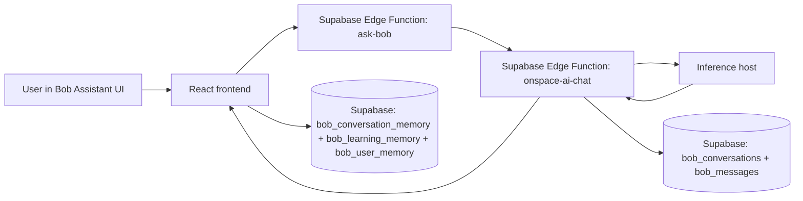

# Bob System Route Map

Last updated: 2026-05-15

## 1) End-to-end topology (canonical chat path)

Primary execution path:
1. User sends prompt from Bob assistant surfaces.
2. Frontend invokes `ask-bob` for action-first/video intents and/or `onspace-ai-chat` via `edgeFunctions.aiChat`.
3. `ask-bob` enforces org access and forwards general inference to `onspace-ai-chat`.
4. `onspace-ai-chat` selects provider path (`/runsync` for RunPod serverless, `/chat` for non-serverless inference host) and persists conversation state.
5. Frontend writes supplemental learning/memory rows to Bob memory tables.

## 2) UI and route surfaces

Canonical Bob routes are defined in App routing and route manifest:
- `/bob-assistant` (main chat/studio)
- `/bob-intake-queue`
- `/live-plan-reviews`
- `/bob-ui-review`
- `/admin/video-generation`
- `/bob-proposals-log`

Alias routes redirect to canonical assistant:
- `/bob` -> `/bob-assistant`
- `/bob-studio` -> `/bob-assistant`
- `/bob/assistant-studio` -> `/bob-assistant`

Navigation + role mapping is wired in:
- `src/App.tsx`
- `src/navigation/routeManifest.ts`
- `src/components/features/AppLayout.tsx`

Primary Bob assistant page and interaction surface:
- `src/pages/BobAssistantStudio.tsx`

## 3) Frontend call graph (Bob)

Main frontend gateway wrappers:
- `src/lib/edgeFunctions.ts`
  - `bobGateway(...)` -> invokes `onspace-ai-chat`
  - `aiChat(...)` -> policy prompt injection + normalization + required section enforcement
  - `grandmasterStudio(...)` -> invokes `grandmaster-studio`
  - `bobResponseFeedback(...)` -> route call to `bob-multimodal-gateway/v1/bob/response`

Primary call sites:
- `src/pages/BobAssistantStudio.tsx`
  - invokes `ask-bob` for video/action path
  - invokes `edgeFunctions.aiChat(...)` for conversational path
  - sends feedback via `edgeFunctions.bobResponseFeedback(...)`
- `src/pages/AiAnalysis.tsx`
- `src/components/features/AiFeedbackChat.tsx`
- `src/pages/GrandmasterCodingStudio.tsx`
- `src/pages/SystemDiagnostics.tsx`

## 4) Edge function route map (backend)

### 4.1 `ask-bob` (action-first orchestrator)
File: `supabase/functions/ask-bob/index.ts`

Responsibilities:
- Auth and organization scope resolution.
- Optional geospatial context fetch (`get_active_context`).
- Video intent confirmation gate.
- Delegates video execution to `bob-generate-video-action`.
- Delegates normal chat to `onspace-ai-chat`.

Internal routing:
- `ask-bob` -> `bob-generate-video-action` (confirmed video intents)
- `ask-bob` -> `onspace-ai-chat` (general chat)

### 4.2 `onspace-ai-chat` (core brain gateway)
File: `supabase/functions/onspace-ai-chat/index.ts`

Responsibilities:
- Auth + role mode enforcement.
- Immutable system policy composition.
- Message history restoration from `bob_conversations` + `bob_messages`.
- Provider selection:
  - RunPod serverless path: `POST <base>/runsync` with `input` envelope
  - Non-serverless path: `POST <base>/chat`
  - Local Ollama path: `POST <OLLAMA_BASE_URL>/api/chat`
- Conversation persistence back to `bob_messages`.

Key behavior:
- RunPod URL normalization strips `/run` and `/runsync` suffixes and reattaches `/runsync`.
- Retry and compatibility fallback for transient `/api/chat` worker errors.

### 4.3 `grandmaster-studio` (privileged control plane)
File: `supabase/functions/grandmaster-studio/index.ts`

Responsibilities:
- Role-gated orchestration for coding studio and diagnostics actions.
- Proxies to inference service endpoints:
  - `/code/task`, `/code/tasks`, `/code/assist`, `/ask-copilot`, `/doctor/health`, `/health`
- Applies mutation contract checks before execution.

### 4.4 `bob-code-change-task` (owner-gated code task executor)
File: `supabase/functions/bob-code-change-task/index.ts`

Responsibilities:
- Grandmaster owner-only guard.
- Policy tiering (`auto_fix_allowed`, `approval_required`, `never_auto_fix`).
- Sends patch-task requests to inference service self-heal endpoint.

### 4.5 `bob-multimodal-gateway` (feedback and multimodal ingress)
File: `supabase/functions/bob-multimodal-gateway/index.ts`

Routes:
- `/v1/bob/interpret`
- `/v1/bob/request_ai`
- `/v1/bob/response`
- `/v1/bob/execution`
- `/v1/bob/privacy/consent`
- `/v1/bob/privacy/delete`

### 4.6 `bob-generate-video-action` (action executor)
File: `supabase/functions/bob-generate-video-action/index.ts`

Responsibilities:
- Org scoping + user session validation.
- Daily org and per-user quotas via `media_generation_log`.
- Delegates actual generation to `generate-briefing-video`.

## 5) Persistence map (brain and memory)

### Conversation state
- `public.bob_conversations`
- `public.bob_messages`
Migration: `supabase/migrations/20260430000001_bob_conversation_memory.sql`

### Session continuity memory
- `public.bob_conversation_memory`
Migration: `supabase/migrations/20260604000006_bob_conversation_memory.sql`

### User memory profile/context
- `public.bob_user_memory`
Migration: `supabase/migrations/20260512000004_bob_user_memory_and_actuation.sql`

### Learning memory
- `public.bob_learning_memory`
Migration: `supabase/migrations/20260604000004_bob_learning_memory.sql`

### Durable intel fallback store
- `public.external_intel_bulletins`
Migration: `supabase/migrations/20260402000100_external_intel_bulletins.sql`

Frontend memory utility entry points:
- `src/lib/bobLearningMemory.ts`

## 6) Host and endpoint resolution matrix

Canonical env aliases used across scripts and functions:
- Base URL aliases:
  - `BOB_SERVICE_URL`
  - `INFERENCE_SERVICE_URL`
- API key aliases:
  - `BOB_INFERENCE_API_KEY`
  - `INFERENCE_API_KEY`
  - `RUNPOD_ENDPOINT_API_KEY` / `RUNPOD_API_KEY`
- RunPod endpoint derivation:
  - `RUNPOD_ENDPOINT_ID` -> `https://api.runpod.ai/v2/<id>/runsync`

Transport mode policy:
- If endpoint matches RunPod serverless shape (`api.runpod.ai/v2/<id>`), use `/runsync` with `input` payload.
- Otherwise use direct `/chat` provider endpoint.

Representative scripts now aligned to this behavior:
- `scripts/talk-with-bob.mjs`
- `scripts/bob-direct-chat.mjs`
- `scripts/broadcast-truth-protocol.mjs`
- `scripts/bob-teach-research-methodology.mjs`
- `scripts/bob-feed-build-context.mjs`
- `scripts/bob-feed-web-research.mjs`
- `scripts/bob-feed-railway-training.mjs`
- `scripts/agentic-ui-shadow-user.mjs`

## 7) Storage bucket grounding and training path

Storage grounding feed script:
- `scripts/bob-feed-storage-bucket-grounding.mjs`

Integrated orchestration:
- `package.json` script `bob:feed-all` includes storage grounding feeder.
- `package.json` script `bob:feed-storage-grounding` available standalone.
- `package.json` script `bob:ask:storage-grounded` uses grounded ask flow.

Grounding policy in feeder includes confirmed bucket list and anti-invention behavior.
Durable fallback path for training intel is via `external_intel_bulletins` when direct ingest endpoint is not available.

## 8) Operational commands (verification and diagnostics)

Core health and capability checks:
- `npm run bob:doctor:any-container`
- `npm run bob:capabilities`
- `npm run test:bob:governance`

Chat smoke paths:
- `node scripts/bob-direct-chat.mjs "ping"`
- `node scripts/talk-with-bob.mjs`
- `node scripts/broadcast-truth-protocol.mjs`

Training/grounding:
- `npm run bob:feed-storage-grounding`
- `npm run bob:feed-all`
- `npm run bob:ask:storage-grounded -- "list verified storage buckets"`

## 9) Remaining caveats

- Some tooling intentionally retains `/chat` for non-serverless backends; this is valid when endpoint is not RunPod serverless.
- RunPod runsync session context may be ephemeral; durable grounding should be written to database-backed tables and/or replayed via grounded prompt prefixes.
- Grandmaster and code-change functions are intentionally high-restriction and role-gated; failed invocations are often policy rejections, not wiring faults.

## 10) Quick answer: is Bob wired end-to-end?

Yes. The current wiring supports:
- Plain-language chat through UI and CLI surfaces.
- Serverless RunPod transport via `/runsync` with proper envelope handling.
- Role-aware policy enforcement at gateway and mutation layers.
- Durable memory and conversation persistence across dedicated Supabase tables.
- Storage bucket grounding feed integrated into Bob training pipelines.
