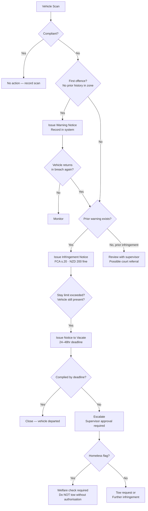
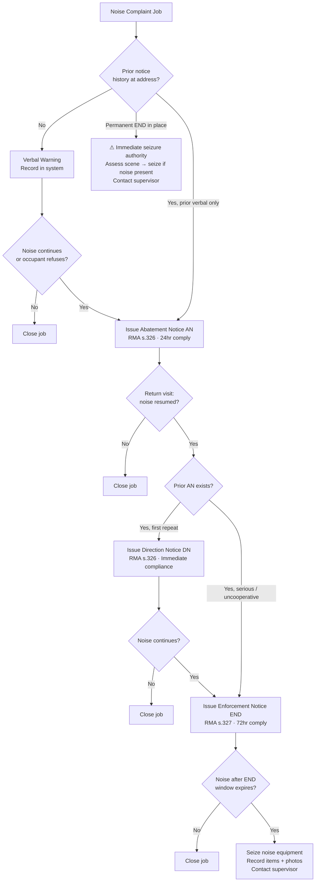

# Enforcement Escalation Decision Tree

> **Who is this for?** Field officers making real-time enforcement decisions. Keep this document bookmarked on your device.

---

## Freedom Camping Enforcement

---

## Noise Control Enforcement

---

## Decision Table Summary

### Freedom Camping

| Situation | Action |
|---|---|
| First observation, no history | Warning Notice |
| Second observation, prior warning exists | Infringement Notice ($200) |
| Stay limit exceeded, vehicle present | Notice to Vacate (24–48hr deadline) |
| NTV deadline passed, vehicle still present | Escalate to supervisor → tow or further infringement |
| Vehicle has homeless flag | Welfare check first — supervisor required before tow |
| Multiple repeat offences, court-level evidence | Court referral via Infringement track |

### Noise Control

| Situation | Action |
|---|---|
| First contact, cooperative occupant | Verbal warning (record in system) |
| First contact, uncooperative or very loud | Abatement Notice (AN) — RMA s.326, 24hr comply |
| Prior AN, noise has recurred | Direction Notice (DN) — immediate compliance |
| Prior AN or DN, serious/persistent | Enforcement Notice (END) — RMA s.327, 72hr comply |
| END issued, noise continues after 72hr | Seize equipment — document everything |
| Permanent END already in place | Immediate seizure authority — assess and act |
| H&S safety flag on property | Read safety brief before attending — contact supervisor |

---

## Notes for Officers

1. **Always check the job context panel** in the Noise Control Officer Portal before acting. The system will display prior notice banners and recommend the appropriate action.

2. **Photos and dB readings** are evidence. Capture them at the scene before issuing any notice.

3. **Homeless-flagged vehicles** require extra care at every stage. Do not proceed to tow without supervisor sign-off.

4. **When in doubt, seek guidance** — call your supervisor rather than issuing the wrong notice level. Issuing a notice at the wrong level can undermine enforcement and create legal risk.

5. **Offline?** Issue the notice anyway — the system queues it for sync. Check the queue before ending shift.

---

## Related Documents

- `OFFICER_FIELD_GUIDE_ENFORCEMENT.md` — Step-by-step instructions for each notice type
- `LEGAL_BASIS_REFERENCE.md` — NZ legislation backing each enforcement action
- `DOCUMENT_MANAGEMENT_GUIDE.md` — Finding, reprinting, and exporting notices
