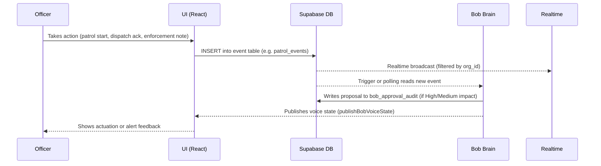

# Event Sequencing Roadmap — FieldOps Manager

**Date**: 2026-05-12  
**Status**: Phase A — Approved  
**Owner**: Data Platform Lead  
**Related Contract**: [EVENT_FAMILY_CONTRACT_2026-05-04.md](./EVENT_FAMILY_CONTRACT_2026-05-04.md)

---

## Overview

This document maps every event family to its delivery phase and defines the schema, migration, and activation sequence. Event families are **additive** — each phase adds new families without modifying existing ones.

---

## Phase-by-Phase Event Family Rollout

### Phase A — Foundation (May 12 – June 9)

**Goal**: Schema only. No live event writes from UI.

| Event Family | Table | Migration | Status |
|---|---|---|---| 
| Operational Cases (hub) | `operational_cases` | `20260504000002_case_model.sql` | ✅ Deployed |
| Patrol Events | `patrol_events` | `20260504000002_case_model.sql` | ✅ Schema deployed |
| Dispatch Events | `dispatch_events` | `20260504000002_case_model.sql` | ✅ Schema deployed |
| Enforcement Events | `enforcement_events` | `20260504000002_case_model.sql` | ✅ Schema deployed |
| Feature Flags | `feature_flags` | `20260504000003_feature_flags.sql` | ✅ Deployed |
| Bob Audit | `bob_approval_audit` | `20260504000004_bob_audit.sql` | ✅ Deployed |

**Phase A Gate**: Org isolation tests 5/5 ✅ + RLS on all 3 families ✅ + Schema matches `src/types/database.ts` ✅

---

### Phase B — Core Operational Flows (June 10 – August 4)

**Goal**: Live event writes activated for 3 bootstrap routes. `FF_PHASE_B_*` flags gate the rollout at 5% → 25% → 50% → 100%.

| Event Family | Activation Trigger | Bootstrap Route |
|---|---|---|
| `patrol_events` | `FF_PHASE_B_PATROL_EVENTS` enabled | `FieldOfficerPortal` → patrol dispatch |
| `dispatch_events` | `FF_PHASE_B_DISPATCH_EVENTS` enabled | `DispatchConsole` → job list |
| `enforcement_events` | `FF_PHASE_B_ENFORCEMENT_EVENTS` enabled | `Enforcement` → timeline |

**Additional Phase B event bridges** (already deployed via `20260505_phase_b1_bridge_to_case_model.sql`):
- `phase_b1`: patrol + respond bridge
- `phase_b2`: dispatch command bridge
- `phase_b3`: radio comms ↔ case bridge
- `phase_b4`: enforcement ↔ case bridge

---

### Phase C — Specialist Modules (August 5 – October 6)

**Goal**: Site-guard, access control, and welfare event families live.

| Event Family | Table | Purpose |
|---|---|---|
| `security_events` | `security_events` | Site-guard trespass, tailgate, POI alerts |
| `access_events` | `access_events` | Door/gate access control audit trail |
| `assistive_events` | `assistive_events` | Welfare checks, PTT call records, officer SOS |

**Phase C event bridges** (already scaffolded):
- `phase_c1`: site-guard bridge
- `phase_c2`: access control bridge
- `phase_c3`: POI/VOI/LOI evidence bridge
- `phase_c4`: assets/keys/client bridge

---

### Phase D — Bob Approval & Transition Systems (October 7 – December 1)

**Goal**: Approval events and transition/handoff events live.

| Event Family | Table | Purpose |
|---|---|---|
| `approval_events` | `bob_approval_audit` | AI-assisted proposal approvals (Bob) |
| `transition_events` | `transition_events` | Shift handoff, offline sync, cross-module state transfer |

---

### Phase E — Audit Consolidation (December 2 – January 31)

**Goal**: Full read/write audit trail consolidated. All 5 prior families feed into unified audit view.

| Event Family | Table | Purpose |
|---|---|---|
| `audit_events` | `platform_audit_events` | Consolidated audit across all families |

---

## Event Lifecycle Diagram



---

## Data Migration Strategy (Zero-Downtime)

| Phase | Migration Step |
|---|---|
| **Phase A** | Schema-only — tables created, no writes from UI |
| **Phase B start** | Edge Function `backfill-cases` trickles existing records into `operational_cases` and event tables |
| **Phase B + 1 week** | UI reads switched from legacy tables to case model; legacy tables remain as fallback |
| **Phase C** | Specialist event tables activated; legacy specialist tables deprecated |
| **Phase E** | Legacy operational tables archived; `platform_audit_events` becomes source of truth |

---

## Rollback Policy

Every Phase B+ activation is gated by a feature flag (`FF_PHASE_B_*`, `FF_PHASE_C_*`, etc.).

To roll back an activated event family:
```bash
bash scripts/rollback-feature-flag.sh FF_PHASE_B_PATROL_EVENTS
```

This sets `enabled = false` in `feature_flags` and the UI will stop writing to that event table immediately on next load.

---

## Validation Checklist (Phase A)

- [x] `operational_cases` table deployed with RLS
- [x] `patrol_events` table deployed with RLS
- [x] `dispatch_events` table deployed with RLS
- [x] `enforcement_events` table deployed with RLS
- [x] `feature_flags` table deployed with rollback script
- [x] `bob_approval_audit` table deployed with RLS
- [ ] Org isolation tests: 5/5 passing in CI (target: June 9)
- [ ] Bootstrap routes smoke tests: 3/3 passing (target: June 9)
- [ ] `src/types/database.ts` reflects all Phase A tables (target: June 9)
