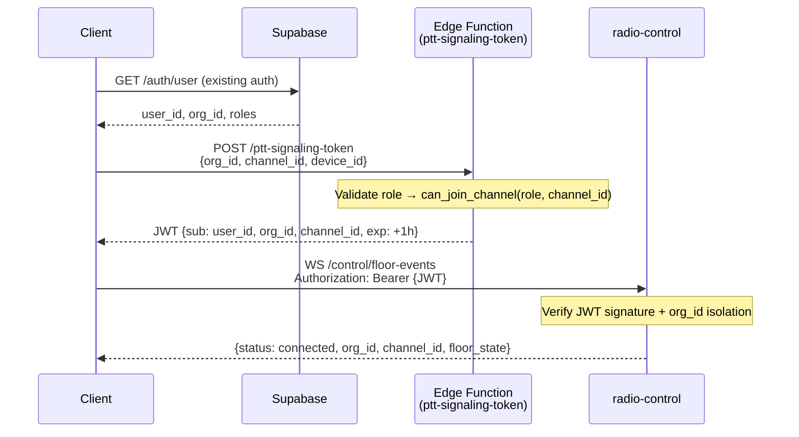
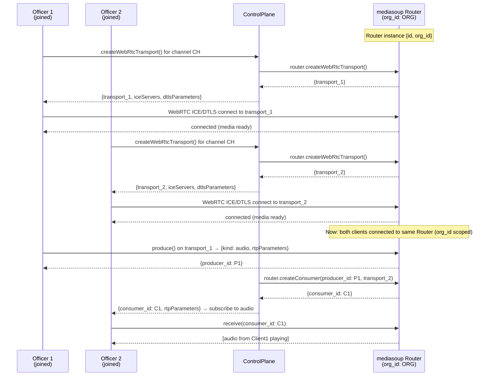
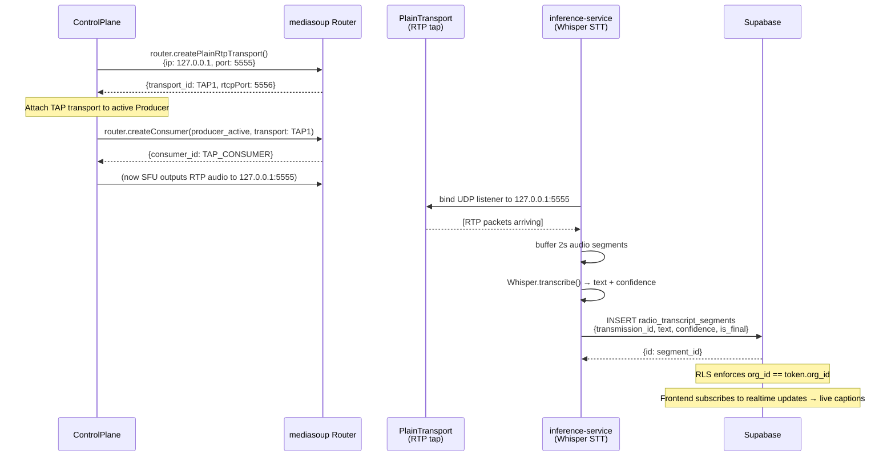
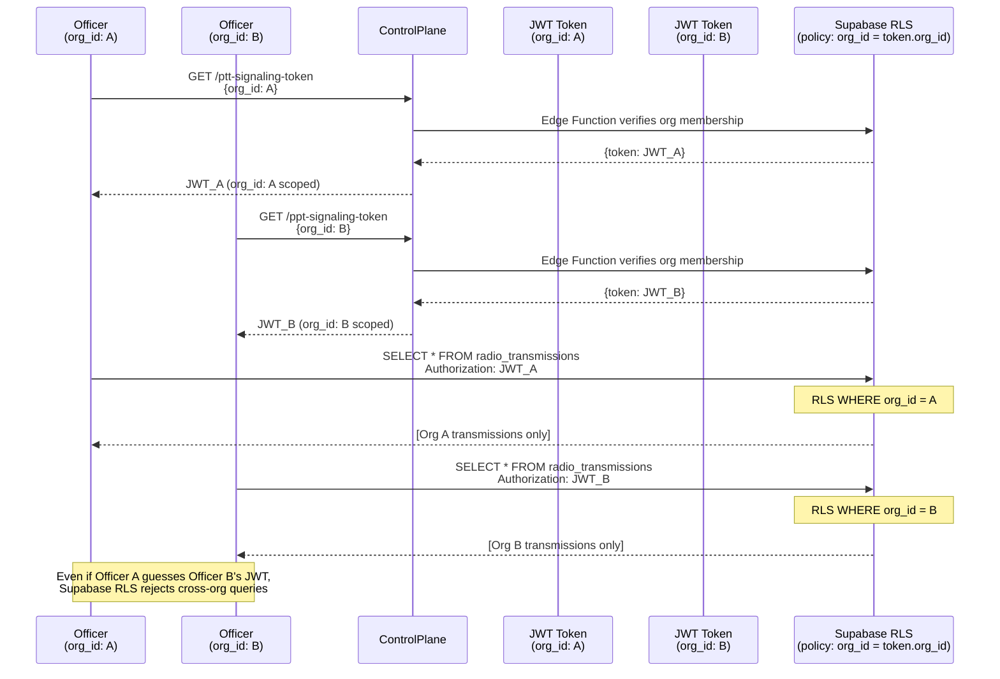
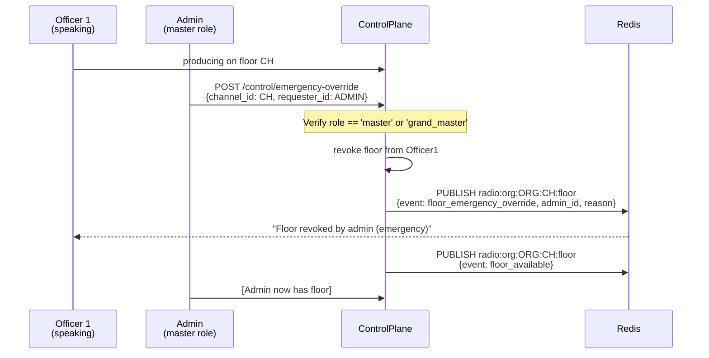
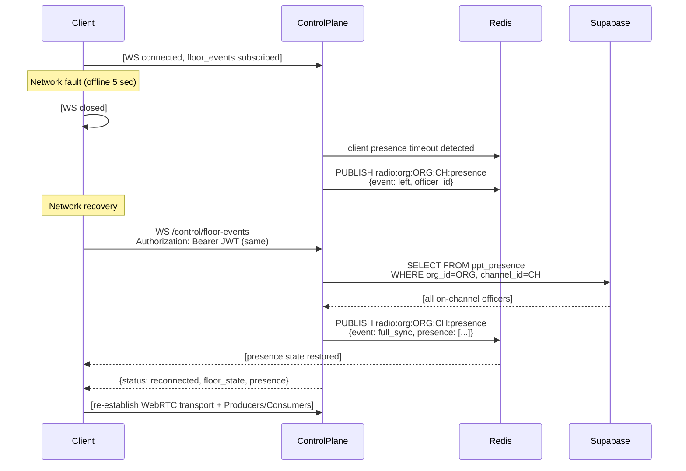

# PTT Phase 0 Service Topology — Detailed Diagrams

## Scope

This document covers the **Phase 0 architecture** (ADRs 003–008): policy plane (Supabase), control plane (`radio-control`), media plane (mediasoup SFU), and AI speech plane (`inference-service`).

---

## 1. System Overview (Three Planes + AI)

```
┌────────────────────────────────────────────────────────────────────┐
│ CLIENT LAYER (Web + React)                                         │
│ ├─ PTTRadio component (channel + floor control UI)                │
│ ├─ WebRTC transports (one per SFU Router)                         │
│ └─ Redis pub/sub subscriptions (floor + presence topics)          │
└────────┬─────────────────────────────────────────────────────────┘
         │
╔════════╩════════════════════════════════════════════════════════╗
║ POLICY PLANE (Supabase PostgreSQL + RLS)                        ║
║ ├─ Org isolation via RLS on all radio_* tables                 ║
║ ├─ Token grant endpoints (Edge Functions)                      ║
║ ├─ radio_transmissions (audit log for all TX)                  ║
║ ├─ radio_transcript_segments (STT output)                      ║
║ ├─ radio_translation_segments (translation output)             ║
║ ├─ radio_tts_renders (synthetic audio artifacts)               ║
║ ├─ radio_voice_profiles (enrolled voice clones)                ║
║ └─ radio_voice_consents (consent + revocation audit)           ║
╚════════╦════════════════════════════════════════════════════════╝
         │ JWT tokens + org_id
╔════════╩════════════════════════════════════════════════════════╗
║ CONTROL PLANE (radio-control Node/Express service)              ║
║ ├─ POST /control/floor-request (ask for speaking)              ║
║ ├─ POST /control/floor-grant (admin: grant speaker)            ║
║ ├─ POST /control/floor-deny (admin: deny speaker)              ║
║ ├─ POST /control/emergency-override                             ║
║ ├─ WebSocket /control/floor-events (room: floor + presence)    ║
║ ├─ Redis pub/sub publish/subscribe per channel                 ║
║ └─ SFU session management (mediasoup Router + Transports)       ║
╚════════╦════════════════════════════════════════════════════════╝
         │ mediasoup control API
╔════════╩════════════════════════════════════════════════════════╗
║ MEDIA PLANE (mediasoup SFU in ppt-server process)               ║
║ ├─ Routers per org (org_id → Router instance)                  ║
║ ├─ WebRtcTransports (one per client per channel)               ║
║ ├─ Producers (one active speaker per channel)                  ║
║ ├─ Consumers (all other channel members)                       ║
║ ├─ PlainTransport RTP tap for AI media (inference-service)     ║
║ └─ Recording PlainTransport fork (authorized channels)         ║
╚════════╦════════════════════════════════════════════════════════╝
         │ RTP audio segments
╔════════╩════════════════════════════════════════════════════════╗
║ AI SPEECH PLANE (inference-service Node/Python)                 ║
║ ├─ STT (Whisper) → text + confidence → Supabase                ║
║ ├─ Translation (Ollama) → target language                       ║
║ ├─ TTS (Piper neutral + Coqui XTTS) → audio artifacts          ║
║ └─ Voice profile lookup (consent check on tx_voice_twin)        ║
╚════════════════════════════════════════════════════════════════╝
```

---

## 2. Authentication Flow — JWT → Control Plane

**Phase 0 Protocol:** Clients obtain a **short-lived scoped token** from Supabase (via Edge Function) before connecting to the control plane.



---

## 3. Floor Control Flow — Request → Grant → Produce

**Phase 0 Protocol:** Floor arbitration is grant-based. Only one producer per channel at a time.

```mermaid
sequenceDiagram
    participant Officer1 as Officer 1<br/>(Wants to speak)
    participant Officer2 as Officer 2<br/>(Current speaker)
    participant ControlPlane
    participant Redis
    participant SFU as mediasoup SFU

    Officer2->>ControlPlane: produces() on WebRtcTransport
    ControlPlane->>SFU: create Producer() for Officer 2
    SFU-->>ControlPlane: {id: producer_2}
    ControlPlane->>Redis: PUBLISH radio:org:ORG:CH:floor {event: speaker_active, speaker_id: 2}
    Redis-->>Officer1: floor event (Officer 2 speaking)
    Redis-->>Officer2: floor event (you are speaking)

    Note over Officer1: Wants to speak; holds PTT
    Officer1->>ControlPlane: POST /control/floor-request {channel_id}
    ControlPlane->>Redis: PUBLISH radio:org:ORG:CH:floor {event: floor_request, requester: 1}
    Redis-->>Officer1: floor request submitted
    Redis-->>Officer2: floor request from Officer 1

    Note over Officer1: Waits for grant or timeout
    Note over Officer2: Sees request; has priority as incumbent

    Officer2->>ControlPlane: Release PTT (closes Producer)
    ControlPlane->>SFU: close Producer for Officer 2
    ControlPlane->>Redis: PUBLISH radio:org:ORG:CH:floor {event: floor_released}

    ControlPlane->>ControlPlane: floor arbitration: grant Officer 1 (first in queue)
    ControlPlane->>Redis: PUBLISH radio:org:ORG:CH:floor {event: floor_grant, speaker_id: 1}
    Redis-->>Officer1: "Floor granted"

    Officer1->>SFU: create Producer() for Officer 1
    SFU-->>Officer1: {id: producer_1}
    Officer1->>ControlPlane: [TX starts, Officer 1 producing]
```

---

## 4. Media + SFU Transport Flow

**Per-client WebRTC → Per-channel Router (org-scoped).**



---

## 5. AI Speech Tap Flow — Media → STT → Transcript

**Mediasoup PlainTransport → RTP tap → Whisper → Supabase.**



---

## 6. Org Isolation Boundaries (RLS + JWT)

**All tables enforce org_id isolation at the row level.**



---

## 7. Emergency Override Flow (Admin Only)

**Master/Grand Master can force floor control.**



---

## 8. Reconnect Workflow — Failover Resilience

**Client disconnect → Redis presence update → Rejoin → Replay state.**



---

## Phase 0 Validation Checklist

- [ ] Supabase org_id RLS policies enforced on all radio_* tables
- [ ] JWT token expiry + refresh mechanism documented
- [ ] Redis pub/sub channel isolation tested across orgs
- [ ] mediasoup Router per org_id + isolation test
- [ ] PlainTransport RTP tap→ inference-service latency <2s
- [ ] Emergency override revokes floor immediately
- [ ] Reconnect test: client rejoins, receives presence + floor state
- [ ] Load test: 100 concurrent channels, 5 floor events/sec per channel

---

## Next Steps (Phase 1)

1. **Ticket Group C: Client Refactor** — migrate React PTT component from peer-to-peer to SFU transport.
2. **Ticket Group D: Service Buildout** — wire up control plane (floor arbitration), mediasoup startup, AI media tap.
3. **Ticket Group B: Data Model** — RLS policies, Edge Function token grants.
