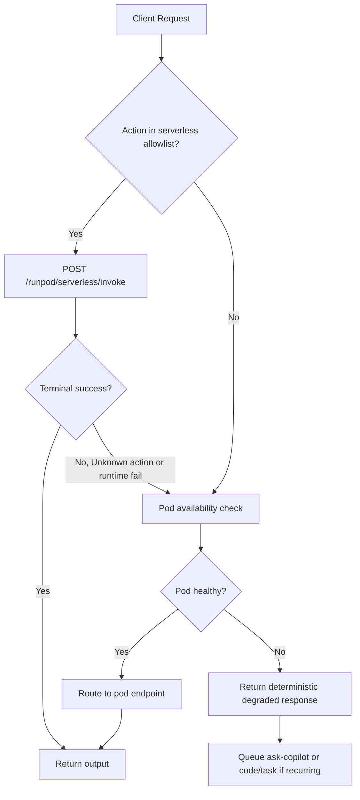
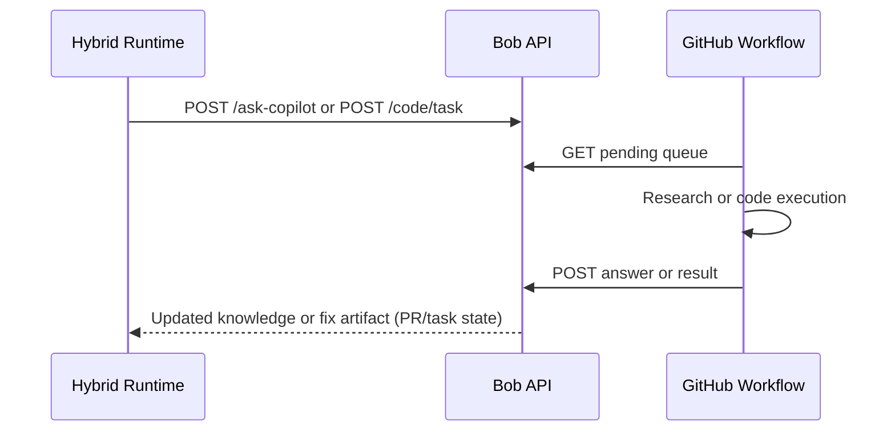

# RunPod Hybrid Runbook (Serverless + Pod + Copilot Sub-Agent Bridge)

Last updated: 2026-05-01
Owner: FieldOps AI Platform Ops

## 1. Scope

This runbook defines how to operate RunPod in hybrid mode for FieldOps:

1. Serverless as primary execution path.
2. Pod as stateful and heavy-workload path.
3. Controlled orchestration through `inference-service`.
4. Sub-agent bridge through Bob's existing Copilot workflows.

## 2. Current Verified Runtime Facts

Environment and code paths confirm:

1. Serverless invoke/status routing exists in `inference-service/server.js` via:
   - `POST /runpod/serverless/invoke`
   - `GET /runpod/serverless/status/:jobId`
2. Pod lifecycle control exists in `inference-service/server.js` via:
   - `GET /runpod/pod`
   - `POST /runpod/pod/start`
   - `POST /runpod/pod/stop`
3. Serverless endpoint health and auth are already validated by workflows:
   - `.github/workflows/ops-runpod-serverless-smoke.yml`
   - `.github/workflows/ops-bob-capability-watchdog.yml`

Live action probe against endpoint `n0bp1ifmq01cx2` (2026-05-01):

1. `ping`: supported
2. `chat`: supported
3. `review`: supported
4. `assess`: supported
5. `translate`: supported
6. `training_note`: supported
7. `ui_vision`: callable, but fails without required `image_b64`
8. `run_playwright`: returns `Unknown action: run_playwright`

Operational implication:

1. The deployed serverless worker currently supports core text actions.
2. Playwright action is not available on live serverless runtime right now.
3. Vision route is available but strict on input contract.

## 3. Hybrid Architecture Standard

### 3.1 Traffic Roles

1. Serverless path (default): low-latency, burstable, cost-efficient for common actions.
2. Pod path (selective): long-running, stateful, heavy/multistep diagnostics and workloads requiring full runtime parity.

### 3.2 Routing Matrix

Use this default until explicitly overridden:

1. Route to serverless:
   - `ping`, `chat`, `review`, `assess`, `translate`, `training_note`
2. Route to pod:
   - actions unavailable in serverless
   - workload needs local disk/session continuity
   - workload needs toolchain/runtime not present in serverless image
3. Reject early with explicit error:
   - action unsupported by both runtimes
   - payload missing mandatory fields (for example, `ui_vision` without `image_b64`)

### 3.3 Orchestration Rule

All app-level routing should go through `inference-service/server.js` wrappers, not direct ad hoc endpoint calls:

1. serverless: `invokeRunpodServerless(...)`
2. pod control: `runpodPodManager.*`

This preserves one policy layer for auth, timeout, polling, and error normalization.

## 4. Recommended Failover Logic

### 4.1 Decision sequence

1. Validate payload contract for requested action.
2. Attempt serverless first when action is in serverless allowlist.
3. If serverless returns `Unknown action` or explicit capability failure, route to pod.
4. If pod unavailable, return deterministic degraded response and queue follow-up task.

### 4.2 Error classes

1. Capability mismatch:
   - signature: `Unknown action: <action>`
   - response: reroute or fail with capability error code
2. Input contract error:
   - signature: for example `image_b64 required`
   - response: 4xx-style client fix guidance, no reroute
3. Runtime outage:
   - signature: timeouts/5xx/unreachable
   - response: fallback to alternate runtime where valid

## 5. Copilot Sub-Agent Bridge (How Both Paths Link To Agentic Work)

Use the existing Bob queues as the stable bridge between runtime execution and Copilot-driven sub-agent work.

### 5.1 Research sub-agent bridge

Current implementation already exists:

1. Queue question: `POST /ask-copilot`
2. Poll queue: `GET /ask-copilot/pending`
3. Answer back: `POST /ask-copilot/:id/answer`
4. Workflow executor: `.github/workflows/ops-bob-ask-copilot.yml`

Use this when hybrid routing finds a gap and needs researched remediation guidance.

### 5.2 Code sub-agent bridge

Current implementation already exists:

1. Queue coding task: `POST /code/task`
2. Pull task: `GET /code/tasks/pending`
3. Mark progress/result: `/code/tasks/:id/*`
4. Workflow executor: `.github/workflows/ops-bob-code-task.yml`

Use this when hybrid routing identifies missing action support, wrong payload contracts, or deployment drift that requires code changes.

### 5.3 Hybrid escalation policy

When runtime routing fails:

1. First failure: return user-facing actionable error.
2. Second similar failure in same category: queue `ask-copilot` diagnostic question.
3. Repeated operational pattern: queue `code/task` to implement permanent fix.

## 6. Canonical Hybrid Flows

### 6.1 Request execution flow

### 6.2 Sub-agent remediation flow

## 7. Operational Guardrails

1. Keep serverless as primary for production traffic.
2. Keep single-pod policy unless an incident commander approves expansion.
3. Use immutable image digests for templates/endpoints.
4. Do not assume action availability from local code alone; validate live endpoint capabilities.
5. Do not treat HTTP 200 transport as functional success; inspect job status and output payload.

## 8. Validation Checklist

After any runtime or routing change:

1. Run `.github/workflows/ops-runpod-quickcheck.yml`.
2. Run `.github/workflows/ops-runpod-serverless-smoke.yml`.
3. Run `.github/workflows/ops-bob-capability-watchdog.yml` for both targets.
4. Validate at least one serverless and one pod scenario through `inference-service` proxy endpoints.

## 9. Known Gaps (Current)

1. Serverless `run_playwright` is currently not implemented in the deployed runtime (`Unknown action`).
2. Capability drift can occur between local `runpod-worker/handler.py` and deployed endpoint image.
3. Pod readiness and proxy health must be treated as independent from control-plane `RUNNING` status.

## 10. Next Engineering Actions

1. Add a serverless capability manifest endpoint or standardized `capabilities` action.
2. Enforce capability-gate before dispatching action classes in hybrid router.
3. Add workflow gate that blocks rollout if mandatory actions are missing on live serverless endpoint.
