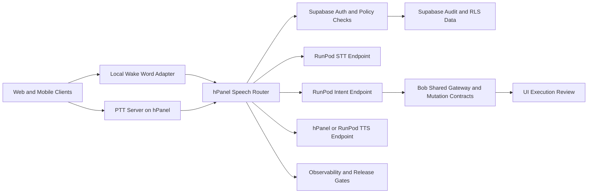

# Self-Hosted Enterprise Speech Stack Spec

Date: 2026-05-06
Owner: Master Systems Manager
Status: Proposed

## Bob Assistant User-Only Policy

1. Bob assistant behavior is strictly user-scoped, not organization-scoped.
2. Access to Bob speech capabilities follows authenticated user identity, even if a user moves between organizations.
3. Organization context may be carried only as optional metadata for analytics or routing hints, never as an access restriction.

## Purpose

Define an enterprise-grade, self-hosted speech and intent platform for Bob that uses the full FieldOps Manager stack deliberately:

1. Web frontend and mobile app for wake-word capture and operator UX.
2. Supabase for authentication, user context, audit, RLS, and policy enforcement.
3. hPanel VPS for always-on speech control-plane routing and PTT-aligned orchestration.
4. RunPod for GPU-heavy inference workloads.
5. Existing Bob governance contracts for safe execution and review.
6. Existing CI and release gates for staging, documentation, and policy compliance.

This spec replaces proprietary wake-word and intent lock-in with a modular architecture built on open model formats and self-hosted endpoints.

## Why This Should Exist

The repo already establishes the following truth:

1. Railway is proxy-only and should not regain ownership of Bob or speech inference.
2. Bob and Ollama are already oriented around RunPod and hPanel/VPS-backed operational control.
3. PTT and voice workflows are first-class operational capabilities, not side features.
4. Governance, tenancy, and audit requirements are stronger than the needs of a generic voice assistant.

Therefore this capability belongs inside the existing enterprise stack, not in a third-party assistant platform.

## User and Role Outcomes

### Field officer

1. Can activate Bob hands-free with a local wake word.
2. Can speak naturally instead of filling forms under operational load.
3. Receives clear confirmation, degraded-mode guidance, and synthetic-audio labeling.
4. Never triggers write actions without explicit policy and role checks.

### Admin and master

1. Can review intent outcomes, confidence, latency, and audit logs.
2. Can enable speech features per environment and later per user cohort.
3. Can observe degradation before it becomes an operational outage.

### Grand master / owner

1. Retains full infrastructure and model control.
2. Avoids vendor lock-in for wake word, STT, intent, and TTS.
3. Can move modules between RunPod, VPS, or future self-hosted GPU without rewriting the whole system.

## Full-Stack Architecture

## Component Responsibilities

### 1. Client wake-word and audio capture

Primary role:

1. Detect wake word locally to avoid streaming ambient audio by default.
2. Provide immediate operator feedback through haptics, visual state, and timeout handling.
3. Capture short audio windows and forward only activated interactions.

Technology direction:

1. Sherpa-ONNX for primary keyword spotting.
2. openWakeWord as the training and experimentation lane.
3. Web and Expo adapters, but the first production lane should prioritize the mobile field workflow.

### 2. hPanel speech router

Primary role:

1. Act as the always-on speech control plane.
2. Receive audio from clients and authenticated internal callers.
3. Attach user, route, and session context.
4. Route STT, intent, and TTS requests to the correct provider.
5. Centralize retries, timeouts, circuit breaking, and fallbacks.

Why hPanel owns this:

1. It already hosts PTT signaling and the lowest-latency always-on operational voice tier.
2. It is a better control-plane home than a burst-only inference runtime.

### 3. RunPod inference endpoints

Primary role:

1. Perform GPU-heavy STT.
2. Perform intent extraction and structured JSON routing.
3. Optionally perform higher-quality or voice-clone TTS in later phases.

Model direction:

1. STT: Faster-Whisper, starting with `small` or `distil-large-v3` depending latency budget.
2. Intent: Phi-3 mini or Llama 3.1 8B Instruct with structured JSON output.
3. TTS neutral voice: Kokoro or Piper-compatible endpoint.
4. Voice twin remains phase-gated and governed by existing ADR constraints.

### 4. Supabase policy and audit layer

Primary role:

1. Authenticate every speech-to-intent request.
2. Bind requests to authenticated user context.
3. Store transcripts, intent decisions, execution review, and later audio render metadata.
4. Enforce user-scoped Bob memory and user-only speech access control.

### 5. Bob shared gateway and execution contracts

Primary role:

1. Convert intent outputs into safe, role-aware actions.
2. Reuse the existing mutation catalog and execution-review pipeline.
3. Prevent speech becoming a bypass around Bob governance.

## Enterprise Best Practices To Adopt

1. Keep control plane and inference plane separate.
2. Keep local wake-word detection on-device whenever possible.
3. Require structured JSON from intent models rather than freeform prose.
4. Use explicit confidence thresholds and require confirmation below threshold.
5. Treat STT, intent, and TTS as independent modules with swappable providers.
6. Keep every write path behind existing Bob contract enforcement.
7. Make degraded mode first-class: speech failure must not break radio or operator workflows.
8. Tag all synthetic audio clearly in UI and audit logs.
9. Keep per-user memory and policy toggles user-scoped.
10. Tie deploy readiness to measurable latency, confidence, and safety gates.

## Security and Compliance Constraints

1. No speech feature may bypass Supabase auth and RLS context.
2. No vendor dependency may become mandatory for core wake-word or intent routing.
3. Voice data and synthetic audio handling must respect existing NZ privacy and consent ADRs.
4. User-scoped audit records are mandatory for all executed or suggested actions.
5. The speech router must never become a generic unauthenticated inference proxy.

## Observability and Enterprise Operations

The speech stack must emit:

1. Wake-word activation counts.
2. False-accept and false-reject tuning data where available.
3. STT latency, transcript confidence, and failure rates.
4. Intent confidence and confirmation-required rates.
5. TTS synthesis latency and provider usage.
6. Per-org and per-role feature usage.
7. Circuit-breaker state for upstream inference providers.

## Release Strategy

### Phase 1

1. Speech router deployed on hPanel.
2. RunPod STT and intent endpoints reachable.
3. No automatic mutations.
4. Read-only or advisory intent outcomes only.

### Phase 2

1. Mobile-first wake-word lane enabled.
2. Haptic confirmation and degraded states implemented.
3. Audit and observability wired.

### Phase 3

1. Controlled execution flows reuse Bob mutation contracts.
2. Confirmation gating enabled by confidence and action type.
3. Governance and route grounding checks expanded.

### Phase 4

1. Neutral TTS productionized.
2. PTT-linked workflows supported.
3. Voice-twin remains separately gated.

## Benefits To The Team and Business

1. Infrastructure ownership stays inside your stack.
2. Providers can be swapped without redesigning the app.
3. Legal and audit posture is stronger than a closed SDK path.
4. Operational latency can be optimized per module.
5. The mobile and web teams work against explicit contracts instead of vendor SDK behavior.
6. Bob remains a governed enterprise copilot, not a side-channel assistant.

## Self-Critique

1. This design adds another control-plane service on hPanel, which increases operational complexity unless it is monitored and deployed with the same discipline as PTT.
2. The spec assumes RunPod remains the preferred GPU tier; if you fully exit external GPU hosting later, the intent and STT capacity plan must be rewritten.
3. The design is stronger on architecture and safety than on field-data tuning; wake-word thresholds and confidence gates will still need real operational audio evidence before they are trustworthy.

## Acceptance Criteria

1. Speech requests always include authenticated user and organization context.
2. Advisory speech intents never bypass the Bob shared gateway for execution-capable actions.
3. STT and intent providers are swappable without changing client contracts.
4. Degraded-mode behavior is visible and non-destructive.
5. CI and governance docs reflect the new architecture before production enablement.