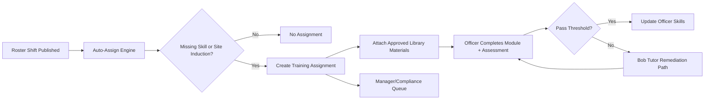

# Training Ecosystem Research and Integration Plan (2026-05-08)

## Goal

Design an enterprise-grade training ecosystem in FieldOps Manager where:
- Bob can generate and tutor training from source materials
- training is reusable and composable (no repeated manual recreation)
- training is auto-assigned from roster skill/site requirements before shift start
- legal references and NZ best-practice checks are explicit and auditable

---

## Research Inputs

### Internal Grounded Sources

1. Realignment architecture rules:
- `docs/BUILD_REALIGNMENT_PLAN_2026-05-04.md` section 9 (data orchestration down-layer), section 11 (phase delivery).

2. Bob/OpenAI runtime and policy:
- `docs/AI_SERVICE_CONFIGURATION.md` (build-training mode, purpose-gated OpenAI usage)
- `docs/LEGAL_BASIS_REFERENCE.md` section 6 (OpenAI research/training privacy controls under NZ Privacy Act 2020).

3. Existing training-related implementation:
- `src/pages/OfficerSkills.tsx` (Bob classroom tutor)
- `supabase/migrations/20260508000003_training_library_and_auto_assignment.sql` (library + assignment + auto-assign RPC)
- `docs/adr/011-training-orchestration-and-auto-assignment.md`

### External Pattern Benchmark (Directional)

Market-leading LMS patterns are consistently built around:
- reusable content libraries and course versioning
- role/audience-based assignment automation
- learning paths with prerequisites
- assessments and competency/certification state
- manager dashboards and compliance reporting
- mobile-first access and microlearning
- integration APIs/webhooks and SSO/identity controls

These patterns align with enterprise platforms such as TalentLMS, Moodle Workplace, Docebo, 360Learning, Cornerstone, and public accessibility/UX guidance already indexed in `docs/uiux-master-redesign/external-pattern-matrix-2026.md`.

---

## Enterprise Target State

## 1) Domain Architecture

### Content Domain
- Canonical source: `training_material_library`
- Adds lifecycle state: `draft`, `legal_review`, `approved`, `retired`
- Supports compositing: module can be assembled from existing material IDs
- Supports media strategy: image/video/interactive/document/composite

### Assignment Domain
- Canonical source: `training_assignments` + `training_assignment_materials`
- Assignment reasons normalized: `skill_gap`, `site_induction`, `refresher`, `compliance_update`, `custom`
- Assignment SLA controls: due windows, overdue policy, escalation rules

### Competency Domain
- Canonical source of granted competency remains `officer_skills`
- Training completion events map to competency grants or renewals
- Certification expiry and recompletion windows are first-class

### Orchestration Domain
- Auto-assignment from roster: required skills + site induction gap detection
- Triggering modes:
  1. Manual run (admin)
  2. Scheduled run (cron/edge scheduler)
  3. Event-driven run (on shift publish/change)

### Governance Domain
- Legal verification pipeline for NZ references
- Purpose and source traceability for Bob/OpenAI research/training prompts
- Immutable evidence for assignment decisions and completion outcomes

---

## 2) Bob + OpenAI Research/Tutor Strategy

Bob should operate in two explicit modes:

1. `training-composer` mode
- Inputs: source text, legal context, reusable materials
- Outputs: lesson plan, assessments, media prompts, tutor scripts

2. `training-verifier` mode
- Inputs: generated draft + legal references + source materials
- Outputs: verified claims, needs-review claims, legal risk notes, remediation recommendations

OpenAI usage policy:
- Allowed only for declared purpose `research` or `training`
- Always attach `openai_purpose`
- Apply data minimization/redaction before external processing
- Persist audit metadata for legal basis and purpose

(See `docs/AI_SERVICE_CONFIGURATION.md` and `docs/LEGAL_BASIS_REFERENCE.md`.)

---

## 3) Realignment-Compliant Integration Pattern

Per section 9 in `docs/BUILD_REALIGNMENT_PLAN_2026-05-04.md`, avoid page-owned query clusters.

Adopt this layering:

1. Edge/RPC and DB as canonical mutation/read contracts.
2. Domain services under `src/lib/` own orchestration and query shapes.
3. Hooks/pages consume domain services and focus on UI state only.

Initial step completed:
- Added `src/lib/trainingOrchestration.ts` to centralize training-library and assignment orchestration reads/writes.

---

## 4) Required Enterprise Controls

### Security and Privacy
1. Org isolation on all training tables (RLS + tested policies).
2. Cross-org operations limited to master/grand_master by explicit policy.
3. Redaction-first for external research/training payloads.

### Compliance
1. Human legal signoff required before policy-critical module publication.
2. Track legal reference quality state (`verified` vs `needs_review`).
3. Keep source-of-truth links for every legal statement.

### Reliability
1. Idempotent auto-assignment (no duplicate active assignments).
2. Scheduler-safe retries with conflict-safe dedupe.
3. Degradation path if Bob/OpenAI unavailable (fallback to approved static training).

### Auditability
1. Assignment generation reason persisted (skill gap/site induction).
2. Completion event history with timestamps and actor identity.
3. Versioned training modules with who/why/when changes.

---

## 5) Functional Blueprint

### Training Authoring
- Drop source material into Bob
- Select topic/audience/skill targets/site scope
- Generate module draft and assessment pack
- Run legal/fact verification
- Submit for legal review
- Publish to reusable library

### Training Assignment
- Trigger auto-assignment for shifts within X hours
- Create assignments for missing skills/site induction
- Attach best matching approved modules
- Notify officer + manager
- Escalate if overdue and shift is approaching

### Training Completion and Skill Grant
- Officer completes module and assessment
- Bob tutor supports wrong-answer remediation
- If pass threshold met, update competency state (`officer_skills`)
- If fail, assign remediation path and recompletion due date

### Targeted Recomposition
- Bob selects approved modules or module fragments by skill/site/risk profile
- Bob assembles short targeted pre-shift training packs
- Preserve lineage (`composed_from_material_ids`) for audit and reuse

---

## 6) Delivery Plan (Enterprise Slices)

### Slice 1: Governance and Lifecycle
- Add module status lifecycle and legal approval gate
- Add provenance fields for references and source traceability

### Slice 2: Completion and Competency
- Add completion attempts table (score, pass/fail, attempt count)
- Add competency grant/renewal bridge into `officer_skills`

### Slice 3: Automation Hardening
- Add scheduler for pre-shift assignment runs
- Add notifications/escalation for overdue mandatory training

### Slice 4: Manager and Compliance Analytics
- Readiness dashboard: shift-ready percentage, missing skills, overdue training
- Compliance dashboard: required/recompletion completion rates by org/site/team

### Slice 5: Bob Chat Integration
- Bring training-composer and verifier actions into Bob Assistant Studio
- Keep approvals and audit trail aligned with existing Bob action governance

---

## 7) Success Metrics

1. Pre-shift readiness rate (officer has all required skills/inductions before shift)
2. Skill gap closure time (assignment created to competency achieved)
3. Mandatory training overdue rate
4. Recompletion compliance rate
5. Legal review turnaround time for policy-critical modules
6. Content reuse ratio (reused modules vs net-new module creation)

---

## Mermaid

