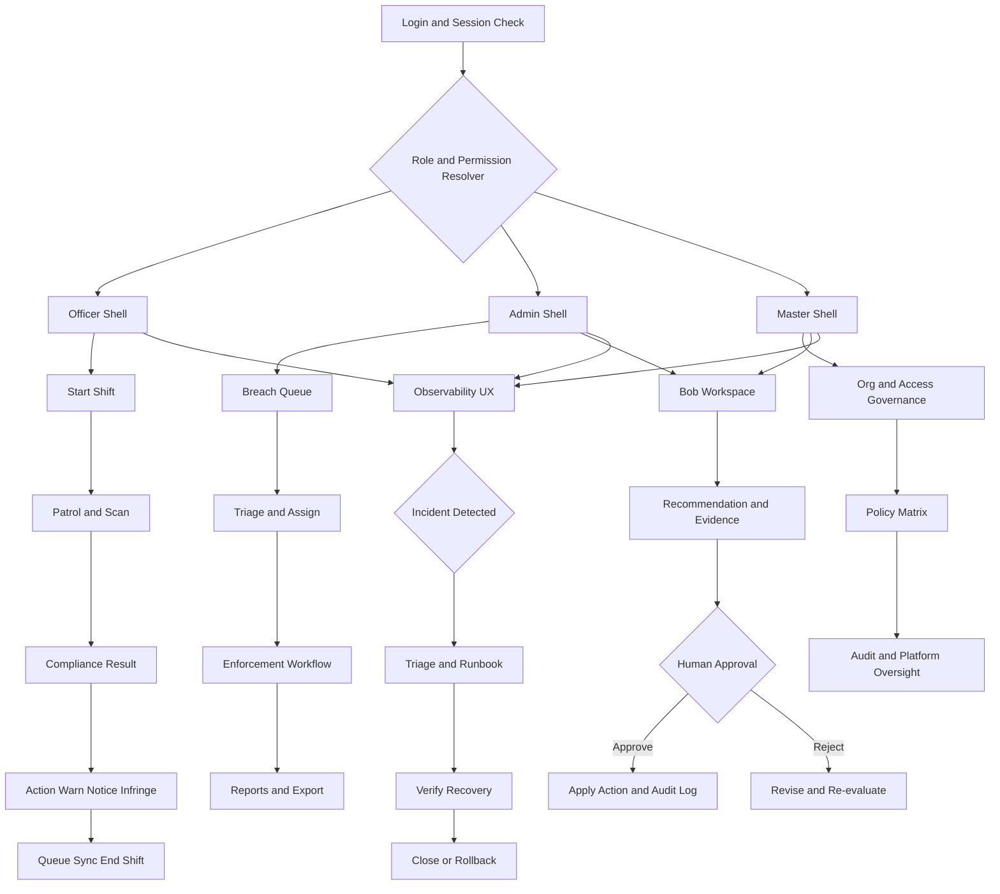

# FieldOps Manager UX/UI Architecture Blueprint (Merged)

Status: Approved reference draft for implementation
Date: 2026-04-23
Scope: Frontend UX/UI architecture, navigation, reliability UX, rollout strategy
Prepared by: Copilot (owner), with live Bob, Dr Bob, and human-test synthesis

## Purpose

This document is the permanent reference architecture for the upcoming UX/UI rebuild and migration work.
It merges three planning perspectives:

1. Bob: role-focused UX structure and consistency
2. Dr Bob: reliability, observability, and operational guardrails
3. Human-test architecture: phased migration, concrete workflows, acceptance criteria

This file is the implementation baseline unless superseded by a newer version.

---

## Executive Decisions

1. Use three production shells only: Officer, Admin, Master.
2. Keep Bob as an assistive workspace, not a primary shell.
3. Adopt a single route manifest as source of truth.
4. Migrate route/nav in phases with a compatibility adapter (no big-bang cutover).
5. Remove internal/dev tooling from production navigation.
6. Embed observability UX in each shell (health, incidents, rollback state).
7. Enforce release gates (build/lint, synthetic checks, role smoke, perf, accessibility).

---

## Best-Source Merge Matrix

### Adopt

1. Bob: role-specific shell architecture.
2. Bob: design-token-driven consistency.
3. Dr Bob: observability and incident triage UX.
4. Dr Bob: release/rollback guardrails.
5. Human-test: phased adapter migration + acceptance test matrix.
6. Human-test: explicit accessibility and performance budgets.

### Modify

1. Bob route-registry proposal: implement as route manifest + adapter for safe migration.
2. Bob workspace: require human approval for all mutating actions.
3. Dr Bob SLO defaults: calibrate to realistic current app baselines before enforcing hard gates.

### Reject

1. Big-bang route migration.
2. Production exposure of internal diagnostics tools.
3. Unapproved AI-initiated mutating operations.

---

## Target Architecture

## 1. Shell Model

### Officer Shell (mobile-first)

Primary outcomes:

1. Start shift
2. Patrol + scan
3. Compliance result
4. Enforcement action
5. Queue/sync clarity
6. End shift summary

Design constraints:

1. Minimal branching
2. Large tap targets
3. Night/high-contrast support
4. Offline-first interaction patterns

### Admin Shell (queue-first)

Primary outcomes:

1. Breach triage
2. Assignment and enforcement
3. Incident management
4. Reporting and exports

Design constraints:

1. Fast filter/search loops
2. Dense but scannable tables/cards
3. Clear status transitions with audit visibility

### Master Shell (governance-first)

Primary outcomes:

1. Org and access governance
2. Policy and matrix management
3. Platform oversight and audit

Design constraints:

1. Clear policy change intent
2. Guardrails around high-risk operations
3. Full traceability for configuration decisions

### Bob Workspace (assistive)

Placed inside Admin and Master contexts.

Capabilities:

1. Recommendations and draft actions
2. Evidence/context display
3. Human approval gate
4. Action audit record generation

Rule:

No direct state mutation without explicit human approval.

---

## 2. Navigation and Route Manifest

One route manifest drives:

1. Sidebar navigation
2. Top-level navigation metadata
3. Mobile nav priorities
4. Search indexing and discoverability

Minimum route manifest fields:

1. routeId
2. path
3. shell
4. navGroup
5. rolesAllowed
6. permissionArea
7. visibilityMode (production, internal, hidden)
8. featureFlag
9. mobilePriority
10. preloadPolicy

Migration method:

1. Introduce manifest and adapter layer first.
2. Migrate route groups incrementally by domain.
3. Remove legacy nav definitions only after parity validation.

---

## 3. Design System and Tokens

Token layers:

1. Core tokens: color, spacing, type, radius, elevation, motion.
2. Semantic tokens: success, warning, breach, queued, offline.
3. Context tokens: night patrol, high contrast, dispatch mode.

Component layers:

1. Primitive (button, input, dialog, table, badge)
2. Composite (filters, cards, form blocks)
3. Domain widgets (scan card, breach card, enforcement timeline, triage queue)

Accessibility baseline:

1. WCAG 2.2 AA
2. Keyboard navigation for Admin/Master
3. Screen reader labels in Officer critical paths
4. Reduced-motion support
5. Color meaning always paired with text/icon cues

---

## 4. State and Data UX Architecture

1. Server state by domain, with explicit cache freshness rules.
2. Local UI state contained per shell boundary.
3. Officer offline mutation queue with deterministic replay.
4. Reconnect conflict UX with clear user controls and audit event output.

---

## 5. Reliability UX and Guardrails

Required in-app observability surfaces:

1. Current health status by domain/service
2. Incident feed and severity
3. Assigned runbook/actions
4. Verification status
5. Rollback controls and status

Release gates:

1. Build and lint pass
2. Synthetic monitor pass
3. Role journey smoke pass
4. Performance budget pass
5. Accessibility gate pass

Rollback sequence:

1. Feature flag rollback
2. Route visibility rollback
3. Deployment rollback

---

## 6. Performance and Accessibility Budgets

Officer Shell:

1. Key flow interactive under 2.5s on 4G median
2. Action feedback under 150ms

Admin Shell:

1. Queue initial data under 2.0s
2. Filter response under 300ms

Master Shell:

1. Governance pages under 2.5s

Shared:

1. Primary route chunk target under 250KB gzip where practical
2. Lazy load non-critical routes with intent-based prefetch
3. Critical accessibility defects must be zero at release

---

## 7. 12-Week Implementation Roadmap

### Weeks 1-2

1. Finalize route manifest schema.
2. Build compatibility adapter.
3. Hide internal tools from production nav.
4. Capture baseline UX and reliability metrics.

### Weeks 3-4

1. Migrate Officer critical path.
2. Harden offline queue and reconnect UX.
3. Validate night/high-contrast usability.

### Weeks 5-6

1. Migrate Admin breach/enforcement queues.
2. Integrate observability UI surfaces.
3. Validate incident triage flow.

### Weeks 7-8

1. Migrate Master governance surfaces.
2. Integrate Bob workspace with approval gates.
3. Add full audit linkages for Bob-assisted actions.

### Weeks 9-10

1. Cross-shell consistency pass.
2. Performance budget enforcement.
3. Deep regression suite expansion.

### Weeks 11-12

1. Remove legacy nav paths after parity checks.
2. Run staged rollout.
3. Conduct post-rollout KPI review and optimization cycle.

---

## 8. KPI Scorecard

1. Officer core task completion >95%.
2. Admin breach triage median <3 min.
3. Incident high-severity acknowledgment <10 min.
4. Route/navigation error rate <0.5%.
5. Critical accessibility defects = 0 before release.
6. P95 interactive targets met per shell budgets.
7. Rollback drill success = 100%.

---

## 9. Visual UI Flow (Merged)

---

## 10. Ownership and Governance

Architecture owner: Copilot-led implementation coordination (with Don as final approver)
Advisory contributors: Bob, Dr Bob, human-test framework

Change control rules:

1. Any architecture change must update this document.
2. Any shell/nav change requires route manifest update.
3. Any Bob-assisted mutating action must preserve approval and audit path.
4. Any release must pass gate checklist.

---

## 11. Immediate Next Actions

1. Create route manifest schema file and validator.
2. Implement compatibility adapter for current nav/routes.
3. Tag and hide production-internal routes by visibilityMode.
4. Start Officer critical-path migration branch.
5. Define and automate release gate checklist.
