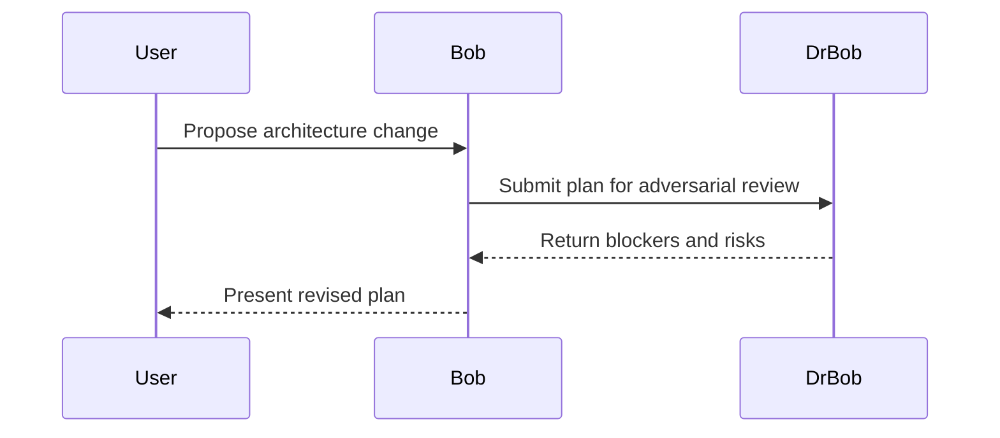

# ADR 000: Template

## Status

Proposed

## Context

Describe the problem, constraints, tenant boundaries, and runtime conditions.

## Decision

State the chosen approach and why it was selected.

## Consequences

- Positive effect
- Tradeoff
- Follow-on constraint Bob must remember

## Verification

- Tests or checks required
- Dr Bob review artifact path

## Mermaid

