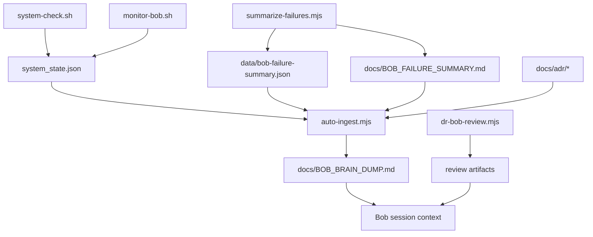

# ADR 001: Bob Autonomous Learning Loop

## Status

Accepted

## Context

Bob now operates across Codespaces, VPS automation, and RunPod-backed review flows. Without durable memory and health signals, Bob can drift between sessions, miss runtime degradation, or repeat ungrounded architecture advice.

## Decision

We standardize Bob's autonomous learning loop around four generated artifacts and one review gate:

- `system_state.json` is the runtime truth source.
- `data/bob-failure-summary.json` and `docs/BOB_FAILURE_SUMMARY.md` summarize recent failure patterns.
- `docs/BOB_BRAIN_DUMP.md` is the generated architecture context snapshot.
- `scripts/dr-bob-review.mjs` remains the adversarial gate for major plans.
- `.github/workflows/ops-bob-autonomous-learning.yml` and the VPS timer run the same shared cycle command.

## Consequences

- Bob must prefer grounded runtime state over stale memory.
- Health degradation is escalated through `system_state.json` and can now fail the GitHub automation run.
- ADRs become the permanent memory layer for finalized design choices.
- Complex UX and multi-org flows should be visualized before implementation.

## Verification

- Run `bash scripts/run-autonomous-learning-cycle.sh` successfully.
- Confirm `system_state.json`, `data/bob-failure-summary.json`, `docs/BOB_FAILURE_SUMMARY.md`, and `docs/BOB_BRAIN_DUMP.md` refresh.
- Run `node scripts/dr-bob-review.mjs --file <artifact>` for major architecture artifacts.
- Confirm `.github/workflows/ops-bob-autonomous-learning.yml` opens or updates an issue and fails when `system_state.json` contains `critical_warning`.

## Mermaid

