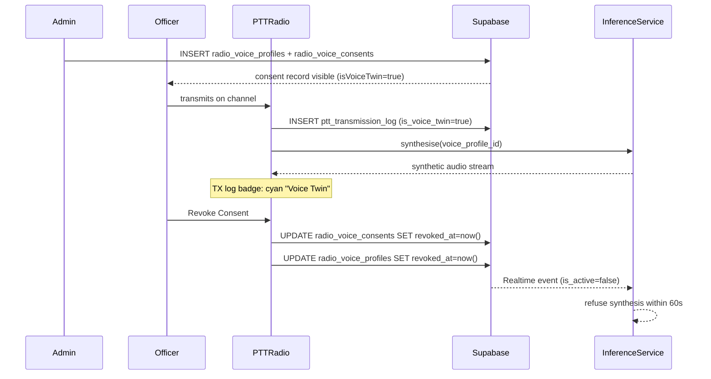

# ADR 007: Voice-Twin Governance Model

## Status

Accepted

## Context

The PTT Radio rebuild (plan.md Phase 5) introduces synthetic voice relay: an officer's captured voice profile is used by Coqui XTTS v2 to reproduce their voice in a translated audio stream broadcast to other channel members. This creates three governance requirements that did not exist in earlier phases:

1. **Consent lifecycle** — an officer must affirmatively consent before any voice profile is enrolled or used; consent can be revoked at any time and must immediately block synthesis (within 60 seconds per ADR 006).
2. **Audit trail** — every synthetic transmission must be tagged with the originating voice profile, the consent record, the provider, and the render latency. Observers must be able to distinguish synthetic relay from original audio.
3. **Organisational approval gate** — voice-twin operations must be gated by an org-level administrator (`admin`, `admin_officer`, `master`, `grand_master`) before an officer is enrolled, preventing self-enrollment without oversight.

Without a governance model, voice-cloning features could be deployed without traceability, increasing legal exposure under the NZ Privacy Act 2020 (addressed in ADR 006) and eroding operator trust.

## Decision

### 1. Consent-first enrolment

- Officers cannot self-enrol. Only roles in `['admin', 'admin_officer', 'master', 'grand_master']` may insert into `radio_voice_profiles` and `radio_voice_consents`.
- Each consent record must carry: `purpose`, `retention_days`, `provider`, and the `voice_profile_id` FK. These fields satisfy NZ Privacy Act 2020 principle 3 (collection purpose) and principle 5 (storage security).
- Consent records are soft-deleted only: `revoked_at` + `revocation_reason` are written; the row is never hard-deleted to preserve the audit chain.

### 2. Synthetic tagging at transmission log level

- Every `TransmissionEntry` rendered in the TX log carries `isVoiceTwin: boolean`.
- For local transmissions, `isVoiceTwin` is set to `true` when `syntheticAudioEnabled && hasActiveVoiceConsent` at the moment the transmission ends.
- For DB-loaded transmission log rows, the column `is_voice_twin` is read from `ptt_transmission_log` and mapped to the field.
- The UI renders a distinct cyan "Voice Twin" badge (`data-testid="voice-twin-badge"`) on every tagged row so operators can immediately distinguish synthetic relay from original audio.

### 3. Audit dashboard

- A dedicated `RadioAuditDashboard` page (admin-only, route `/radio/audit`) shows:
  - All `radio_voice_consents` for the active org (consented, revoked, pending).
  - All `radio_tts_renders` for the active org with provider, latency, and synthetic tag.
  - A 7-day synthetic render volume chart (recharts).
- The page is gated to `canManageVoiceProfiles` roles and is rendered outside the main operator radio console to avoid cluttering the patrol flow.

### 4. Feature-flag gate

- All voice-twin UI (enrollment, consent panel, TX badge, audit dashboard) is gated by `VITE_RADIO_SYNTHETIC_AUDIO_ENABLED`. Disabling the flag makes the entire subsystem invisible to operators without requiring a code deployment.

### 5. Revocation enforcement contract

- On revocation, both `radio_voice_profiles.revoked_at` and `radio_voice_consents.revoked_at` are written in a single parallel mutation (see `handleRevokeVoiceProfile` in `PTTRadio.tsx`).
- The inference service must poll `radio_voice_profiles` (or receive a Supabase Realtime event on the `is_active` computed column) and refuse to synthesise for revoked profiles within the 60-second window mandated by ADR 006.
- Until the inference service enforces this contract, the `VITE_RADIO_SYNTHETIC_AUDIO_ENABLED` flag must remain `false` in production.

## Consequences

- Positive: full audit chain from consent to transmission; regulatory exposure minimised; operators always know when they are hearing synthetic audio.
- Tradeoff: admin overhead for enrolment — officers cannot self-serve voice twin activation.
- Follow-on constraint: the inference service (Phase D) must implement revocation polling before Phase 5 is production-ready. This is a blocking dependency tracked in Ticket Group D.

## Verification

- E2E test: `officer sees enrollment permission guard for voice twin` — asserts non-admin cannot self-enrol.
- E2E test: `shows voice twin consent status indicators` — asserts active consent displays correctly.
- E2E test: `voice-twin TX log badge appears when consent is active` — asserts synthetic tagging in TX log.
- E2E test: `RadioAuditDashboard renders consent and render audit tables` (to be added with Group E implementation).

## Mermaid

