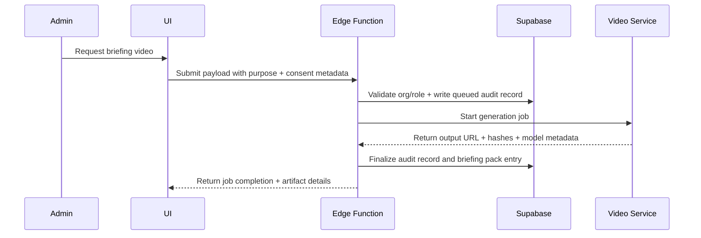

# ADR 010: Video Generation Consent Model

## Status

Proposed

## Context

Bob video creation is required for operational briefings, but the current platform has no explicit consent, retention, or audit model for generated video artifacts.

Existing governance covers voice synthesis in ADR 007, while video generation introduces additional risks:
- synthetic media misuse
- cross-organization data leakage
- missing chain-of-custody for enforcement evidence
- undefined retention and revocation behavior

The platform is multi-organization and must enforce strict org scoping via RLS.

## Decision

Adopt a consent-first video generation model with explicit purpose tagging, scoped access, and immutable audit records.

1. Consent requirements:
- Video generation is allowed only for roles: admin, admin_officer, master.
- Every request must include `purpose` in {`research`, `training`, `briefing`}.
- For any video containing personally identifying visuals, consent status must be recorded before generation.

2. Data model requirements:
- Introduce `media_generation_log` table for every generation request and output.
- Introduce `video_briefing_packs` table for generated operational briefing bundles.
- Store org_id, actor_user_id, source references, model info, output location, retention controls, and revocation metadata.

3. Access and policy:
- Enforce org isolation via RLS (`org_id` must match caller org context).
- Service-role operations are allowed only for controlled backend jobs and must write audit records.
- Cross-org reads/writes are denied by default.

4. Retention and revocation:
- Default retention for generated video: 90 days.
- Revocation marks artifact as revoked immediately and queues deletion.
- Legal hold flag prevents deletion until released.

5. Evidence integrity:
- Persist source hashes and output hash for generated artifacts.
- Persist generation model name/version and provider.
- Persist request timestamp and actor identity for chain-of-custody.

## Consequences

- Positive effect: clear legal and operational governance for Bob video outputs.
- Tradeoff: additional schema, policy, and workflow complexity.
- Follow-on constraint Bob must remember: no video generation without purpose + consent metadata where required.

## Verification

- Migration applies cleanly and adds required tables/indexes.
- RLS tests prove cross-org isolation.
- E2E test proves authorized generation, unauthorized denial, and revocation workflow.
- Dr Bob review artifact path: data/dr-bob-reviews/video-generation-consent-model.json

## Mermaid

