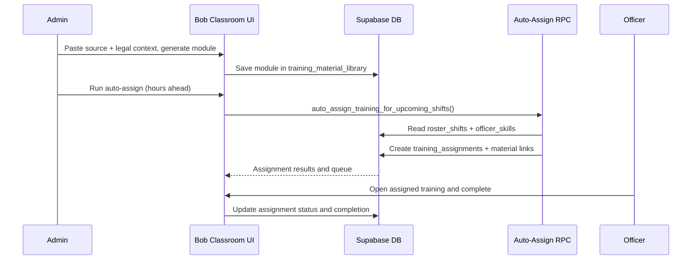

# ADR 011: Training Orchestration and Auto-Assignment

## Status

Proposed

## Context

The platform now includes Bob classroom tutoring, generated training content, and an initial training library plus assignment engine.

Operational need has expanded beyond ad-hoc content:
- training must be reusable and composable (no repeated manual recreation)
- assignments must be generated automatically from roster requirements before shift start
- NZ legal references and best-practice checks must be explicit and auditable
- assignment eligibility and completion must remain organization-scoped under RLS

Current constraints:
- multi-organization isolation is mandatory
- shift planning is already centered on `roster_shifts` and `required_skills`
- officer competencies are tracked in `officer_skills`
- legal-sensitive workflows require explainability and audit evidence

## Decision

Adopt a Training Orchestration Engine with four layers:

1. Content layer (reusable library):
- Persist generated/manual modules in `training_material_library`.
- Support compositing by storing `composed_from_material_ids`.
- Index by `topic`, `skill_tags`, `site_id`, and active state.

2. Assignment layer (execution queue):
- Persist per-officer assignments in `training_assignments`.
- Link selected content via `training_assignment_materials`.
- Track status lifecycle: assigned -> in_progress -> completed/overdue/cancelled.

3. Automation layer (pre-shift gap closure):
- Run `auto_assign_training_for_upcoming_shifts` against upcoming `roster_shifts`.
- Detect skill gaps from `required_skills` versus active `officer_skills`.
- Detect site induction gaps for `client_site_id`.
- Create deduplicated assignments due before shift start.

4. Governance layer (verification and legal grounding):
- Require legal-reference context for Bob-generated compliance modules.
- Produce explicit verification outcomes: verified or needs_review.
- Keep human legal/compliance signoff as final publication gate for policy-critical modules.

## Consequences

- Positive effect: enterprise-ready training flow that is reusable, auditable, and automatically tied to workforce scheduling.
- Tradeoff: increased schema and orchestration complexity, including queue management and lifecycle handling.
- Follow-on constraint Bob must remember: no cross-org training reads/writes, and no policy-critical legal claim should be treated as final without human compliance signoff.

## Verification

- Migration checks:
- `training_material_library`, `training_assignments`, `training_assignment_materials` created with expected indexes and RLS.
- RPC checks:
- `auto_assign_training_for_upcoming_shifts` creates assignments for missing skills/site induction and avoids duplicate active assignments.
- App checks:
- Bob Classroom Tutor can import learning history, generate modules, save to library, and trigger automation.
- Security checks:
- officers can only view/update their own assignments; admins manage org-scoped training objects.
- Dr Bob review artifact path:
- data/dr-bob-reviews/training-orchestration-auto-assignment.json

## Mermaid

