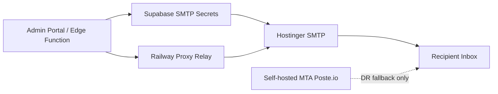

# ADR 012: Enterprise Email Architecture Baseline

## Status

Accepted

## Context

FieldOps Manager currently runs across Vercel, Supabase, Railway, RunPod, and hPanel.
Email documentation had conflicting production paths (Hostinger SMTP, Postal VPS,
and self-hosted MTA), which creates operational ambiguity and elevated enterprise risk.

Current build goals:

- Reliable transactional delivery for reports and notices
- Low operational burden with clear ownership
- Fast incident recovery and secret governance across Supabase and GitHub
- No dependency on features marked as coming soon

## Decision

Adopt managed Hostinger SMTP as the single production baseline for this build.

Architecture:

1. Supabase Edge Functions send transactional email using SMTP secrets.
2. Railway proxy relay remains active for runtime-limit resilience and controlled routing.
3. Supabase Auth custom SMTP uses the same managed mailbox credentials.
4. Self-hosted MTA/Poste.io remains fallback-only (disaster recovery and drills), not primary.
5. Postal VPS remains a future option for tenant-level inbound routing and advanced mail ops.

## Consequences

- Positive effect: one clear production path with lower operational complexity.
- Positive effect: faster go-live and stronger day-1 reliability.
- Tradeoff: managed-provider limits may constrain very high burst traffic.
- Tradeoff: advanced inbound reply routing is deferred until explicitly enabled.
- Constraint: all docs and env templates must align with this decision unless superseded by a new ADR.

## Verification

- DNS: MX, SPF, DKIM, DMARC aligned to Hostinger for root domain.
- Secrets: SMTP values consistent across Supabase Edge Functions, Supabase Auth, and proxy runtime.
- Runtime: authenticated live send through send-report-email returns success and inbox receipt.
- Monitoring: delivery failures and SMTP auth failures are logged and alerted.

## Mermaid

