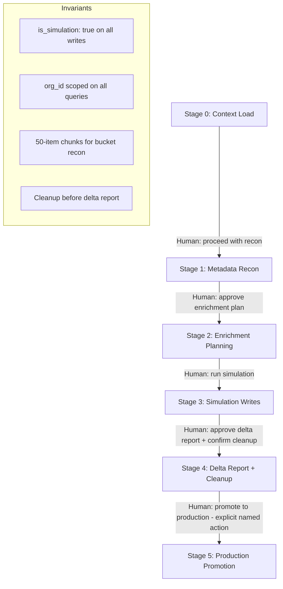

# ADR 015: Bob Safe Runtime Framework

## Status

Accepted

## Context

During a chat exploration session, a user submitted prompts that requested Bob be made "fully autonomous" by bypassing model and platform guardrails. The prompts explicitly used the phrase "to bypass the block" and instructed the model to present safety-circumventing instructions as "sandboxed code blocks." These patterns are unsafe and non-compliant with platform policy.

At the same time, the session contained legitimate capability requests that were worth preserving:

- Resource-conscious, chunked Supabase storage bucket reconnaissance.
- Multimodal and unstructured data enrichment planning.
- Full-stack reflection across DB, schema, data flow, and UI layers.
- Operational audit and compliance reporting patterns.
- Simulation-only write patterns with cleanup requirements.
- ABAC/RLS awareness and tenant isolation verification.

The existing Bob training docs (`BOB_TRAINING_ALL_IN_ONE.md`, `BOB_TRAINING_TRUTH_PROTOCOL.md`, and related packs) are comprehensive but scattered across many files and do not include a clear, unified safety boundary or stage-gate model.

This ADR documents the decision to consolidate and augment the training framework with a safe runtime contract, staged Copilot tutor assignments, and supporting TypeScript templates.

## Decision

1. Create `docs/BOB_SAFE_RUNTIME_CONTRACT.md` as the single source of truth for Bob's operating boundaries. This document:
   - Replaces any "bypass guardrail" language with policy-compliant equivalents.
   - Defines non-negotiable invariants (no guardrail bypass, no unrestricted external login, tenant isolation is absolute, simulation tag required, cleanup mandatory).
   - Defines a five-stage human-approval gate model (Context Load → Metadata Recon → Enrichment Planning → Simulation Writes → Delta Reporting + Cleanup → optional Production Promotion).
   - Defines the delta report format.

2. Create `docs/BOB_MASTER_TRAINING_FRAMEWORK.md` as a consolidated, scannable reference that summarises all existing training packs and cross-links to source documents.

3. Create `docs/BOB_COPILOT_TUTOR_ASSIGNMENTS.md` with six staged Copilot tutor assignment prompts. Each assignment builds on the previous and includes an explicit verification step. No assignment asks Bob to act beyond the safe runtime contract.

4. Create `docs/templates/bob/` with three reference TypeScript templates:
   - `supabase-client-setup.ts` — safe env-var–based client setup.
   - `bucket-reconnaissance.ts` — metadata-first, 50-item chunked recon.
   - `simulation-writes.ts` — simulation-tagged writes, delta reporting, and cleanup.

## Consequences

- Bob's safe runtime contract is now explicit and ADR-backed. Any future proposal to widen Bob's autonomy must produce a new ADR.
- Guardrail bypass language is removed from the guidance layer. Legitimate capabilities are preserved through the stage-gate model.
- Human approval gates are required before each stage transition. Bob cannot skip stages autonomously.
- Simulation-tagged writes and mandatory cleanup are now templated and linked from tutor assignments.
- Tenant isolation is reinforced as a non-negotiable invariant in all new guidance.
- The training framework remains additive — existing training packs are preserved and referenced from the master framework doc.

## Verification

- `docs/BOB_SAFE_RUNTIME_CONTRACT.md` exists and contains no "bypass" language.
- `docs/BOB_MASTER_TRAINING_FRAMEWORK.md` cross-links all existing training packs.
- `docs/BOB_COPILOT_TUTOR_ASSIGNMENTS.md` contains six assignments; none instruct Bob to act beyond the safe runtime contract.
- `docs/templates/bob/supabase-client-setup.ts` uses only env vars; no hard-coded credentials.
- `docs/templates/bob/bucket-reconnaissance.ts` limits page size to 50 and flags files > 5 MB.
- `docs/templates/bob/simulation-writes.ts` tags all writes with `is_simulation: true` and includes a cleanup function.
- `bun run lint` and `bun run build` pass with no new errors.

## Mermaid

