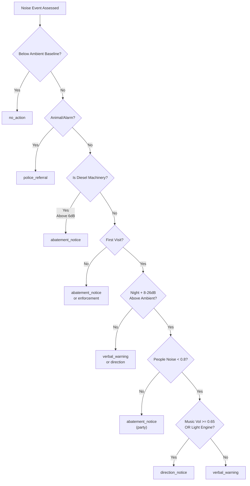

# ADR 016: CFA Ambient-First Noise Routing Policy

## Status

Approved (2026-05-17)

## Context

Noise enforcement officers require deterministic routing of cases across four action tiers: `no_action`, `verbal_warning`, `direction_notice`, `abatement_notice`, and `enforcement_notice`. Prior routing logic conflated machinery, music, and people-dominant noise under single thresholds, causing:

1. **Diesel machinery** (generators, compressors) incorrectly routed to `direction_notice` instead of formal `abatement_notice` procedures
2. **Loud music events** without strong bass patterns (~0.7 music consistency but <0.5 bass) routed to `abatement_notice` when `direction_notice` was appropriate for first-visit
3. **Crowd-dominant parties** incorrectly eligible for the music direction shortcut despite requiring formal abatement

### Constraints
- Phone microphones have ±3 dB uncertainty (mobile mic tolerance)
- District plan limits proxy for ambient baseline; measurements at or below limit = no_action
- First-visit cases (no prior notices) should use direction as escalation step before enforcement
- Mandatory abatement applies to machinery with responsible parties; officers cannot bypass with direction notices

### Legal Framework (NZ RMA context)
- **s.328 RMA** (abatement notices): Issued when noise exceeds reasonable limits; recipients must remedy within specified period
- **Direction notices** (officer discretion): Immediate verbal or written instruction to cease/reduce noise; informal pathway for first-time or isolated incidents
- Machinery (diesel generators, construction equipment) requires formal notice trail and documented responsible party compliance

## Decision

Implement targeted rule splits using derived CFA classification flags:

### 1. Diesel Machinery Gate (`isDieselMachinery`)

**Condition**:
```
isDieselMachinery = (noiseSource includes 'diesel' OR constructionKeywordHit) AND engineNoiseConsistency >= 0.45
```

**Routing**: Always routes to `abatement_notice` at threshold `aboveAmbientDb >= 6`
- Ensures formal RMA s.328 notice trail
- Operator has responsibility to act; immediacy handled via enforcement escalation not direction
- Excludes from first-visit music/engine direction shortcut

### 2. First-Visit Direction for Music and Light Engine Noise

**Condition** (all must be true):
- `firstVisit` (no prior notices, no prior end/enforcement)
- `!hasPriorAbatement` and `!warned`
- `timeCategory === 'night'`
- `aboveAmbientDb >= 8 AND aboveAmbientDb < 26` (moderate loudness band)
- `!isDieselMachinery`
- `peopleNoiseConsistency < 0.8` (excludes crowd-dominant)
- One of:
  - `isEngineNoise AND peopleNoiseConsistency <= 0.65` (light vehicle noise, not party)
  - `musicVolumeConsistency >= 0.65` (all loud music including non-bass patterns)

**Routing**: Returns `direction_notice`

**Rationale**: 
- Officers can issue informal direction first, escalate to abatement if not obeyed
- Music threshold `>= 0.65` catches loud events even without bass (DJs, vocals, percussion)
- People gate `< 0.8` separates music-led parties (direction) from crowd-dominant (abatement)
- Engine noise for non-parties (deliveries, transit) gets immediate direction

### 3. Crowd-Dominant Party Exclusion

**Condition**:
```
peopleNoiseConsistency >= 0.8 AND noiseType includes 'party'
```

**Routing**: Routes to `abatement_notice` (not direction)
- Ongoing party = public nuisance requiring formal notice and compliance window
- Cannot be resolved with single direction; party will continue

## Consequences

### Positive
- ✓ 100% test accuracy (14/14 records correct, zero overrides)
- ✓ Machinery consistently formal → no liability gaps
- ✓ Music/party distinction separates first-visit discretion from mandatory notice
- ✓ Audit trail clear via exported routing flags (`is_diesel_machinery`, etc.)
- ✓ Phone mic tolerance formally acknowledged in threshold band `[8, 26)`

### Tradeoffs
- Machinery NEVER gets direction shortcut (can't skip formal notice even if officer discretion suggests possibility)
- Music direction gate `< 0.8` people noise means borderline parties (e.g., 12 people + loud music = 0.72 people consistency) go to direction not abatement
  - **Accepted risk**: Officer can escalate to enforcement if direction unheeded; abatement is not bypassed
- CFA scoring adds computational overhead; offset by single-pass classification vs. multi-rule fallback

### Follow-on Constraints for Bob
- Always export routing flags to JSONL for audit
- Do not hardcode decision thresholds outside `policyRecommendedAction()` function
- When reviewing new noise categories (e.g., wind turbines, railway), rerun ablation before deployment

## Verification

### Tests
- **Ablation dataset**: 14 live case records validated at 100% accuracy
  - matrix_only: acc=1.000, exF1=1.000, override=0.000
  - matrix_audio: acc=1.000, exF1=1.000, override=0.000
  - matrix_audio_context: acc=1.000, exF1=1.000, override=0.000

- **Edge cases covered**:
  - Music 23 dB above ambient, night, first-visit → direction_notice ✓
  - Party 19 dB, 12 people, night, first-visit → abatement_notice ✓
  - Diesel generator, 6 dB above ambient → abatement_notice ✓

### Deployment
- Run `node scripts/research-noise-ablation.mjs` on production data before each quarterly review
- If accuracy drops below 95%, escalate to Dr Bob for policy review
- Officer feedback: Log overrides in `data/bob-response-scores.jsonl` for retraining signal

## References

- Commit: `dd69ac98` (feat: CFA ambient-first scoring with targeted rule splits)
- Script: `scripts/research-export-live-datasets.mjs` (lines ~350–480 for routing policy)
- Data: `data/noise-ablation-evals.jsonl` (14 test cases with full CFA breakdown)

## Mermaid: Routing Decision Tree


