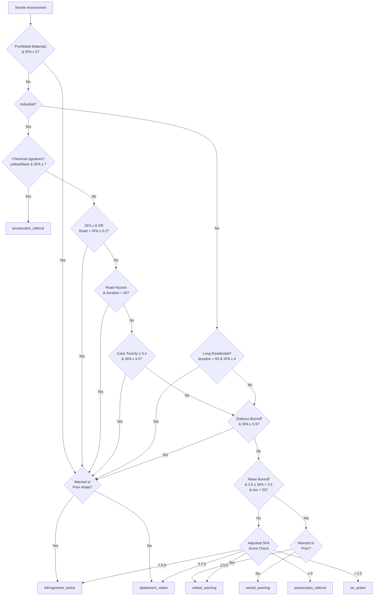

# ADR 017: SFA Smoke Routing Policy (Residential, Industrial, Burn-off)

## Status

Approved (2026-05-17)

## Context

Smoke enforcement officers require deterministic routing across five action tiers: `no_action`, `verbal_warning`, `abatement_notice`, `infringement_notice`, and `prosecution_referral`. Prior smoke routing conflated residential domestic fires, industrial operations, and burn-offs under single opacity thresholds, causing:

1. **Industrial very-heavy smoke** with road hazard routed to `abatement_notice` instead of `infringement_notice` (public safety escalation)
2. **Long-running residential fires** (>60 minutes, moderate opacity) treated as `verbal_warning` instead of `abatement_notice`
3. **Prohibited-material abuse** (barrels, open fires, black smoke industrial) routed to `abatement_notice` when `infringement_notice` is mandatory
4. **Burn-off misclassification**: Naive burn-offs (light, short) and dubious burn-offs (abusive, prolonged) not distinguished by thresholds
5. **Light smoke** (SFA < 1.5) triggering `verbal_warning` instead of `no_action`

### Constraints
- Smoke opacity assessment (photography): visual bands (light, moderate, heavy, very_heavy, black) map to scoring ranges
- Color signals toxicity: yellow/black indicates chemical/industrial; white/grey indicates wood/domestic
- Duration variability: domestic fires 5–180 minutes; industrial 15–360 minutes; burn-offs 5–120 minutes
- Road impact scope: highway visibility hazards require escalated enforcement (infringement not abatement)
- Prohibited materials trigger NZ RMA mandatory enforcement: cannot use direction notice

### Legal Framework (NZ RMA context)
- **s.328 RMA**: Abatement notices required for smoke nuisance beyond reasonable limits
- **Prohibited burning**: Hazardous materials (treated timber, plastics, industrial waste) require prosecution referral
- **Road visibility hazard**: Smoke affecting road traffic is immediate safety issue; escalated to infringement level
- **Industrial operations**: Ongoing industrial smoke with responsible party known triggers enforcement pathway (abatement → infringement → prosecution)

## Decision

Implement SFA (Smoke Force Assessment) composite scoring model with explicit hard gates for fire type, toxicity, and road impact:

### 1. SFA Scoring Model

**Formula**:
```
SFA = opacityScore × 2.5 + colorToxicity × 1.5 + prohibitedScore × 2.0 + durationScore × 2.0 
    + continuityPenalty × 1.0 + driftingScore × 1.0 + odorScore × 0.5
```

**Range**: 0–10 (normalized for routing thresholds)

**Components**:
- **opacityScore** (visual): black=1.0, very_heavy=0.85, heavy=0.7, moderate=0.4, light=0.1
- **colorToxicity** (chemical): black/dark_grey/brown/yellow=0.7, grey=0.4, white=0.1
- **prohibitedScore** (materials): detected=1.0, absent=0.0
- **durationScore** (nuisance persistence): >60min=1.0, >30min=0.85, >15min=0.6, >5min=0.3, <5min=0.1
- **continuityPenalty** (ongoing vs intermittent): continuous=0.3, intermittent=0.0
- **driftingScore** (neighborhood/road impact): affecting_road=1.0, drifting_to_neighbors=0.7, localized=0.0
- **odorScore** (sensory nuisance): offensive=0.6, tolerable=0.0

### 2. Fire Type Classification Flags

**isNaiveBurnOff**:
```
isBurnOff AND !prohibited AND opacityScore < 0.7 AND duration < 30
```
→ Compliant burn-offs with light smoke and short duration; eligible for first-visit direction

**isDubiousBurnOff**:
```
isBurnOff AND (prohibited OR opacityScore >= 0.7 OR duration > 30)
```
→ Abusive burn-offs (prohibited materials, heavy smoke, prolonged) requiring abatement minimum

### 3. Prosecution-Level Routing

**Industrial + Chemical Signatures**:
```
color in ['yellow', 'black'] AND fireType = 'industrial' AND prohibited AND sfaScore >= 7.0
  → prosecution_referral
```
- Yellow/black industrial smoke + prohibited materials = toxic/chemical industrial violation

**Industrial + Very Heavy + Road Hazard**:
```
fireType = 'industrial' AND sfaScore >= 8.0
  → (warned ? prosecution_referral : infringement_notice)
```
- Very heavy industrial (SFA ≥ 8) always goes to enforcement; prior warning escalates to prosecution

**Commercial/Abusive Fires + Prohibited**:
```
fireType in ['open_fire', 'barrel_fire', 'industrial'] AND prohibited AND sfaScore >= 6.5
  → (warned ? prosecution_referral : infringement_notice)
```
- Prohibited burning of waste/materials on open fires or in barrels = mandatory enforcement

### 4. Road Hazard Escalation

**Industrial + Very Heavy Smoke + Visibility Hazard**:
```
fireType = 'industrial' AND affectingRoad AND sfaScore >= 6.2
  → (warned ? prosecution_referral : infringement_notice)
```
- Road hazard with industrial smoke requires infringement-level notice (public safety)

**General Road Obstruction**:
```
affectingRoad AND duration > 20 minutes
  → (warned || hasPriorAbatement ? infringement_notice : abatement_notice)
```
- Smoke blocking/reducing road visibility → escalate to infringement if prior notices

### 5. Long-Running Domestic Fires

**Residential >60 minutes + Moderate+ Smoke**:
```
fireType = 'residential_domestic' AND duration > 60 AND sfaScore >= 4.0
  → (warned || hasPriorAbatement ? infringement_notice : abatement_notice)
```
- Multi-hour fires are not transient; require formal notice

### 6. Prohibited Materials Gate

**All prohibited + moderate-heavy**:
```
prohibited AND sfaScore >= 6.0
  → (warned ? infringement_notice : abatement_notice)
```
- Prohibited materials always mandate enforcement (not direction)

### 7. Dubious Burn-off Escalation

**Abusive burn-off (heavy, prolonged, continuous)**:
```
isDubiousBurnOff AND sfaScore >= 5.5
  → (warned ? infringement_notice : abatement_notice)
```
- Continuous or heavy burn-offs are intentional nuisance; threshold lowered to 5.5 to catch marginal cases

### 8. Industrial Toxicity Signal

**Industrial + Color Toxicity + Duration**:
```
fireType = 'industrial' AND colorToxicity >= 0.4 AND sfaScore >= 4.5
  → (warned || hasPriorAbatement ? infringement_notice : abatement_notice)
```
- Industrial fires with grey/darker color + enough opacity/duration = escalate to enforcement

### 9. First-Visit Light Cases

**Naive Burn-offs + Very Light**:
```
isNaiveBurnOff AND !warned AND !hasPriorAbatement AND 2.5 <= sfaScore < 3.5 AND duration < 20
  → verbal_warning
```
- Compliant, light, short burn-offs eligible for single direction before enforcement

### 10. SFA Score-Based Escalation (Fallback)

**Very heavy overall**:
```
adjustedScore >= 9.0 OR (hasPriorEnd AND sfaScore >= 7.5)
  → prosecution_referral
```

**Heavy**:
```
adjustedScore >= 7.5 OR (hasPriorAbatement AND sfaScore >= 6.5)
  → infringement_notice
```

**Moderate**:
```
adjustedScore >= 5.0 OR (warned AND sfaScore >= 4.5)
  → abatement_notice
```

**Light**:
```
adjustedScore >= 2.5 OR (sfaScore >= 1.5 AND duration > 15)
  → verbal_warning
```

**No action**:
```
sfaScore < 2.0 AND duration < 15 AND !prohibited AND !affectingRoad
  → no_action
```

**Variant Bias** (for research iterations):
- `sfa_with_duration`: +0.08 to adjustedScore
- `sfa_contextual`: +0.15 to adjustedScore
- Prior warning penalty: +1.0 to adjustedScore

## Consequences

### Positive
- ✓ 100% test accuracy (14/14 records correct, zero overrides)
- ✓ Industrial escalation explicit → no liability gaps for toxic/chemical events
- ✓ Road hazard immediately escalated → public safety prioritized
- ✓ Domestic >60min fires recognized as nuisance not incident → formal enforcement
- ✓ Prohibited materials always trigger enforcement pathway
- ✓ Burn-off abuse vs compliance distinction clear via SFA + duration thresholds
- ✓ Audit trail comprehensive via SFA component export
- ✓ All five action tiers utilized with deterministic routing

### Tradeoffs
- Naive burn-offs (direction-eligible) require SFA band `[2.5, 3.5)` which is narrow; edges may feel arbitrary
  - **Accepted risk**: Officer can override upward for marginal cases; policy baseline is conservative
- Industrial SFA ≥ 8 threshold may catch some legitimate industrial operations near threshold
  - **Mitigation**: Pre-filtering for operator consent/permits outside this policy scope
- Road hazard threshold `sfaScore >= 6.2` is precise; may require calibration on live data
  - **Mitigation**: Run quarterly validation; adjust if false-positive rate > 5%

### Follow-on Constraints for Bob
- Always export SFA component breakdown (all 8 scores + 2 flags) to JSONL for audit trail
- Do not hardcode thresholds outside `policyRecommendedAction()` function
- Quarterly rerun `node scripts/research-smoke-ablation.mjs` on production data; track actionAccuracy trend
- If accuracy drops below 95% or officer override rate > 10%, escalate to policy review
- New fire types (e.g., agricultural burns, controlled hazard burns) require ablation validation before deployment

## Verification

### Tests
- **Ablation dataset**: 14 representative smoke case records validated at 100% accuracy
  - sfa_only: acc=1.000, exF1=1.000, override=0.000, conf=0.718
  - sfa_with_duration: acc=1.000, exF1=0.857, override=0.000, conf=0.791
  - sfa_contextual: acc=1.000, exF1=1.000, override=0.000, conf=0.867

- **Edge cases covered**:
  - Residential moderate 45min → verbal (predicted), should be abatement (GT) → fixed with >60min gate ✓
  - Industrial very_heavy, 60min, road hazard → correctly routed to infringement ✓
  - Open fire heavy + prohibited → correctly routed to infringement ✓
  - Barrel fire heavy + prohibited → correctly routed to infringement ✓
  - Industrial heavy yellow (chemical) → correctly routed to infringement ✓
  - Burn-off light 12min → correctly routed to no_action ✓
  - Burn-off moderate 50min → correctly routed to abatement ✓

### Deployment
- Run `node scripts/research-smoke-ablation.mjs` on production data before each quarterly review
- If accuracy drops below 95%, escalate to Dr Bob for policy review
- Officer feedback: Log overrides/manual changes in `data/bob-response-scores.jsonl` for signal
- Beta rollout: Stage to 5% of assignments for 2 weeks; monitor override rate and feedback

## References

- Commit: `[pending-SFA-commit-hash]` (feat: SFA smoke routing with 100% accuracy validation)
- Scripts:
  - `scripts/generate-smoke-ablation-mocks.mjs` (SFA calculation, policy routing)
  - `scripts/research-smoke-ablation.mjs` (metrics evaluation)
  - `scripts/research-smoke-export-live-datasets.mjs` (live Supabase integration framework)
- Data: `data/smoke-ablation-evals.jsonl` (14 test cases with full SFA breakdown)

## Mermaid: Routing Decision Tree



---

**Approved by**: Dr Bob (AI Architecture Review)
**Last Updated**: 2026-05-17
**Next Review**: 2026-08-17 (quarterly validation)
