# FreedomCamp Manager — System Overview & Build Review

> **Last updated**: March 2026
> **Purpose**: Complete system architecture reference with diagrams explaining what the build does, how data flows, and how all services connect.

---

## Table of Contents

1. [What This System Does](#1-what-this-system-does)
2. [High-Level Architecture](#2-high-level-architecture)
3. [Frontend Architecture](#3-frontend-architecture)
4. [Database Schema](#4-database-schema)
5. [Data Flow: Observation → Compliance → Breach](#5-data-flow-observation--compliance--breach)
6. [Edge Functions](#6-edge-functions)
7. [External Services & Integrations](#7-external-services--integrations)
8. [Build & Deployment Process](#8-build--deployment-process)
9. [CI/CD Pipelines](#9-cicd-pipelines)
10. [Authentication & Authorization](#10-authentication--authorization)

---

## 1. What This System Does

FreedomCamp Manager is a **web-based enforcement platform** for freedom camping compliance in New Zealand. It tracks vehicles at camping zones, detects rule violations (overstays, non-self-contained vehicles), and manages the enforcement workflow from detection to resolution.

```
┌──────────────────────────────────────────────────────────────────┐
│                    WHAT THE SYSTEM MANAGES                       │
├──────────────────────────────────────────────────────────────────┤
│                                                                  │
│  👮 Field Officers        → Patrol zones, scan vehicle plates    │
│  📷 Vehicle Scanning      → ALPR + AI photo recognition          │
│  🗺️  Zone Geofencing      → Per-zone rules (nights, SC required) │
│  📊 Compliance Engine     → Automated breach detection            │
│  ⚠️  Breach Management    → Warnings → Notices → Escalation      │
│  📈 Reporting             → Dashboards, KPIs, leadership packs   │
│  🏢 Multi-Organisation    → Owner → Provider → Client hierarchy  │
│  🛡️  Officer Welfare      → Inactivity detection, wellness checks│
│  🅿️  ParkPow Integration  → Parking enforcement platform sync    │
│  ⚖️  Incident Management  → Court-ready evidence with legal holds│
│                                                                  │
└──────────────────────────────────────────────────────────────────┘
```

### User Roles

| Role | Portal | Access Level |
|------|--------|-------------|
| `master` | Admin Portal | Full system access across all organisations |
| `admin` | Admin Portal | Organisation-scoped administration |
| `officer` | Field Officer Portal | Mobile-optimised scanning & patrols |
| `admin_officer` | Both Portals | Can switch between admin and field views |

---

## 2. High-Level Architecture

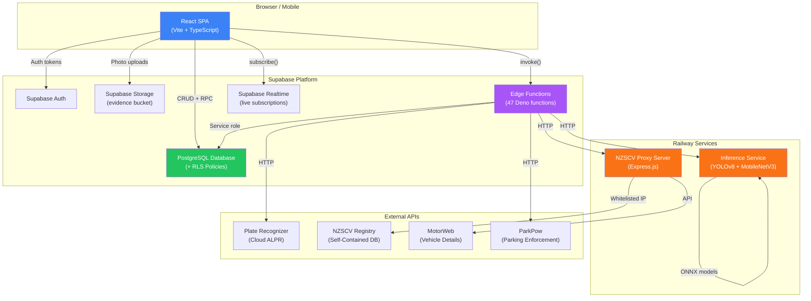

### Component Summary

| Component | Technology | Deployment | Purpose |
|-----------|-----------|-----------|---------|
| **React SPA** | React 18 + Vite + TypeScript | Static hosting | User interface |
| **Supabase** | PostgreSQL + Auth + Edge Functions | Supabase Cloud | Backend-as-a-service |
| **Inference Service** | Node.js + ONNX Runtime | Railway | AI vehicle detection & embeddings |
| **Proxy Server** | Express.js | Railway | Static IP for NZSCV API whitelist |

---

## 3. Frontend Architecture

### Tech Stack

```
┌─────────────────────────────────────────────────┐
│                   React SPA                      │
├─────────────────────────────────────────────────┤
│  UI Layer     │ shadcn/ui (33 Radix primitives) │
│  Styling      │ Tailwind CSS v3 + animations    │
│  Routing      │ React Router v6                  │
│  State        │ Zustand (auth + global filters)  │
│  Server State │ TanStack Query v5                │
│  Forms        │ react-hook-form + zod            │
│  Charts       │ Recharts                         │
│  Maps         │ Leaflet + React Leaflet          │
│  Build        │ Vite + SWC                       │
│  Package Mgr  │ bun                              │
└─────────────────────────────────────────────────┘
```

### Routing Map

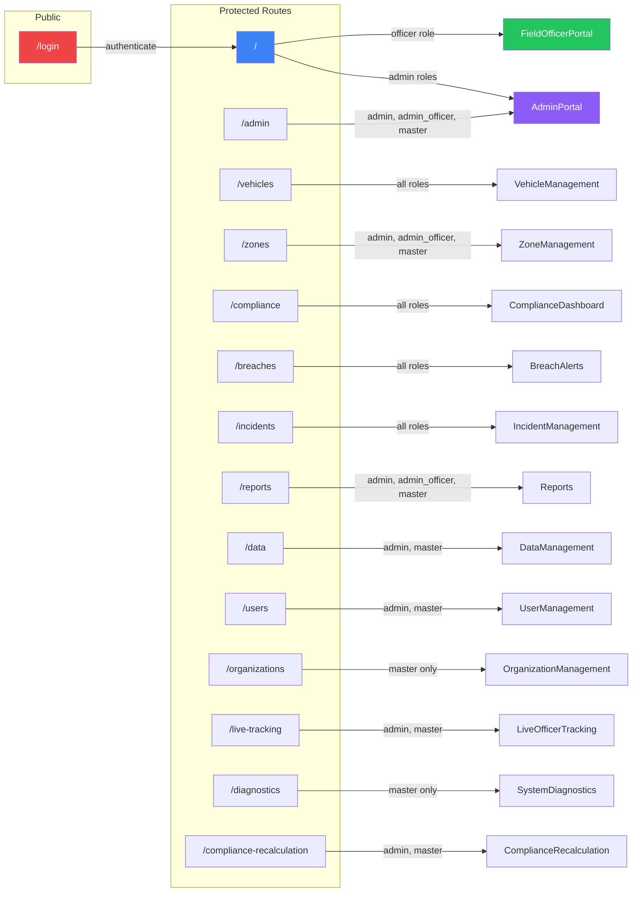

### Source Directory Layout

```
src/
├── main.tsx                 # Entry → React 18 createRoot
├── App.tsx                  # Router + auth guards + providers
├── index.css                # Tailwind base styles
│
├── pages/                   # 30 page components
│   ├── AdminPortal.tsx          Dashboard for admin/master
│   ├── FieldOfficerPortal.tsx   Mobile-first scanning interface
│   ├── VehicleManagement.tsx    Vehicle search & details
│   ├── ZoneManagement.tsx       CRUD zones with map
│   ├── ComplianceDashboard.tsx  Compliance metrics
│   ├── BreachAlerts.tsx         Breach list & resolution
│   ├── IncidentManagement.tsx   Incident tracking
│   ├── Reports.tsx              Report generation hub
│   ├── LiveOfficerTracking.tsx  Real-time GPS map
│   └── ...                      (20 more pages)
│
├── components/
│   ├── ui/                  # 33 shadcn/ui primitives
│   │   ├── button.tsx, dialog.tsx, form.tsx, table.tsx, ...
│   └── features/            # 65+ domain components
│       ├── PlateScanner.tsx, BreachCard.tsx, ZoneMap.tsx, ...
│
├── hooks/                   # 29 custom React hooks
│   ├── useVehicles.ts           canonical_vehicles CRUD
│   ├── usePatrols.ts            Patrol lifecycle management
│   ├── useBreaches.ts           Breach queries & resolution
│   ├── useZones.ts              Zone CRUD + stats
│   ├── useVehicleCompliance.ts  Compliance history
│   ├── usePlateScans.ts         ALPR scan management
│   ├── useIncidents.ts          Incident CRUD
│   └── ...                      (22 more hooks)
│
├── stores/                  # Zustand state stores
│   ├── authStore.ts             User session + role
│   └── globalFiltersStore.ts    Date/org/zone filters
│
├── lib/                     # 21 utility modules
│   ├── supabase.ts              Supabase client (NZ timezone)
│   ├── edgeFunctions.ts         Edge function caller wrapper
│   ├── fileUpload.ts            Storage upload helpers
│   ├── geocoding.ts             Reverse geocoding
│   └── ...                      (17 more utilities)
│
└── types/
    ├── database.ts              Generated Supabase DB types
    └── index.ts                 App-level type definitions
```

---

## 4. Database Schema

### Core Tables (Entity Relationship)

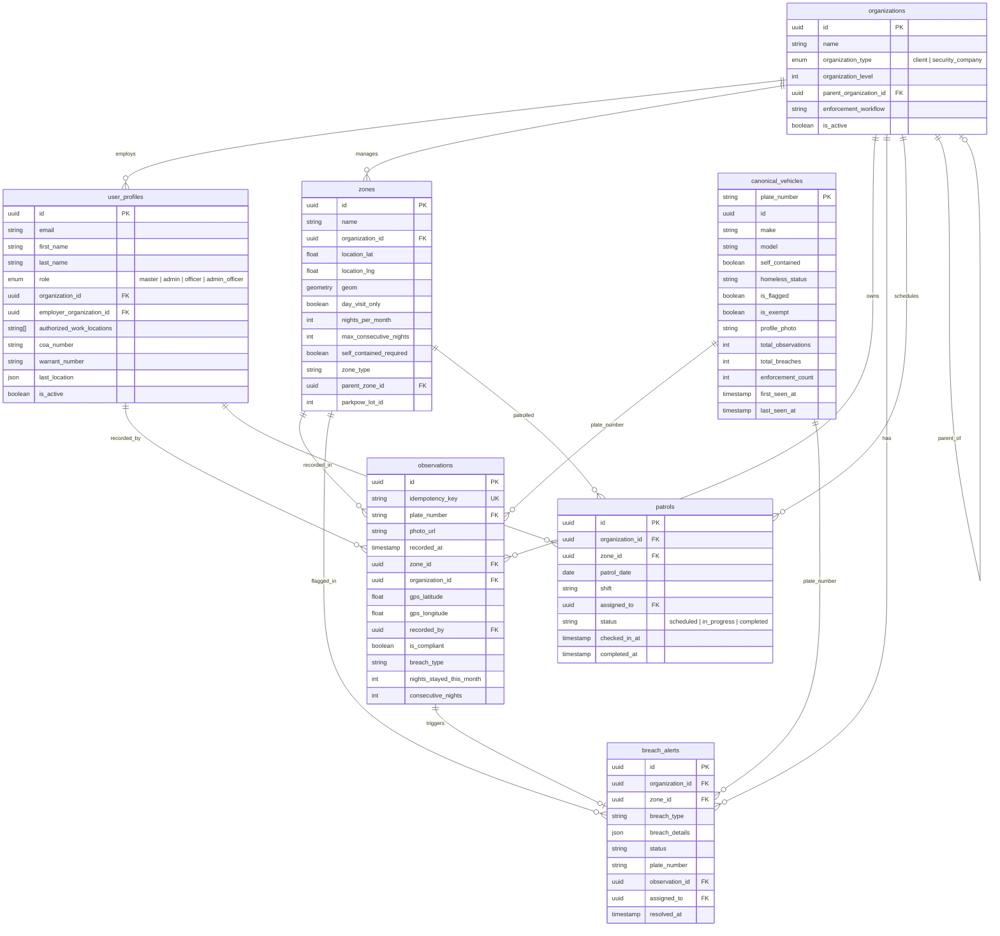

### Table Purposes

| Table | Purpose | Key Relationships |
|-------|---------|-------------------|
| **organizations** | Multi-tenant hierarchy (owner → provider → client) | Parent-child self-reference |
| **user_profiles** | All users with roles, credentials, permissions | Belongs to organization |
| **zones** | Geofenced camping areas with compliance rules | Belongs to organization |
| **canonical_vehicles** | Master vehicle record (one per plate) | Aggregates from observations |
| **observations** | Individual vehicle sightings with GPS + photo | Links vehicle → zone → officer |
| **breach_alerts** | Compliance violations requiring action | Links observation → zone → vehicle |
| **patrols** | Officer patrol assignments and check-ins | Links officer → zone |

### Additional Tables (via Migrations)

The 82 SQL migrations define additional tables not in the TypeScript type definitions, including:

| Table | Purpose |
|-------|---------|
| `compliance_results` | Cached compliance calculation results |
| `enforcement_actions` | Warnings, notices to vacate, escalations |
| `incidents` | Incident reports with evidence |
| `incident_attachments` | Photos/documents for incidents |
| `vehicle_observations_v2` | Mirror/backup of observations (not for queries) |
| `plate_scans` | Raw ALPR scan records |
| `drift_events` | Compliance rule change tracking |
| `admin_recalculation_actions` | Audit log for recalculations |
| `zone_compliance_matrix` | Per-zone compliance rules |
| `person_records` | Individual person tracking |
| `audit_logs` | System audit trail |

---

## 5. Data Flow: Observation → Compliance → Breach

This is the **core pipeline** of the system — how a vehicle sighting becomes a compliance check and potentially a breach alert.

### Step-by-Step Flow

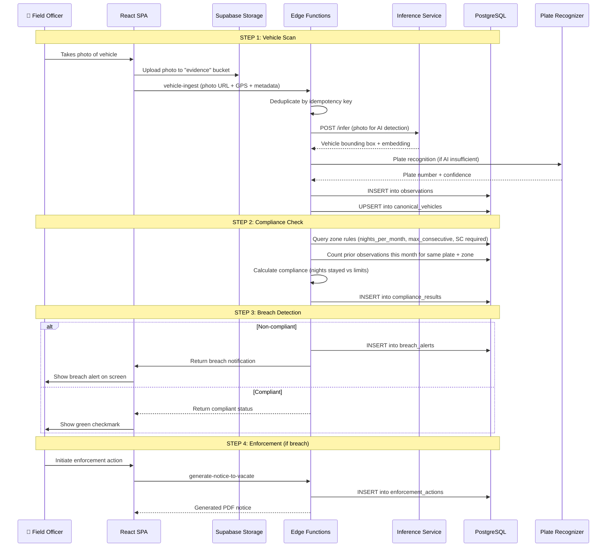

### Compliance Rules Engine

```
┌─────────────────────────────────────────────────────────┐
│              ZONE COMPLIANCE RULES                       │
├─────────────────────────────────────────────────────────┤
│                                                          │
│  Each zone defines:                                      │
│                                                          │
│  ┌──────────────────────┬───────────────────────────┐   │
│  │ nights_per_month     │ Max nights in a calendar   │   │
│  │                      │ month (e.g., 3)            │   │
│  ├──────────────────────┼───────────────────────────┤   │
│  │ max_consecutive_     │ Max nights in a row        │   │
│  │ nights               │ (e.g., 2)                  │   │
│  ├──────────────────────┼───────────────────────────┤   │
│  │ self_contained_      │ Must vehicle be certified  │   │
│  │ required             │ self-contained? (T/F)      │   │
│  ├──────────────────────┼───────────────────────────┤   │
│  │ day_visit_only       │ No overnight stays (T/F)   │   │
│  ├──────────────────────┼───────────────────────────┤   │
│  │ allowed_days         │ Which days camping is      │   │
│  │                      │ permitted                  │   │
│  └──────────────────────┴───────────────────────────┘   │
│                                                          │
│  Breach Types:                                           │
│  • overstay            – Exceeded nights_per_month       │
│  • consecutive_days    – Exceeded max_consecutive_nights │
│  • no_self_contained   – Not certified in SC zone        │
│  • unauthorized_zone   – Camping in prohibited zone      │
│  • nights_exceeded     – General night limit violation    │
│                                                          │
└─────────────────────────────────────────────────────────┘
```

### Batch Recalculation Flow

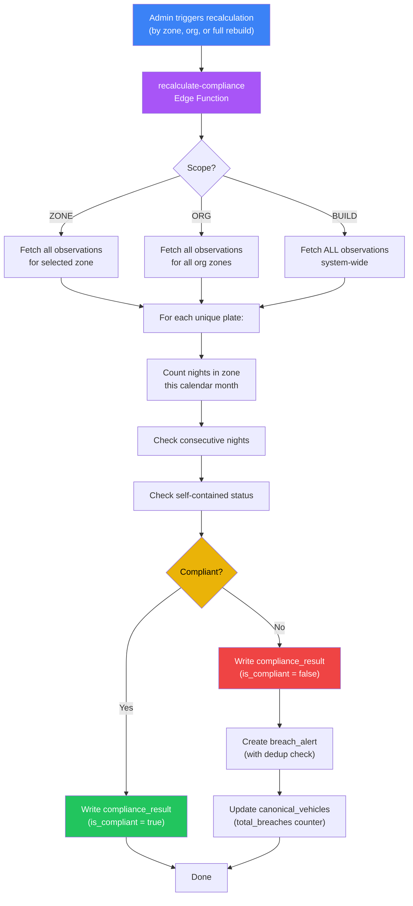

---

## 6. Edge Functions

The system has **47 Supabase Edge Functions** organized into these categories:

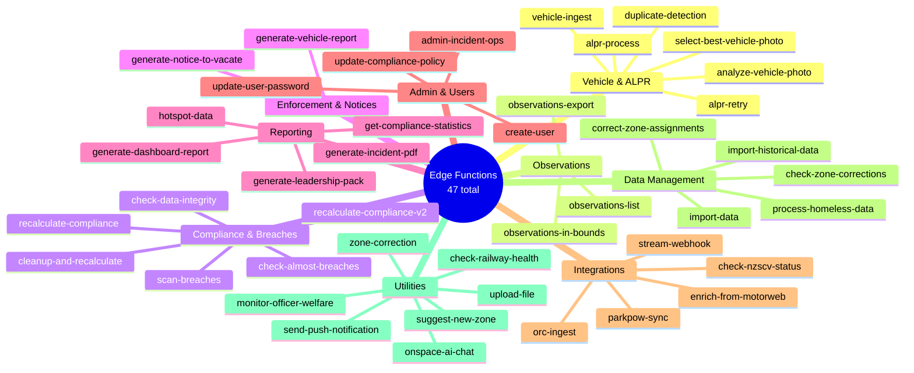

### Key Edge Function Flows

| Function | Trigger | Input | Output |
|----------|---------|-------|--------|
| `vehicle-ingest` | Officer scan | Photo + GPS + plate | Observation + canonical vehicle |
| `alpr-process` | After photo upload | Photo URL | Plate number via AI/OCR |
| `recalculate-compliance` | Admin action | Scope (zone/org/build) | Updated compliance_results |
| `scan-breaches` | Scheduled / manual | Organization ID | New breach_alerts |
| `generate-notice-to-vacate` | Admin action | Breach ID | PDF document |
| `parkpow-sync` | Nightly cron | Action type | Synced lot/watchlist data |
| `monitor-officer-welfare` | Periodic | Officer ID | Welfare alert if inactive |

---

## 7. External Services & Integrations

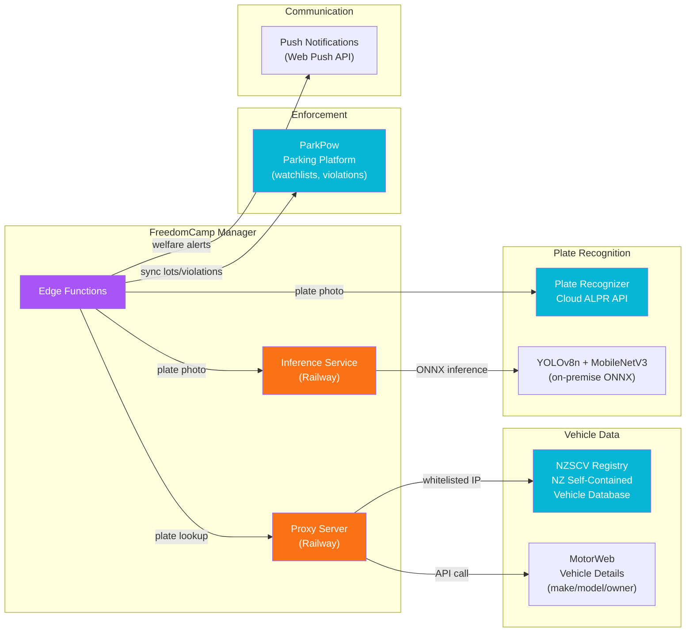

### Integration Details

| Service | Purpose | Connection Method |
|---------|---------|------------------|
| **Plate Recognizer** | Cloud ALPR — reads plate numbers from photos | Direct HTTP from Edge Functions |
| **Inference Service** | On-premise AI — YOLOv8n vehicle detection + MobileNetV3 embeddings | HTTP via Railway |
| **NZSCV Proxy** | Checks if vehicle is certified self-contained | Via proxy server (static IP required) |
| **MotorWeb** | NZ vehicle registration details (make, model, owner) | Via proxy server |
| **ParkPow** | Parking enforcement platform — watchlists, sessions, violations | Direct HTTP from Edge Functions |
| **Web Push** | Officer welfare alerts and breach notifications | Web Push API |

---

## 8. Build & Deployment Process

### Frontend Build Pipeline

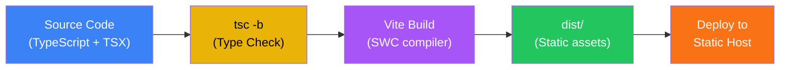

```
Build Commands:
──────────────────────────────────────────────────────
bun install          Install dependencies (bun.lock)
bun run build        tsc -b && vite build → dist/
bun run dev          Vite dev server (localhost:5173)
bun run lint         ESLint 9 flat config check
bun run preview      Preview production build
──────────────────────────────────────────────────────
```

### Inference Service Build (Multi-Stage Docker)

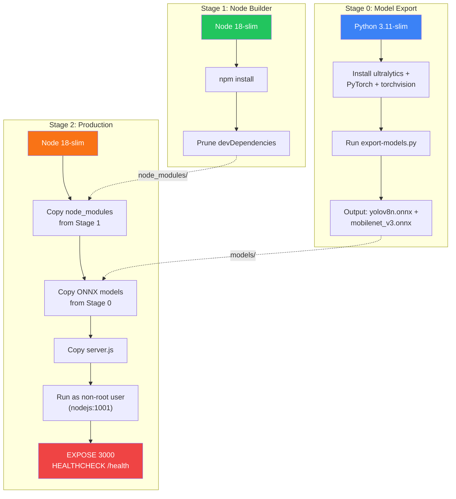

### Deployment Targets

```
┌──────────────────────────────────────────────────────────┐
│                  DEPLOYMENT ARCHITECTURE                  │
├──────────────────────────────────────────────────────────┤
│                                                           │
│  ┌─────────────┐    ┌──────────────┐    ┌────────────┐  │
│  │  React SPA  │    │   Supabase   │    │  Railway   │  │
│  │             │    │              │    │            │  │
│  │  Static     │    │  PostgreSQL  │    │ Inference  │  │
│  │  hosting    │◄──►│  Auth        │◄──►│ Service    │  │
│  │  (Vite      │    │  Edge Fns    │    │            │  │
│  │   build)    │    │  Storage     │    │ Proxy      │  │
│  │             │    │  Realtime    │    │ Server     │  │
│  └─────────────┘    └──────────────┘    └────────────┘  │
│                                                           │
│  Environment Variables Required:                          │
│  • VITE_SUPABASE_URL         (Frontend)                  │
│  • VITE_SUPABASE_ANON_KEY    (Frontend)                  │
│  • SUPABASE_SERVICE_ROLE_KEY (Edge Functions)            │
│  • RAILWAY_TOKEN             (CI/CD)                     │
│  • PROXY_SECRET              (Proxy Server auth)         │
│                                                           │
└──────────────────────────────────────────────────────────┘
```

---

## 9. CI/CD Pipelines

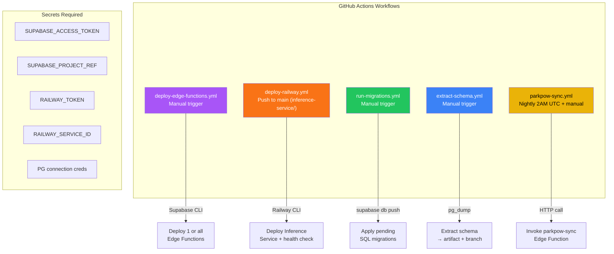

### Workflow Summary

| Workflow | Trigger | What It Does |
|----------|---------|-------------|
| **deploy-edge-functions** | Manual | Deploys one or all 47 Edge Functions via Supabase CLI |
| **deploy-railway** | Push to `main` (inference-service changes) OR manual | Builds + deploys inference service to Railway, verifies health |
| **run-migrations** | Manual | Applies pending SQL migrations to Supabase PostgreSQL |
| **extract-schema** | Manual | Dumps current DB schema for documentation/audit |
| **parkpow-sync** | Nightly 2AM UTC + manual | Syncs parking lot data, watchlists, violations with ParkPow |

---

## 10. Authentication & Authorization

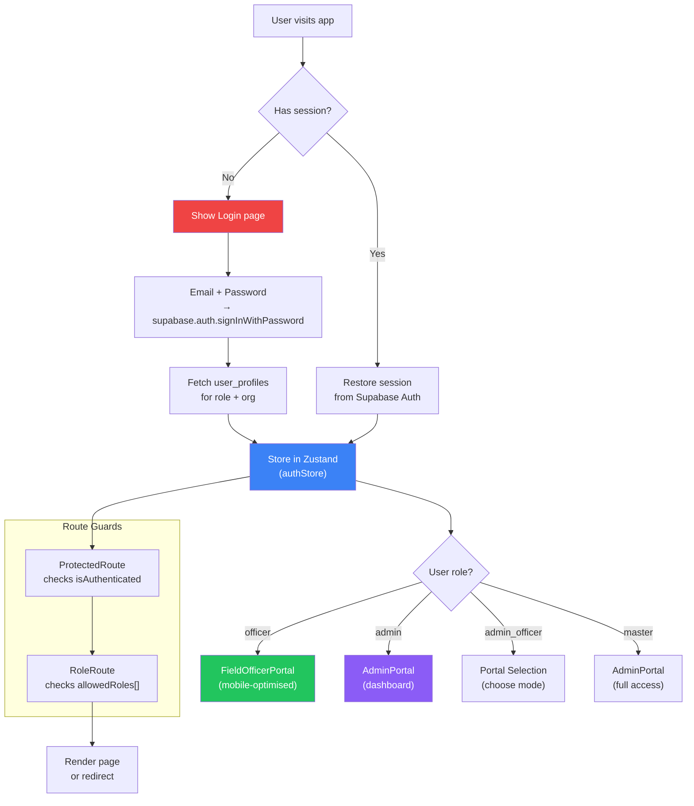

### Row-Level Security (RLS)

All database access is governed by PostgreSQL RLS policies:

```
┌─────────────────────────────────────────────────────────┐
│                   RLS POLICY MODEL                       │
├─────────────────────────────────────────────────────────┤
│                                                          │
│  master role      → Can see ALL data across ALL orgs     │
│  admin role       → Can see data for OWN organisation    │
│                     + child organisations                │
│  officer role     → Can see data for assigned zones      │
│                     within own organisation              │
│  admin_officer    → Same as admin (uses admin policies)  │
│                                                          │
│  Service Role Key → Bypasses all RLS (Edge Functions)    │
│                                                          │
│  Special handling:                                       │
│  • authorized_work_locations limits officer zone access  │
│  • employer_organization_id for security company staff   │
│  • EXCEPTION handlers for bad data in RLS functions      │
│                                                          │
└─────────────────────────────────────────────────────────┘
```

---

## Quick Reference

### Key Files

| File | Purpose |
|------|---------|
| `src/App.tsx` | Main router, auth guards, providers |
| `src/stores/authStore.ts` | Authentication state (Zustand) |
| `src/lib/supabase.ts` | Supabase client (NZ timezone) |
| `src/lib/edgeFunctions.ts` | Edge function caller (47 functions) |
| `src/types/database.ts` | Generated Supabase DB types |
| `supabase/functions/_shared/cors.ts` | CORS headers for Edge Functions |
| `inference-service/server.js` | AI inference API (YOLOv8 + MobileNetV3) |
| `proxy-server/server.js` | NZSCV/MotorWeb proxy API |

### Build Commands

| Command | What It Does |
|---------|-------------|
| `bun install` | Install all dependencies |
| `bun run dev` | Start Vite dev server (localhost:5173) |
| `bun run build` | TypeScript check + Vite production build |
| `bun run lint` | ESLint code quality check |
| `bun run preview` | Preview production build locally |
